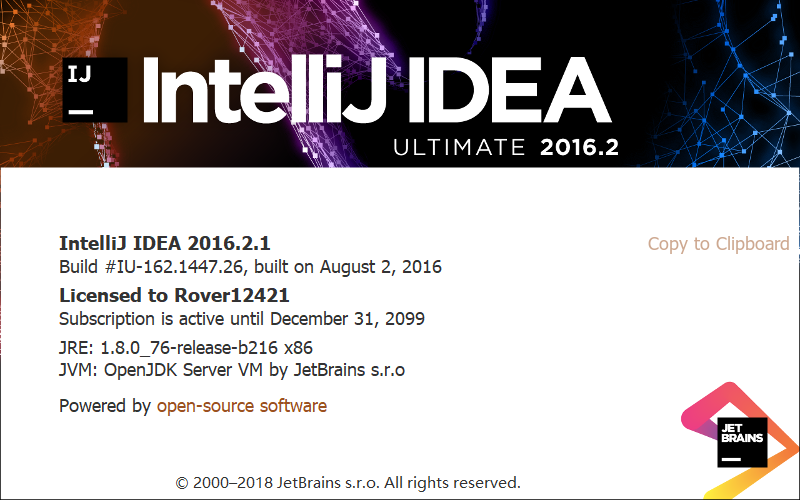
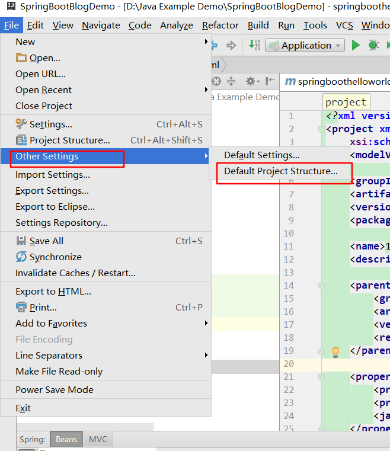
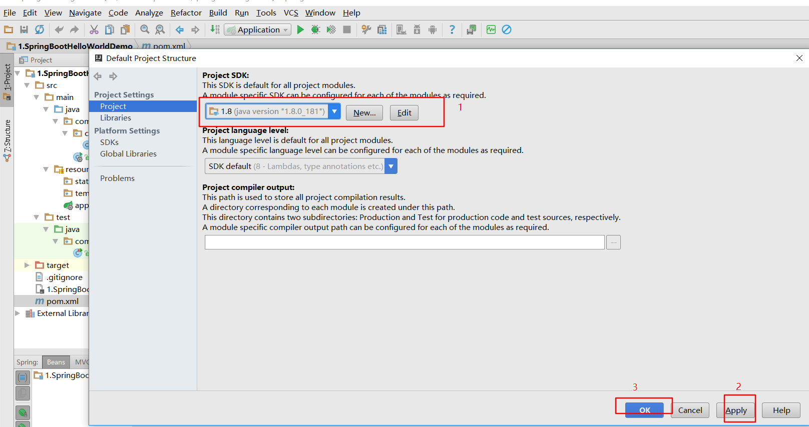
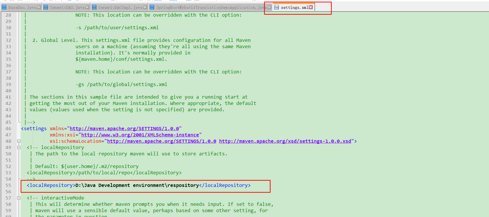
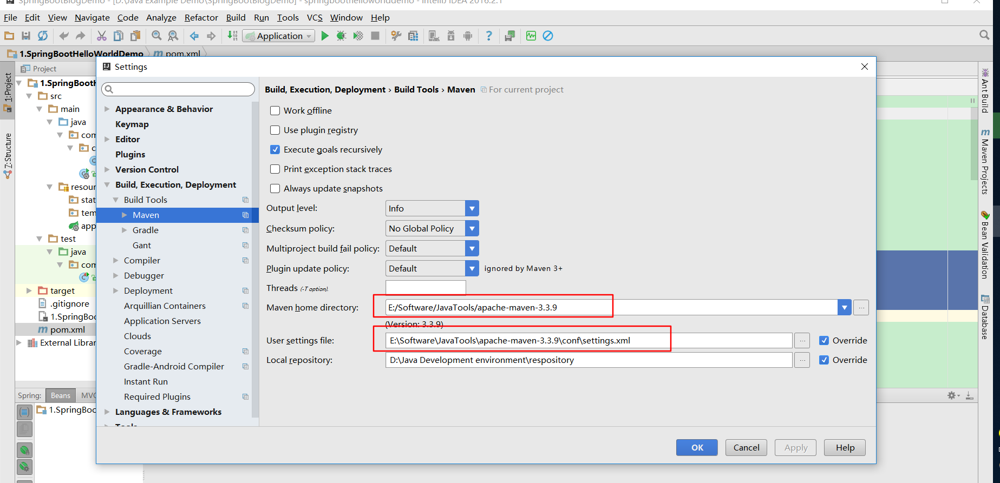
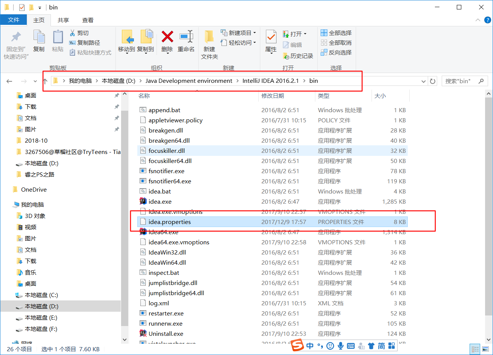
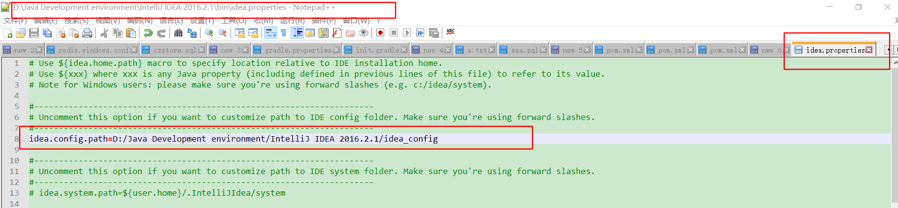
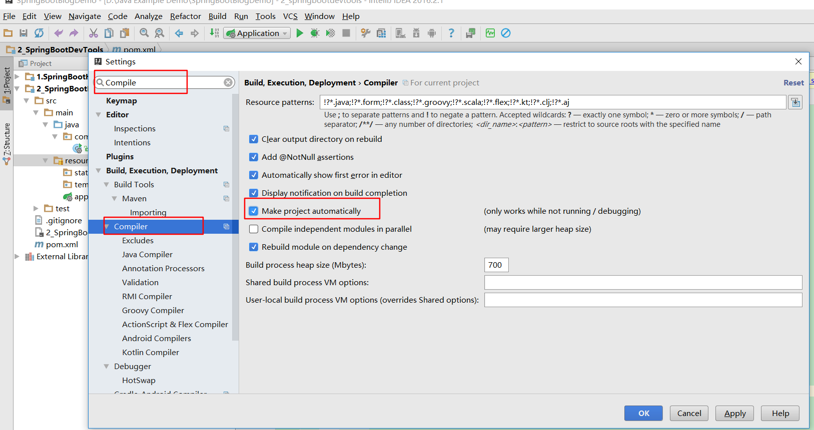

# 第0讲 SpringBoot开发工具

[TOC]
## 1. Idea：2016.2.1



## 2. 配置默认jdk版本：jdk1.8.0_181







## 3. 配置maven：apache-maven-3.3.9

### 3.1. 在maven安装目录下conf文件夹下setting.xml文件中添加阿里云镜像


```xml
<mirror>  
      <id>alimaven</id>  
      <name>aliyun maven</name>  
      <url>http://maven.aliyun.com/nexus/content/groups/public/</url>  
      <mirrorOf>central</mirrorOf>          
</mirror>  

```

### 3.2. idea中配置本地仓库路径



### 3.3 idea中配置自己安装的maven软件



## 4. 个性化配置idea_config

下载路径：https://github.com/kuailexiaoyi/idea_config.git

* 进入IDEA安装目录下的bin目录：



* 编辑,配置idea个性化配置文件路径



## 5. Idea设置自动编译




## 6. SpringBoot: 1.5.7.RELEASE

> Snapshot版本代表不稳定、尚处于开发中的版本，快照版本。  
Release版本则代表稳定的版本，发行版本。

```xml

<parent>
		<groupId>org.springframework.boot</groupId>
		<artifactId>spring-boot-starter-parent</artifactId>
		<version>1.5.7.RELEASE</version>
		<relativePath/> <!-- lookup parent from repository -->
</parent>

```