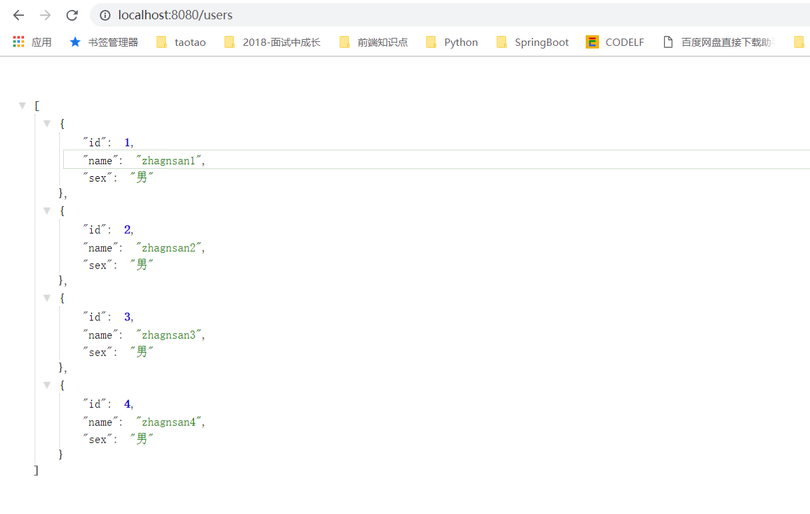

# 第十课 SpringBoot集成FastJson

[TOC]

## 1.FastJson简介：

> Fastjson是一个Java语言编写的高性能功能完善的JSON库。它采用一种“假定有序快速匹配”的算法，把JSON Parse的性能提升到极致，是目前Java语言中最快的JSON库。Fastjson接口简单易用，已经被广泛使用在缓存序列化、协议交互、Web输出、Android客户端等多种应用场景

--- 

## 2. 引入依赖：pom.xml

```java
<dependency>
    <groupId>com.alibaba</groupId>
    <artifactId>fastjson</artifactId>
    <version>1.2.31</version>
</dependency>
```

## 3. 配置FastJson:FastJsonConfiguration

```java
package com.springboot.fastjson.config;

import com.alibaba.fastjson.serializer.SerializerFeature;
import com.alibaba.fastjson.support.config.FastJsonConfig;
import com.alibaba.fastjson.support.spring.FastJsonHttpMessageConverter;
import org.springframework.context.annotation.Configuration;
import org.springframework.http.MediaType;
import org.springframework.http.converter.HttpMessageConverter;
import org.springframework.web.servlet.config.annotation.WebMvcConfigurerAdapter;

import java.util.ArrayList;
import java.util.List;

/**
 * @Description:
 * @Author: zrblog
 * @CreateTime: 2018-09-25 22:52
 * @Version:v1.0
 */
@Configuration
public class FastJsonConfiguration extends WebMvcConfigurerAdapter {

    @Override
    public void configureMessageConverters(List<HttpMessageConverter<?>> converters) {
        FastJsonHttpMessageConverter fastJsonHttpMessageConverter = new FastJsonHttpMessageConverter();

        FastJsonConfig fastJsonConfig = new FastJsonConfig();

        fastJsonConfig.setSerializerFeatures(SerializerFeature.PrettyFormat);

        //处理乱码问题

        List<MediaType> mediaTypes = new ArrayList<>();

        mediaTypes.add(MediaType.APPLICATION_JSON_UTF8);

        fastJsonHttpMessageConverter.setSupportedMediaTypes(mediaTypes);

        fastJsonHttpMessageConverter.setFastJsonConfig(fastJsonConfig);

        converters.add(fastJsonHttpMessageConverter);
    }
}

```

## 4. 编写Entity：

* User.java

```java
package com.springboot.fastjson.domain;

/**
 * @Description:
 * @Author: zrblog
 * @CreateTime: 2018-09-25 23:05
 * @Version:v1.0
 */
public class User {
    private Integer id;

    private String name;

    private String sex;

    public User() {
        super();
    }

    public User(Integer id, String name, String sex) {
        this.id = id;
        this.name = name;
        this.sex = sex;
    }

    public Integer getId() {
        return id;
    }

    public void setId(Integer id) {
        this.id = id;
    }

    public String getName() {
        return name;
    }

    public void setName(String name) {
        this.name = name;
    }

    public String getSex() {
        return sex;
    }

    public void setSex(String sex) {
        this.sex = sex;
    }
}

```

## 5. 编写Controller层：

```java
package com.springboot.fastjson.controller;

import com.springboot.fastjson.domain.User;
import org.springframework.web.bind.annotation.RequestMapping;
import org.springframework.web.bind.annotation.RestController;

import java.util.ArrayList;
import java.util.List;

/**
 * @Description:
 * @Author: zrblog
 * @CreateTime: 2018-09-25 23:04
 * @Version:v1.0
 */
@RestController
public class UserController {

    @RequestMapping("users")
    public List<User> getAllUser() {
        List<User> userList = new ArrayList<User>();

        User user1 = new User(1,"zhagnsan1","男");
        User user2 = new User(2,"zhagnsan2","男");
        User user3 = new User(3,"zhagnsan3","男");
        User user4 = new User(4,"zhagnsan4","男");

        userList.add(user1);
        userList.add(user2);
        userList.add(user3);
        userList.add(user4);
        return userList;
    }

    @RequestMapping("hello")
    public String syHello() {
        return "Hello World";
    }
}

```

## 6. 测试：访问 http://localhost:8080/users

