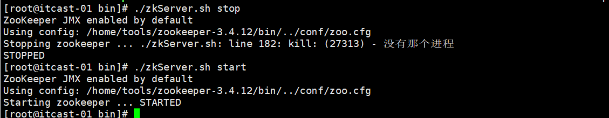
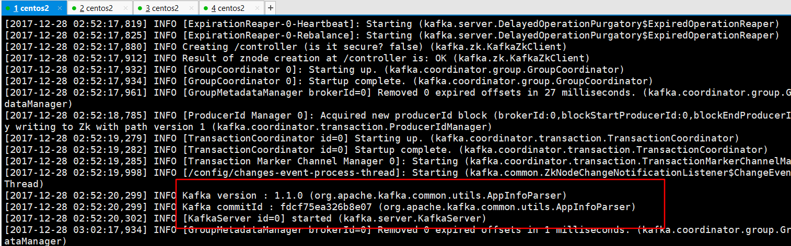
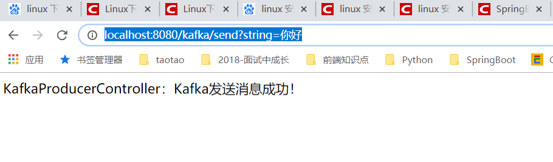
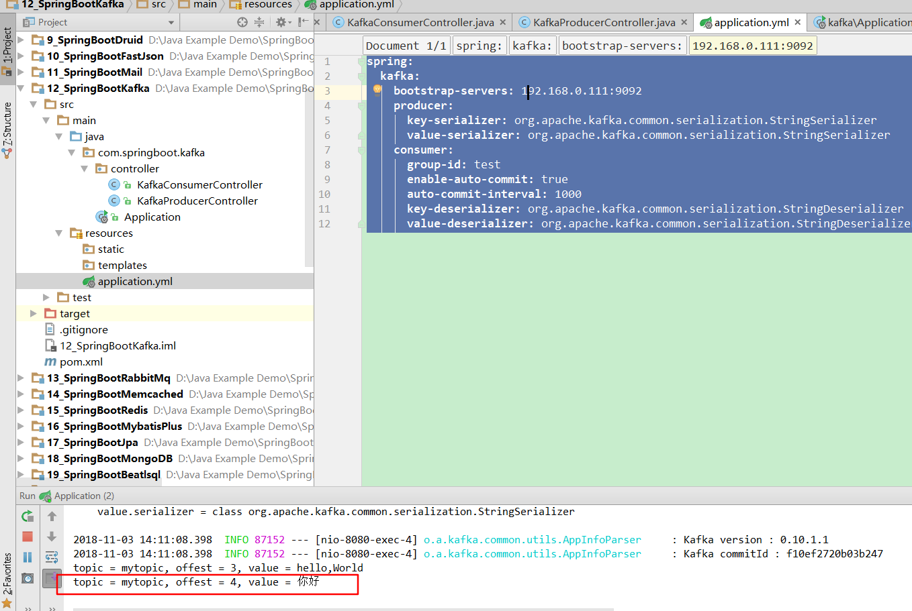

# 第十二课 SpringBoot集成Kafka消息中间件

[TOC]

## 1. kafka简介

> Kafka是由Apache软件基金会开发的一个开源流处理平台，由Scala和Java编写。Kafka是一种高吞吐量的分布式发布订阅消息系统，它可以处理消费者规模的网站中的所有动作流数据。 这种动作（网页浏览，搜索和其他用户的行动）是在现代网络上的许多社会功能的一个关键因素。 这些数据通常是由于吞吐量的要求而通过处理日志和日志聚合来解决。 对于像Hadoop的一样的日志数据和离线分析系统，但又要求实时处理的限制，这是一个可行的解决方案。Kafka的目的是通过Hadoop的并行加载机制来统一线上和离线的消息处理，也是为了通过集群来提供实时的消息。

## 2. linux下启动kafka

* 2.1 百度网盘下载

链接：https://pan.baidu.com/s/1wP3Ki3PogmAQCnSX-cK1kA 
提取码：tuyy 

* 2.2 [Linux下Kafka环境的搭建](https://blog.csdn.net/xuzhelin/article/details/71515208)

* 2.3 启动zookeeper

    - 进入Zookeeper解压包下：/home/tools/zookeeper-3.4.12/bin，运行以下命令，启动zookeeper。
    - 
```
./zkServer.sh start  //启动zookeeper
```


* 2.4 启动kafka

```
./bin/kafka-server-start.bat ./config/server.properties
```



```
创建TOPIC
./kafka-topics.sh --create --zookeeper 192.168.0.111:2181 --replication -factor 1 --partitions 1 --topic mytopic 

创建生产者：
./kafka-console-producer.sh --broker-list 192.168.0.111:9092 --topic mytopic

创建生产者：
./kafka-console-consumer.bat --zookeeper 192.168.0.111:2181 --topic mytopic 

查看topic列表：
./kafka-topics.bat --list --zookeeper 192.168.0.111:2181
```

## 3. SpringBoot集成kafka

### 3.1 引入依赖： pom.xml

```xml
<!--SpringBoot集成kafka-->
<dependency>
    <groupId>org.springframework.kafka</groupId>
    <artifactId>spring-kafka</artifactId>
</dependency>
```

### 3.2 配置kafka：application.yml

```yml
spring:
  kafka:
    bootstrap-servers: 192.168.0.111:9092
    producer:
      key-serializer: org.apache.kafka.common.serialization.StringSerializer
      value-serializer: org.apache.kafka.common.serialization.StringSerializer
    consumer:
      group-id: test
      enable-auto-commit: true
      auto-commit-interval: 1000
      key-deserializer: org.apache.kafka.common.serialization.StringDeserializer
      value-deserializer: org.apache.kafka.common.serialization.StringDeserializer
```

### 3.3 编写消息生成类：KafkaProducerController

```java
package com.springboot.kafka.controller;

import org.springframework.beans.factory.annotation.Autowired;
import org.springframework.kafka.core.KafkaTemplate;
import org.springframework.web.bind.annotation.RequestMapping;
import org.springframework.web.bind.annotation.RestController;

/**
 * @Description:
 * @Author: zrblog
 * @CreateTime: 2018-09-27 07:52
 * @Version:v1.0
 */
@RestController
@RequestMapping("/kafka")
public class KafkaProducerController {

    @Autowired
    private KafkaTemplate<String,String> kafkaTemplate;

    @RequestMapping("/send")
    public String send(String string) {
        kafkaTemplate.send("mytopic", string);
        return "KafkaProducerController：Kafka发送消息成功！";
    }
}

```

### 3.4 编写消息消费类：KafkaConsumerController

```java
package com.springboot.kafka.controller;

import org.apache.kafka.clients.consumer.ConsumerRecord;
import org.springframework.kafka.annotation.KafkaListener;
import org.springframework.stereotype.Component;

/**
 * @Description:
 * @Author: zrblog
 * @CreateTime: 2018-09-27 07:52
 * @Version:v1.0
 */
@Component
public class KafkaConsumerController {

    @KafkaListener(topics = {"mytopic"})
    public void listen(ConsumerRecord<?, ?> record) {

        System.out.printf("topic = %s, offest = %d, value = %s\n",record.topic(),record.offset(),record.value());
    }
}
```

### 3.5 测试：

访问： http://localhost:8080/kafka/send?string=%E4%BD%A0%E5%A5%BD





