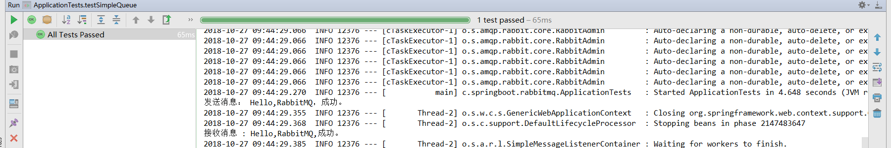
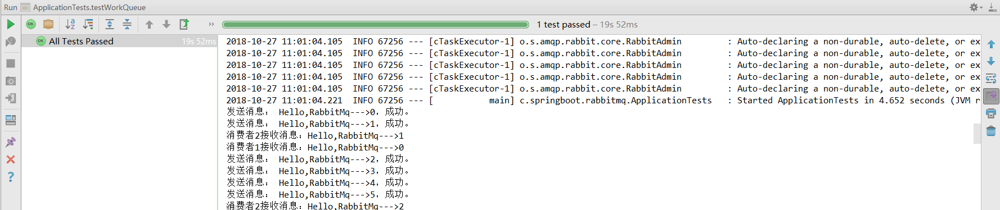
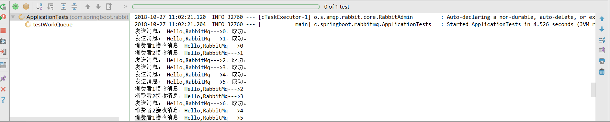
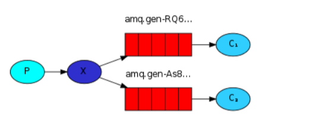
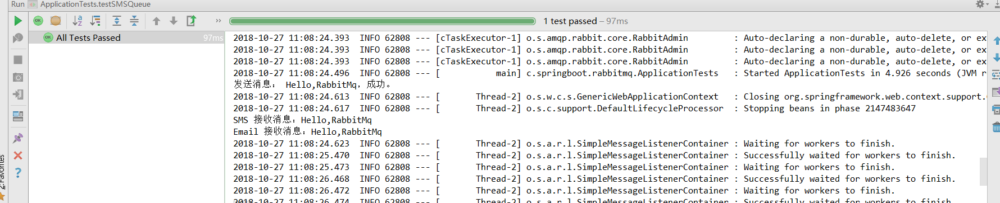
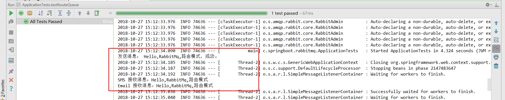
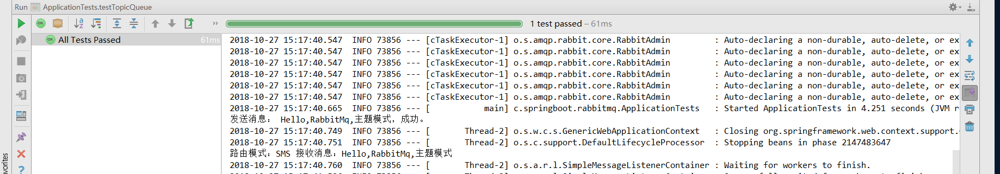

# 第十三讲 SpringBoot集成RabbitMQ

[TOC]

## 1. RabbitMQ百度百科

>MQ全称为Message Queue, 消息队列（MQ）是一种应用程序对应用程序的通信方法。应用程序通过读写出入队列的消息（针对应用程序的数据）来通信，而无需专用连接来链接它们。消息传递指的是程序之间通过在消息中发送数据进行通信，而不是通过直接调用彼此来通信，直接调用通常是用于诸如远程过程调用的技术。排队指的是应用程序通过 队列来通信。队列的使用除去了接收和发送应用程序同时执行的要求。其中较为成熟的MQ产品有IBM WEBSPHERE MQ等等。

## 2.SpringBoot集成RabbitMQ

### 2.1 引入依赖：pom.xml

```xml
<dependency>
    <groupId>org.springframework.boot</groupId>
    <artifactId>spring-boot-starter-amqp</artifactId>
</dependency>
```

### 2.2 配置RabbitMQ: application.yml

```yml
spring:
  rabbitmq:
    host: localhost
    port: 5672
    username: guest
    password: guest
    listener:
      simple:
        prefetch: 0  #1：公平分发模式；0：轮询分发模式

```

### 2.3 队列

#### 2.3.1 简单队列

1. 声明简单队列: RabbitMQConfiguration.java

```java
package com.springboot.rabbitmq.config;

import org.springframework.amqp.core.Queue;
import org.springframework.context.annotation.Bean;
import org.springframework.context.annotation.Configuration;

/**
 * @Description:
 * @Author: zrblog
 * @CreateTime: 2018-09-28 22:08
 * @Version:v1.0
 */
@Configuration
public class RabbitMQConfiguration {

    private static final String QUEUE_SIMPLE_NAME = "test_simple_queue";

    @Bean
    public Queue queue(){
        return new Queue(QUEUE_SIMPLE_NAME,false,false,false,null);
    }
}
```

2. 声明消费者: RabbitMQConsumer.java

```java
package com.springboot.rabbitmq.config;

import org.springframework.amqp.rabbit.annotation.RabbitHandler;
import org.springframework.amqp.rabbit.annotation.RabbitListener;
import org.springframework.stereotype.Component;

/**
 * @Description: 消费者
 * @Author: zrblog
 * @CreateTime: 2018-09-28 22:11
 * @Version:v1.0
 */
@RabbitListener(queues = "test_simple_queue")
@Component
public class RabbitMQConsumer {

    @RabbitHandler
    public void process(String message) {
        System.out.println("接收消息 : " + message + ",成功。");
    }
}

```

3. 测试生产者：ApplicationTests.java

```java
/*
	* 测试简单RabbitMQ简单队列
	*
	* */
	@Test
	public void testSimpleQueue() {
		String message = "Hello,RabbitMQ";
		amqpTemplate.convertAndSend("test_simple_queue",message);
		System.out.println("发送消息： " + message + "，成功。");
	}
```




#### 2.3.2 公平分发模式工作队列

> 公平分发模式在Spring-amqp中是默认的，这种情况也是日常工作中使用最为正常的，轮询模式用的较少，区别在于prefetch默认是1，如果设置为0就是轮询模式。

1. 配置工作队列：RabbitMQWorkConfiguration.java

```java
package com.springboot.rabbitmq.config;

import org.springframework.amqp.core.Queue;
import org.springframework.context.annotation.Bean;
import org.springframework.context.annotation.Configuration;

/**
 * @Description:
 * @Author: zrblog
 * @CreateTime: 2018-09-28 22:21
 * @Version:v1.0
 */
@Configuration
public class RabbitMQWorkConfiguration {

    private final static String QUEUE_WORK_NAME = "test_workfair_queue";

    @Bean
    public Queue workQueue() {
        return new Queue(QUEUE_WORK_NAME, false, false, false, null);
    }
}

```

2. 消费者1：

```java
package com.springboot.rabbitmq.workqueue;

import org.springframework.amqp.rabbit.annotation.RabbitHandler;
import org.springframework.amqp.rabbit.annotation.RabbitListener;
import org.springframework.stereotype.Component;

/**
 * @Description:
 * @Author: zrblog
 * @CreateTime: 2018-09-28 22:22
 * @Version:v1.0
 */
@RabbitListener(queues = "test_workfair_queue")
@Component
public class WorkConsumer1 {


    @RabbitHandler
    public void process(String message) throws InterruptedException {
        System.out.println("消费者1接收消息：" + message);

        Thread.sleep(1000);

    }
}

```

3. 消费者2

```java
package com.springboot.rabbitmq.workqueue;

import org.springframework.amqp.rabbit.annotation.RabbitHandler;
import org.springframework.amqp.rabbit.annotation.RabbitListener;
import org.springframework.stereotype.Component;

/**
 * @Description:
 * @Author: zrblog
 * @CreateTime: 2018-09-28 22:22
 * @Version:v1.0
 */
@RabbitListener(queues = "test_workfair_queue")
@Component
public class WorkConsumer2 {

    @RabbitHandler
    public void process(String message) throws InterruptedException {
        System.out.println("消费者2接收消息：" + message);

        Thread.sleep(1000);

    }
}

```

4. 测试生产者

```java
/*
    * 测试RabbitMQ工作队列
    *
    * */
    @Test
    public void testWorkQueue() {

        for (int i = 0; i < 20;i++){
            String message = "Hello,RabbitMq--->" + i;
            //发送消息
            amqpTemplate.convertAndSend("test_workfair_queue",message);
            System.out.println("发送消息： " + message + "，成功。");
            try {
                Thread.sleep(i*100);
            } catch (InterruptedException e) {
                e.printStackTrace();
            }
        }
    }
```



### 2.3.3 轮询分发模式工作队列

修改application.yml:

```
spring:
  rabbitmq:
    host: localhost
    port: 5672
    username: guest
    password: guest
    listener:
      simple:
        prefetch: 0  #1：公平分发模式；0：轮询分发模式
```




### 2.3.4 订阅模式：FanoutExchange



1. 定义交换机、队列、以及交互及和队列之间的关系

RabbitMQSwsConfiguration.java

```java
package com.springboot.rabbitmq.config;

import org.springframework.amqp.core.Binding;
import org.springframework.amqp.core.BindingBuilder;
import org.springframework.amqp.core.FanoutExchange;
import org.springframework.amqp.core.Queue;
import org.springframework.context.annotation.Bean;
import org.springframework.context.annotation.Configuration;

/**
 * @Description:
 * @Author: zrblog
 * @CreateTime: 2018-09-28 22:36
 * @Version:v1.0
 */
@Configuration
public class RabbitMQSwsConfiguration {

    private final static String EXCHANGE_FANNOUT_NAME = "test_exchange_fanout";
    private final static String QUEUE_PS_SMS_NAME = "test_queue_ps_sms";
    private final static String QUEUE_PS_EMAIL_NAME = "test_queue_ps_email";

    @Bean("fanoutExchange")
    public FanoutExchange fanoutExchange() {
        return new FanoutExchange(EXCHANGE_FANNOUT_NAME);
    }

    @Bean
    public Queue fanoutSmsQueue() {
        return new Queue(QUEUE_PS_SMS_NAME, false, false, false, null);
    }

    @Bean
    public Queue fanoutEmailQueue() {
        return new Queue(QUEUE_PS_EMAIL_NAME, false, false, false, null);
    }

    @Bean
    public Binding smsQueueExchangeBinding(FanoutExchange fanoutExchange, Queue fanoutSmsQueue) {
        return BindingBuilder.bind(fanoutSmsQueue).to(fanoutExchange);
    }

    @Bean
    public Binding emailQueueExchangeBinding(FanoutExchange fanoutExchange, Queue fanoutEmailQueue) {
        return BindingBuilder.bind(fanoutEmailQueue).to(fanoutExchange);
    }
}

```

2. 消费者1:EmailConsumer.java

```java
package com.springboot.rabbitmq.smsqueue;

import org.springframework.amqp.rabbit.annotation.RabbitHandler;
import org.springframework.amqp.rabbit.annotation.RabbitListener;
import org.springframework.stereotype.Component;

/**
 * @Description:
 * @Author: zrblog
 * @CreateTime: 2018-09-28 22:45
 * @Version:v1.0
 */
@RabbitListener(queues = "test_queue_ps_email")
@Component
public class EmailConsumer {

    @RabbitHandler
    public void process(String message) {
        System.out.println("Email 接收消息：" + message);
    }
}

```

3. 消费者2: SmsConsumer.java

```java
package com.springboot.rabbitmq.smsqueue;

import org.springframework.amqp.rabbit.annotation.RabbitHandler;
import org.springframework.amqp.rabbit.annotation.RabbitListener;
import org.springframework.stereotype.Component;

/**
 * @Description:
 * @Author: zrblog
 * @CreateTime: 2018-09-28 22:45
 * @Version:v1.0
 */
@RabbitListener(queues = "test_queue_ps_sms")
@Component
public class SmsConsumer {

    @RabbitHandler
    public void process(String message) {
        System.out.println("SMS 接收消息：" + message);
    }
}

```

4. 测试生产者：

```java
 /*
   * 测试RabbitMQ订阅模式
   *
   * */
    @Test
    public void testSMSQueue() {
        String message = "Hello,RabbitMq";
        //发送消息
        amqpTemplate.convertAndSend("test_exchange_fanout", "",message);
        System.out.println("发送消息： " + message + "，成功。");
    }
```




### 2.3.5 路由模式

1. 配置队列

```java
package com.springboot.rabbitmq.config;

import org.springframework.amqp.core.Binding;
import org.springframework.amqp.core.BindingBuilder;
import org.springframework.amqp.core.DirectExchange;
import org.springframework.amqp.core.Queue;
import org.springframework.context.annotation.Bean;
import org.springframework.context.annotation.Configuration;

/**
 * @Description:
 * @Author: zrblog
 * @CreateTime: 2018-09-28 22:36
 * @Version:v1.0
 */
@Configuration
public class RabbitMQRouteConfiguration {

    private final static String ROUTE_FANNOUT_NAME = "test_route_fanout";
    private final static String QUEUE_ROUTE_SMS_NAME = "test_queue_route_sms";
    private final static String QUEUE_ROUTE_EMAIL_NAME = "test_queue_route_email";

    @Bean("exchange")
    public DirectExchange fanoutExchange() {
        return new DirectExchange(ROUTE_FANNOUT_NAME);
    }

    @Bean
    public Queue queue() {
        return new Queue(QUEUE_ROUTE_SMS_NAME, false, false, false, null);
    }

    @Bean
    public Queue fanoutEmailQueue() {
        return new Queue(QUEUE_ROUTE_EMAIL_NAME, false, false, false, null);
    }

    @Bean
    public Binding smsQueueExchangeBinding(DirectExchange exchange, Queue queue) {
        return BindingBuilder.bind(queue).to(exchange).with("info");
    }

    @Bean
    public Binding emailQueueExchangeBinding(DirectExchange exchange, Queue queue) {
        return BindingBuilder.bind(queue).to(exchange).with("info");
    }
}

```

2. 消费者1：RouteEmailConsumer

```java
package com.springboot.rabbitmq.routequeue;

import org.springframework.amqp.rabbit.annotation.RabbitHandler;
import org.springframework.amqp.rabbit.annotation.RabbitListener;
import org.springframework.stereotype.Component;

/**
 * @Description:
 * @Author: zrblog
 * @CreateTime: 2018-09-28 22:45
 * @Version:v1.0
 */
@RabbitListener(queues = "test_queue_route_email")
@Component
public class RouteEmailConsumer {

    @RabbitHandler
    public void process(String message) {
        System.out.println("路由模式：Email 接收消息：" + message);
    }
}

```

3. 消费者2：RouteSmsConsumer

```java
package com.springboot.rabbitmq.routequeue;

import org.springframework.amqp.rabbit.annotation.RabbitHandler;
import org.springframework.amqp.rabbit.annotation.RabbitListener;
import org.springframework.stereotype.Component;

/**
 * @Description:
 * @Author: zrblog
 * @CreateTime: 2018-09-28 22:45
 * @Version:v1.0
 */
@RabbitListener(queues = "test_queue_route_sms")
@Component
public class RouteSmsConsumer {

    @RabbitHandler
    public void process(String message) {
        System.out.println("路由模式：SMS 接收消息：" + message);
    }
}

```

4. 测试：

```java
 /*
   * 测试RabbitMQ路由模式
   *
   * */
    @Test
    public void testRouteQueue() {
        String message = "Hello,RabbitMq,路由模式";
        //发送消息
        amqpTemplate.convertAndSend("test_exchange_fanout","info" , message);
        System.out.println("发送消息： " + message + "，成功。");
    }
```




### 2.3.6 主题模式:TopicExchange,类似路由模式

1. 配置队列

```java
package com.springboot.rabbitmq.config;

import org.springframework.amqp.core.*;
import org.springframework.context.annotation.Bean;
import org.springframework.context.annotation.Configuration;

/**
 * @Description:
 * @Author: zrblog
 * @CreateTime: 2018-09-28 22:36
 * @Version:v1.0
 */
@Configuration
public class RabbitMQTopicConfiguration {

    private final static String ROUTE_FANNOUT_NAME = "test_topic_fanout";
    private final static String QUEUE_ROUTE_SMS_NAME = "test_queue_topic_sms";
    private final static String QUEUE_ROUTE_EMAIL_NAME = "test_queue_topic_email";

    @Bean("exchange")
    public TopicExchange fanoutExchange() {
        return new TopicExchange(ROUTE_FANNOUT_NAME);
    }

    @Bean
    public Queue smsQueue() {
        return new Queue(QUEUE_ROUTE_SMS_NAME, false, false, false, null);
    }

    @Bean
    public Queue emailQueue() {
        return new Queue(QUEUE_ROUTE_EMAIL_NAME, false, false, false, null);
    }

    @Bean
    public Binding smsQueueExchangeBinding(TopicExchange exchange, Queue queue) {
        return BindingBuilder.bind(queue).to(exchange).with("info");
    }

    @Bean
    public Binding emailQueueExchangeBinding(TopicExchange exchange, Queue queue) {
        return BindingBuilder.bind(queue).to(exchange).with("info");
    }
}

```

2. 消费者：TopicSmsConsumer

```java
package com.springboot.rabbitmq.topic;

import org.springframework.amqp.rabbit.annotation.RabbitHandler;
import org.springframework.amqp.rabbit.annotation.RabbitListener;
import org.springframework.stereotype.Component;

/**
 * @Description:
 * @Author: zrblog
 * @CreateTime: 2018-09-28 22:45
 * @Version:v1.0
 */
@RabbitListener(queues = "test_queue_topic_sms")
@Component
public class TopicSmsConsumer {

    @RabbitHandler
    public void process(String message) {
        System.out.println("主題模式：SMS 接收消息：" + message);
    }
}
```

3. 测试主题模式：

```java
  /*
   * 测试RabbitMQ主題模式
   *
   * */
    @Test
    public void testTopicQueue() {
        String message = "Hello,RabbitMq,主題模式";
        //发送消息
        amqpTemplate.convertAndSend("test_topic_fanout","info" , message);
        System.out.println("发送消息： " + message + "，成功。");
    }
```



参考资源：[SpringBoot整合RabbitMQ](https://blog.csdn.net/saytime/article/details/80541450)