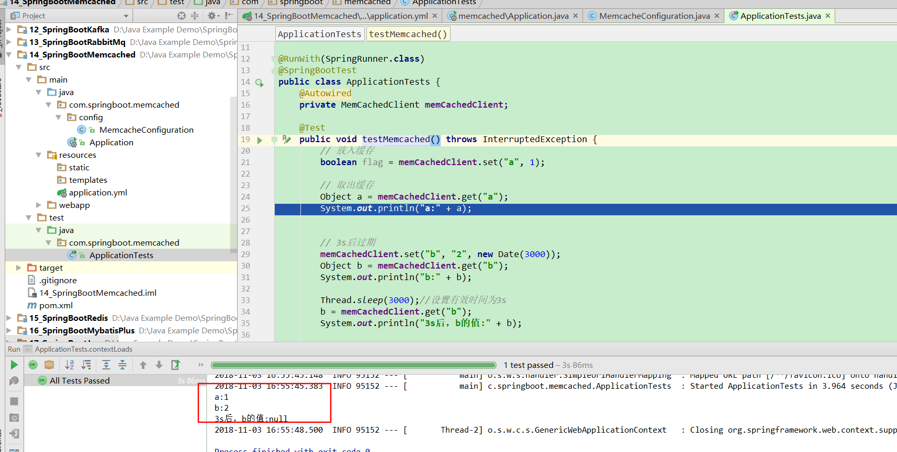

# 第十四课 SpringBoot集成Memcached

[TOC]

## 1. 引入依赖：pom.xml

```xml
<dependency>
            <groupId>commons-pool</groupId>
            <artifactId>commons-pool</artifactId>
            <version>1.5.6</version>
        </dependency>

        <dependency>
            <groupId>com.danga</groupId>
            <artifactId>java_memcached-release</artifactId>
            <version>2.6.6</version>
            <scope>system</scope>
            <systemPath>${project.basedir}/src/main/webapp/WEB-INF/lib/java_memcached-release_2.6.6.jar</systemPath>
        </dependency>

        <dependency>
            <groupId>net.spy</groupId>
            <artifactId>spymemcached</artifactId>
            <version>2.11.3</version>
        </dependency>
```

## 2. 配置Memcache:application.yml

```yml
## Memcache 配置 ##
memcache:
  servers: 192.168.0.111:11211
  failover: true
  initConn: 100
  minConn: 20
  maxConn: 1000
  maintSleep: 50
  nagel: false
  socketTO: 3000
  aliveCheck: true
```

在虚拟机上安装了memcached，安装教程参考[Linux Memcached 安装](http://www.runoob.com/memcached/memcached-install.html)

* memcached作为后台服务运行：

```
memcached -d -m 64M -u root -l 192.168.0.111 -p admin -c 256 -P /tmp/memcached.pid
```

## 3.编写配置类：MemcacheConfiguration

```java
package com.springboot.memcached.config;

import com.danga.MemCached.MemCachedClient;
import com.danga.MemCached.SockIOPool;
import org.springframework.beans.factory.annotation.Value;
import org.springframework.context.annotation.Bean;
import org.springframework.context.annotation.Configuration;

/**
 * @Description:
 * @Author: zrblog
 * @CreateTime: 2018-10-08 09:05
 * @Version:v1.0
 */
@Configuration
public class MemcacheConfiguration {

    @Value("${memcache.servers}")
    private String[] servers;
    @Value("${memcache.failover}")
    private boolean failover;
    @Value("${memcache.initConn}")
    private int initConn;
    @Value("${memcache.minConn}")
    private int minConn;
    @Value("${memcache.maxConn}")
    private int maxConn;
    @Value("${memcache.maintSleep}")
    private int maintSleep;
    @Value("${memcache.nagel}")
    private boolean nagel;
    @Value("${memcache.socketTO}")
    private int socketTO;
    @Value("${memcache.aliveCheck}")
    private boolean aliveCheck;

    @Bean
    public SockIOPool sockIOPool() {
        SockIOPool pool = SockIOPool.getInstance();
        pool.setServers(servers);
        pool.setFailover(failover);
        pool.setInitConn(initConn);
        pool.setMinConn(minConn);
        pool.setMaxConn(maxConn);
        pool.setMaintSleep(maintSleep);
        pool.setNagle(nagel);
        pool.setSocketTO(socketTO);
        pool.setAliveCheck(aliveCheck);
        pool.initialize();
        return pool;
    }

    @Bean
    public MemCachedClient memCachedClient() {
        MemCachedClient memCachedClient = new MemCachedClient();
        return memCachedClient;
    }
}
```

## 4.测试：

```java
package com.springboot.memcached;

import com.danga.MemCached.MemCachedClient;
import org.junit.Test;
import org.junit.runner.RunWith;
import org.springframework.beans.factory.annotation.Autowired;
import org.springframework.boot.test.context.SpringBootTest;
import org.springframework.test.context.junit4.SpringRunner;

import java.util.Date;

@RunWith(SpringRunner.class)
@SpringBootTest
public class ApplicationTests {
    @Autowired
    private MemCachedClient memCachedClient;

    @Test
    public void testMemcached() throws InterruptedException {
        // 放入缓存
        boolean flag = memCachedClient.set("a", 1);

        // 取出缓存
        Object a = memCachedClient.get("a");
        System.out.println("a:" + a);


        // 3s后过期
        memCachedClient.set("b", "2", new Date(3000));
        Object b = memCachedClient.get("b");
        System.out.println("b:" + b);

        Thread.sleep(3000);//设置有效时间为3s
        b = memCachedClient.get("b");
        System.out.println("3s后，b的值:" + b);

    }

}

```


* set与add在key不存在时效果一致，add在key存在时不会成功。

* set与replace在key存在时效果一致，replace在key不存在不会成功。

## 5. 集成过程中遇到的问题

## 5.1 错误提示：

```html
<div style="color:red">
2018-10-08 09:42:32.654 ERROR 14952 --- [           main] c.schooner.MemCached.SchoonerSockIOPool  :   
attempting to get SockIO from uninitialized pool!
</div>
```

---

## 5.2 问题：SockIOPOOl没有初始化,没有执行initialize()方法

```java
 @Bean
    public SockIOPool sockIOPool() {
        SockIOPool pool = SockIOPool.getInstance();
        pool.setServers(servers);
        pool.setFailover(failover);
        pool.setInitConn(initConn);
        pool.setMinConn(minConn);
        pool.setMaxConn(maxConn);
        pool.setMaintSleep(maintSleep);
        pool.setNagle(nagel);
        pool.setSocketTO(socketTO);
        pool.setAliveCheck(aliveCheck);
        return pool;
    }
```

---

## 5.3 解决方法：

```java
    @Bean
    public SockIOPool sockIOPool () {
        SockIOPool pool = SockIOPool.getInstance();
        pool.setServers(servers);
        pool.setFailover(failover);
        pool.setInitConn(initConn);
        pool.setMinConn(minConn);
        pool.setMaxConn(maxConn);
        pool.setMaintSleep(maintSleep);
        pool.setNagle(nagel);
        pool.setSocketTO(socketTO);
        pool.setAliveCheck(aliveCheck);
        pool.initialize();
        return pool;
    }

```