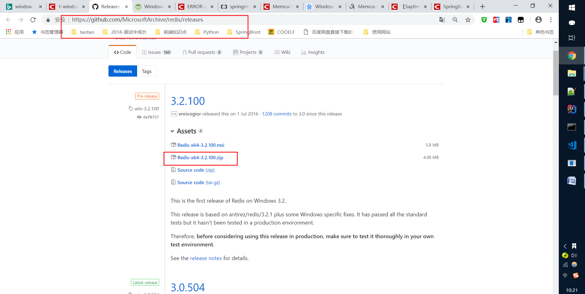
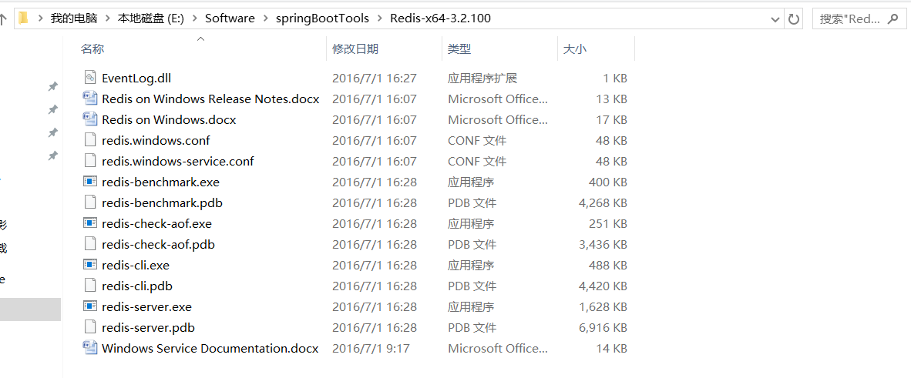
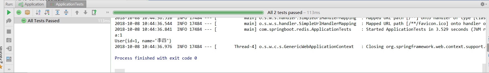

# 第十五课 SpringBoot集成Redis

[TOC]

## 1.Window下安装Redis

### 1.1 下载Redis单机版安装包

下载网址：https://github.com/MicrosoftArchive/redis/releases  



### 1.2 启动Redis

#### 1.2.1 解压压缩包  

  

#### 1.2.2 启动redis  

redis-server.exe redis.windows.conf

#### 1.2.3 配置窗口关闭，redis依然在运行状态

redis-server --service-install redis.windows.conf

然后使用下面命令就可以启动了：  

redis-server --service-start

这样即使Redis服务端的窗口关闭了，也不会影响Redis服务了。

## 2.SpringBoot集成Redis

### 2.1 添加依赖

```xml
<dependency>
    <groupId>org.springframework.boot</groupId>
    <artifactId>spring-boot-starter-data-redis</artifactId>
</dependency>
```

### 2.2 application.yml中配置Redis

```yml
spring:
  redis:
    database: 0
    host: 127.0.0.1
    port: 6379
    timeout: 3000
    pool:
      max-active: 200
      max-wait: 1000
      max-idle: 200
      min-idle: 50
```

### 2.3 RedisConfig类

```java
package com.springboot.redis.config;

import org.springframework.beans.factory.annotation.Autowired;
import org.springframework.context.annotation.Bean;
import org.springframework.context.annotation.Configuration;
import org.springframework.data.redis.connection.RedisConnectionFactory;
import org.springframework.data.redis.connection.jedis.JedisConnectionFactory;
import org.springframework.data.redis.core.RedisTemplate;
import org.springframework.data.redis.serializer.JdkSerializationRedisSerializer;
import org.springframework.data.redis.serializer.StringRedisSerializer;

/**
 * @Description:
 * @Author: zrblog
 * @CreateTime: 2018-10-08 10:04
 * @Version:v1.0
 */
@Configuration
public class RedisConfig {

    @Autowired
    private JedisConnectionFactory jedisConnectionFactory;

    @Bean
    public RedisTemplate<String, Object> redisTemplate(RedisConnectionFactory factory) {
        RedisTemplate<String, Object> redisTemplate = new RedisTemplate<>();
        redisTemplate.setConnectionFactory(jedisConnectionFactory);
        redisTemplate.setKeySerializer(new StringRedisSerializer());
        redisTemplate.setValueSerializer(new JdkSerializationRedisSerializer());
        redisTemplate.afterPropertiesSet();
        return redisTemplate;
    }
}
```

实体User类

```java

package com.springboot.redis.domain;

import java.io.Serializable;

/**
 * @Description:
 * @Author: zrblog
 * @CreateTime: 2018-10-08 10:08
 * @Version:v1.0
 */
public class User implements Serializable {

    private Integer id;
    private String name;

    public User() {
    }

    public User(Integer id, String name) {
        this.id = id;
        this.name = name;
    }

    public Integer getId() {
        return id;
    }

    public void setId(Integer id) {
        this.id = id;
    }

    public String getName() {
        return name;
    }

    public void setName(String name) {
        this.name = name;
    }

    @Override
    public String toString() {
        return "User{" +
                "id=" + id +
                ", name='" + name + '\'' +
                '}';
    }
}

```

### 2.4 测试Redis

```java
package com.springboot.redis;

import com.springboot.redis.domain.User;
import org.junit.Test;
import org.junit.runner.RunWith;
import org.springframework.beans.factory.annotation.Autowired;
import org.springframework.boot.test.context.SpringBootTest;
import org.springframework.data.redis.core.RedisTemplate;
import org.springframework.test.context.junit4.SpringRunner;

@RunWith(SpringRunner.class)
@SpringBootTest
public class ApplicationTests {

    @Autowired
    private RedisTemplate<String, Object> redisTemplate;

    @Test
    public void contextLoads() {
    }

    @Test
    public void redisTest() {

        //存儲字符串
        redisTemplate.opsForValue().set("a", 1);

        Object a = redisTemplate.opsForValue().get("a");
        System.out.println("a:" + a);

        //存取user对象
        User user = new User(1, "李四");

        redisTemplate.opsForValue().set("user",user);

        Object result = redisTemplate.opsForValue().get("user");

        System.out.println(result.toString());
    }
}

```
测试结果：  

