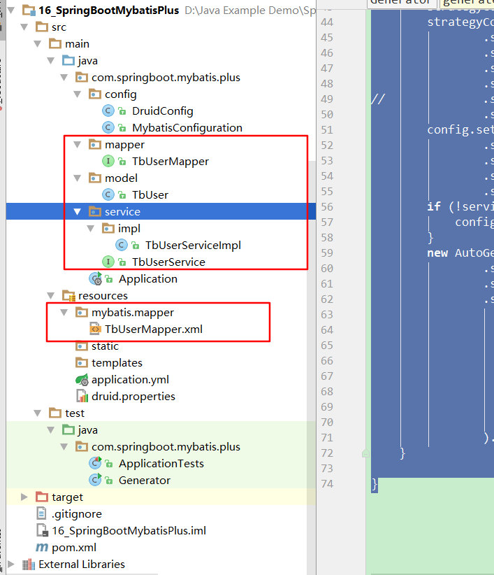

# 第十六课 SpringBoot集成Mybatis-plus

[TOC]

## 1. 添加依赖

```xml

<dependency>
            <groupId>org.springframework.boot</groupId>
            <artifactId>spring-boot-starter</artifactId>
        </dependency>

		<dependency>
			<groupId>org.springframework.boot</groupId>
			<artifactId>spring-boot-starter-web</artifactId>
		</dependency>

        <!--Druid数据连接池-->
        <dependency>
            <groupId>com.alibaba</groupId>
            <artifactId>druid</artifactId>
            <version>1.1.0</version>
        </dependency>

        <!-- mysql connector数据库驱动 -->
        <dependency>
            <groupId>mysql</groupId>
            <artifactId>mysql-connector-java</artifactId>
            <scope>runtime</scope>
        </dependency>


        <!-- Mybatis-plus依赖 -->
        <dependency>
            <groupId>com.baomidou</groupId>
            <artifactId>mybatisplus-spring-boot-starter</artifactId>
            <version>1.0.5</version>
        </dependency>
        <dependency>
            <groupId>com.baomidou</groupId>
            <artifactId>mybatis-plus</artifactId>
            <version>${mybatis-plus.version}</version>
        </dependency>

        <dependency>
			<groupId>org.springframework.boot</groupId>
			<artifactId>spring-boot-starter-test</artifactId>
			<scope>test</scope>
		</dependency>
```

## 2. 数据库

```sql
/*Table structure for table `tb_user` */

DROP TABLE IF EXISTS `tb_user`;

CREATE TABLE `tb_user` (
  `id` int(11) NOT NULL AUTO_INCREMENT COMMENT 'ID',
  `username` varchar(50) DEFAULT NULL COMMENT '用户名',
  `age` int(11) DEFAULT NULL COMMENT '年龄',
  `ctm` datetime DEFAULT NULL COMMENT '创建时间',
  PRIMARY KEY (`id`)
) ENGINE=InnoDB AUTO_INCREMENT=7 DEFAULT CHARSET=utf8;

/*Data for the table `tb_user` */

insert  into `tb_user`(`id`,`username`,`age`,`ctm`) values (1,'张三',18,'2018-09-22 10:34:17'),(2,'Honey',22,'2018-09-22 10:34:17'),(3,'王五',19,'2018-09-22 10:34:17'),(5,'Tony',66,NULL),(6,'Jack',23,NULL);
```

## 3.代码详情

### 3.1 application.yml

```yml
spring:
  datasource:
    driver-class-name: com.mysql.jdbc.Driver
    url: jdbc:mysql://127.0.0.1:3306/test?useUnicode=true&characterEncoding=utf8&autoReconnect=true&useSSL=false
    username: root
    password: root


mybatis-plus:
  # 如果是放在src/main/java目录下 classpath:/com/yourpackage/*/mapper/*Mapper.xml
  # 如果是放在resource目录 classpath:/mapper/*Mapper.xml
  mapper-locations: classpath:mybatis/mappers/*Mapper.xml
  #实体扫描，多个package用逗号或者分号分隔
  typeAliasesPackage: cn.saytime.model
  global-config:
    #主键类型  0:"数据库ID自增", 1:"用户输入ID",2:"全局唯一ID (数字类型唯一ID)", 3:"全局唯一ID UUID";
    id-type: 0
    #字段策略 0:"忽略判断",1:"非 NULL 判断"),2:"非空判断"
    field-strategy: 1
    #驼峰下划线转换
    #db-column-underline: true
    #刷新mapper 调试神器
    #refresh-mapper: true
    #数据库大写下划线转换
    #capital-mode: true
    # Sequence序列接口实现类配置
    #key-generator: com.baomidou.mybatisplus.incrementer.OracleKeyGenerator
    #逻辑删除配置（下面3个配置）
    #logic-delete-value: 1
    #logic-not-delete-value: 0
    #sql-injector: com.baomidou.mybatisplus.mapper.LogicSqlInjector
    #自定义填充策略接口实现
    #meta-object-handler: com.baomidou.springboot.MyMetaObjectHandler
  configuration:
    map-underscore-to-camel-case: true
    cache-enabled: false
    #配置JdbcTypeForNull
    jdbc-type-for-null: 'null'

```

### 3.2 druid.properties

```properties
#--------------------------
# 下面为连接池的补充设置，应用到上面所有数据源中
# 初始化大小，最小，最大
spring.datasource.initialSize=5
spring.datasource.minIdle=1
spring.datasource.maxActive=50
# 配置获取连接等待超时的时间
spring.datasource.maxWait=60000
# 配置间隔多久才进行一次检测，检测需要关闭的空闲连接，单位是毫秒
spring.datasource.timeBetweenEvictionRunsMillis=60000
# 配置一个连接在池中最小生存的时间，单位是毫秒
spring.datasource.minEvictableIdleTimeMillis=300000
spring.datasource.validationQuery=SELECT 1 FROM DUAL
spring.datasource.testWhileIdle=true
spring.datasource.testOnBorrow=false
spring.datasource.testOnReturn=false
# 打开PSCache，并且指定每个连接上PSCache的大小
spring.datasource.poolPreparedStatements=false
#spring.datasource.maxPoolPreparedStatementPerConnectionSize=20
# 配置监控统计拦截的filters，去掉后监控界面sql无法统计，'wall'用于防火墙
spring.datasource.filters=stat,wall,log4j
# 通过connectProperties属性来打开mergeSql功能；慢SQL记录
spring.datasource.connectionProperties=druid.stat.mergeSql=true;druid.stat.slowSqlMillis=5000
# 合并多个DruidDataSource的监控数据
#spring.datasource.useGlobalDataSourceStat=true

```

### 3.3 DruidConfig类

```java
package com.springboot.mybatis.plus.config;

import com.alibaba.druid.pool.DruidDataSource;
import org.springframework.boot.context.properties.ConfigurationProperties;
import org.springframework.context.annotation.Bean;
import org.springframework.context.annotation.Configuration;
import org.springframework.context.annotation.PropertySource;

import javax.sql.DataSource;

@Configuration
@PropertySource(value = "classpath:druid.properties")
public class DruidConfig {

    @Bean(destroyMethod = "close",initMethod = "init")
    @ConfigurationProperties(prefix = "spring.datasource")
    public DataSource druidDataSource() {
        DruidDataSource druidDataSource = new DruidDataSource();

        return druidDataSource;
    }
}

```

### 3.4 MybatisConfiguration类

```java
package com.springboot.mybatis.plus.config;

import com.baomidou.mybatisplus.plugins.PaginationInterceptor;
import org.mybatis.spring.annotation.MapperScan;
import org.springframework.context.annotation.Bean;
import org.springframework.context.annotation.Configuration;

@Configuration
@MapperScan("com.springboot.mybatis.plus.mapper*")
public class MybatisConfiguration {

    /**
     *
     * 分页组件,自动识别数据库类型
     * 多租户，请参考官网【插件扩展】
     */
    @Bean
    public PaginationInterceptor paginationInterceptor() {
        return new PaginationInterceptor();
    }


}

```

### 3.5 自动代码生成工具类

```java
package com.springboot.mybatis.plus;

import com.baomidou.mybatisplus.generator.AutoGenerator;
import com.baomidou.mybatisplus.generator.config.DataSourceConfig;
import com.baomidou.mybatisplus.generator.config.GlobalConfig;
import com.baomidou.mybatisplus.generator.config.PackageConfig;
import com.baomidou.mybatisplus.generator.config.StrategyConfig;
import com.baomidou.mybatisplus.generator.config.rules.DbType;
import com.baomidou.mybatisplus.generator.config.rules.NamingStrategy;


public class Generator {

    public static void main(String[] args) {
        String packageName = "com.springboot.mybatis.plus";
        boolean serviceNameStartWithI = false;//auth -> UserService, 设置成true: auth -> IUserService
        generateByTables(false, packageName, "zrblog", "ssm", "tb_user");

        System.out.println("completed...");
    }

    /**
     * @param serviceNameStartWithI
     * @param packageName   包名
     * @param author  作者
     * @param database  数据库名
     * @param tableNames 表名
     */
    private static void generateByTables(boolean serviceNameStartWithI, String packageName, String author, String database, String... tableNames) {
        GlobalConfig config = new GlobalConfig();
        String dbUrl = "jdbc:mysql://127.0.0.1:3306/" + database + "?useUnicode=true&characterEncoding=utf8&autoReconnect=true&useSSL=false";
        DataSourceConfig dataSourceConfig = new DataSourceConfig();
        dataSourceConfig.setDbType(DbType.MYSQL)
                .setUrl(dbUrl)
                .setUsername("root")
                .setPassword("root")
                .setDriverName("com.mysql.jdbc.Driver");
        StrategyConfig strategyConfig = new StrategyConfig();
        strategyConfig
                .setCapitalMode(true)
                .setEntityLombokModel(false)
                .setDbColumnUnderline(true)
                .setNaming(NamingStrategy.underline_to_camel)
//              .setSuperMapperClass("cn.saytime.mapper.BaseMapper")
                .setInclude(tableNames);//修改替换成你需要的表名，多个表名传数组
        config.setActiveRecord(false)
                .setAuthor(author)
                .setOutputDir("e:\\codeGen")
                .setFileOverride(true)
                .setEnableCache(false);
        if (!serviceNameStartWithI) {
            config.setServiceName("%sService");
        }
        new AutoGenerator().setGlobalConfig(config)
                .setDataSource(dataSourceConfig)
                .setStrategy(strategyConfig)
                .setPackageInfo(
                        new PackageConfig()
                                .setParent(packageName)
                                .setController("web")
                                .setEntity("model")
                                .setMapper("mapper")
                                .setService("service")
                                .setServiceImpl("service.impl")
                                .setXml("mybatis.mappers")
                ).execute();
    }

}
```

## 4. 执行Generate的main方法，到输出路径，发现代码文件已经生成好了。

```
com
    springboot
        mybatis
            plus
                model
                    TbUser.java
                mapper
                    TbUserMapper.java
                service
                    impl
                        TbUserServiceImpl.java
                    TbUserService.java
                web
                    TbUserController.java
                mybatis
                    mappers
                        TbUserMapper.xml

```

将model,mapper,service文件夹下的代码放到项目的com.springboot.mybatis.plus目录下，将mybatis/mappers文件夹拷贝到src/main/resources目录下。最终目录结构如下


## 5. 测试代码

```java
package com.springboot.mybatis.plus;

import com.springboot.mybatis.plus.model.TbUser;
import com.springboot.mybatis.plus.service.TbUserService;
import org.junit.Test;
import org.junit.runner.RunWith;
import org.springframework.beans.factory.annotation.Autowired;
import org.springframework.boot.test.context.SpringBootTest;
import org.springframework.test.context.junit4.SpringRunner;

@RunWith(SpringRunner.class)
@SpringBootTest
public class ApplicationTests {

    @Autowired
    private TbUserService tbUserService;

	@Test
	public void contextLoads() {
	}

	@Test
    public void queryAllUser() {
        List<TbUser> users = tbUserService.selectList(null);
        System.out.println(users);
    }

}

```

> 输出结果：[TbUser{, id=1, username=张三, age=18, ctm=Sat Sep 22 10:34:17 CST 2018}, TbUser{, id=2, username=Honey, age=22, ctm=Sat Sep 22 10:34:17 CST 2018}, TbUser{, id=3, username=王五, age=19, ctm=Sat Sep 22 10:34:17 CST 2018}, TbUser{, id=5, username=Tony, age=66, ctm=null}, TbUser{, id=6, username=Jack, age=23, ctm=null}]

## 6. mybatis-plus其他使用方式

### 6.1 更加id查询用户

```java
TbUser users = tbUserService.selectById(1);
```

### 6.2 查询名字是张三的用户

```java
TbUser user = tbUserService.selectOne(new EntityWrapper<TbUser>().eq("username", "张三"));
```

### 6.3 查询id > 1 的用户

```java
List<TbUser> userList = tbUserService.selectList(new EntityWrapper<TbUser>().gt("id", 1));
```

### 6.4 添加用户

```java
TbUser user = new TbUser();
user.setName("赵六");
boolean insert = tbUserService.insert(user);
```

### 6.4 删除用户

```java
boolean b = tbUserService.deleteById(1);
```

### 6.5 更新用户

```java
TbUser user = tbUserService.selectById(1);
user.setName("张三2");
boolean b = tbUserService.updateById(user)
```

### 6.6 分页查询用户：查询id>1 每页一条数据，第二页，也就是第三条数据。

```java
Page<TbUser> page = new Page<>();
page.setCurrent(2);
page.setSize(1);
tbUserService.selectPage(page, new EntityWrapper<User>().gt("id", 1));
List<User> userList = page.getRecords();
System.out.println(userList);

```