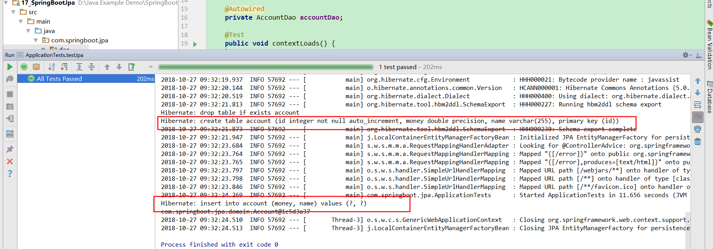
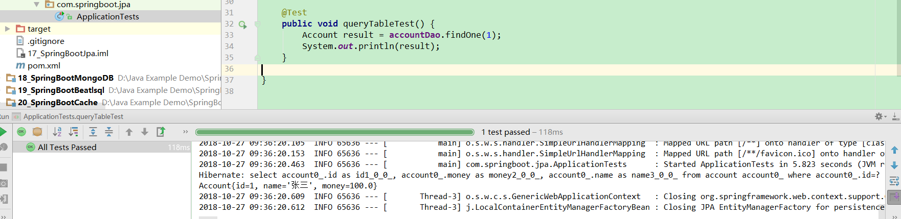

# 第十七讲 SpringBoot集成Jpa

[TOC]

## 1. JPA百度百科

> JPA是Java Persistence API的简称，中文名Java持久层API，是JDK 5.0注解或XML描述对象－关系表的映射关系，并将运行期的实体对象持久化到数据库中。 [1] 

>Sun引入新的JPA ORM规范出于两个原因：其一，简化现有Java EE和Java SE应用开发工作；其二，Sun希望整合ORM技术，实现天下归一。

## 2. SpringBoot集成Jpa

### 2.1 引入依赖：pom.xml

```xml
    <dependency>
        <groupId>org.springframework.boot</groupId>
        <artifactId>spring-boot-starter-data-jpa</artifactId>
    </dependency>
    <dependency>
        <groupId>mysql</groupId>
        <artifactId>mysql-connector-java</artifactId>
    </dependency>
```

### 2.2 配置数据源：application.yml

```yml
spring:
  datasource:
    driver-class-name: com.mysql.jdbc.Driver
    url: jdbc:mysql://localhost:3306/ssm
    username: root
    password: root

  jpa:
    hibernate:
      ddl-auto: update
    show-sql: true
```

* 将jpa.hibernate.ddl-auto设置为：create,可以通过jpa在数据库中建表。但是建表成功之后，要将jpa.hibernate.ddl-auto设置为：update，否则每次重启工程会删除表并新建。

### 2.3 持久层：Account.java

> @Entity 表明是一个映射的实体类

```java
package com.springboot.jpa.domain;

import javax.persistence.Entity;
import javax.persistence.GeneratedValue;
import javax.persistence.Id;

/**
 * @Description:
 * @Author: zrblog
 * @CreateTime: 2018-10-10 22:51
 * @Version:v1.0
 */

@Entity
public class Account {

    @Id
    @GeneratedValue //表示字段自动生成
    private Integer id;

    private String name;

    private Double money;

    public Account() {
        super();
    }

    public Account(Integer id, String name, Double money) {
        this.id = id;
        this.name = name;
        this.money = money;
    }

    public Integer getId() {
        return id;
    }

    public void setId(Integer id) {
        this.id = id;
    }

    public String getName() {
        return name;
    }

    public void setName(String name) {
        this.name = name;
    }

    public Double getMoney() {
        return money;
    }

    public void setMoney(Double money) {
        this.money = money;
    }
}

```

### 2.4 Dao层：AccountDao.java

> 编写一个继承JpaRepository的接口就能完成数据访问，JpaRepository<Account,Integer>中Account表示对象名，Integer表示主键的类型,一般是Integer类型或者是Long类型。

```java
package com.springboot.jpa.dao;

import com.springboot.jpa.domain.Account;
import org.springframework.data.jpa.repository.JpaRepository;

/**
 * @Description:
 * @Author: zrblog
 * @CreateTime: 2018-10-10 22:53
 * @Version:v1.0
 */
public interface AccountDao extends JpaRepository<Account,Integer> {
}


```

### 2.5 建表测试

> 将jpa.hibernate.ddl-auto设置为：create

```java
package com.springboot.jpa;

import com.springboot.jpa.dao.AccountDao;
import com.springboot.jpa.domain.Account;
import org.junit.Test;
import org.junit.runner.RunWith;
import org.springframework.beans.factory.annotation.Autowired;
import org.springframework.boot.test.context.SpringBootTest;
import org.springframework.test.context.junit4.SpringRunner;

@RunWith(SpringRunner.class)
@SpringBootTest
public class ApplicationTests {

	@Autowired
	private AccountDao accountDao;

	@Test
	public void contextLoads() {
	}

	@Test
	public void createTableTest() {
		Account account = new Account();
		account.setName("张三");
		account.setMoney(100.0);
        Account result = accountDao.save(account);
        System.out.println(result);
    }

}

```

* 测试结果:如果出现下图表示建表成功，并且插入数据成功。



### 2.6 查询测试

```java
    @Test
    public void queryTableTest() {
        Account result = accountDao.findOne(1);
        System.out.println(result);
    }

```

测试结果：如果出现如下图所示表示查询成功

