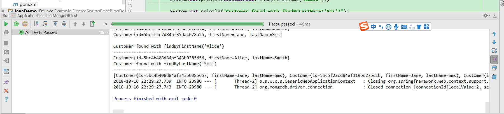

# 第十八讲 SpringBoot集成MongoDB

[TOC]

## 1. MongoDB介绍

> MongoDB 是一个基于分布式文件存储的数据库。由C++语言编写。旨在为WEB应用提供可扩展的高性能数据存储解决方案。

> MongoDB   是一个介于关系数据库和非关系数据库之间的产品，是非关系数据库当中功能最丰富，最像关系数据库的。它支持的数据结构非常松散，是类似json的bson格式，因此可以存储比较复杂的数据类型。Mongo最大的特点是它支持的查询语言非常强大，其语法有点类似于面向对象的查询语言，几乎可以实现类似关系数据库单表查询的绝大部分功能，而且还支持对数据建立索引。

## 2. Window下安装MongoDB

[Window10系统下安装MongoDB](https://blog.csdn.net/kye055947/article/details/82526398)

## 3. SpringBoot集成MongoDB

### 3.1 POM.xml添加依赖

```xml
<!--springboot集成mongodb-->
<dependency>
    <groupId>org.springframework.boot</groupId>
    <artifactId>spring-boot-starter-data-mongodb</artifactId>
</dependency>
```

### 3.2 application.yml添加配置

```yml
spring:
  data:
    mongodb:
      uri: mongodb://localhost:27017/springboot-db
```

### 3.3 SpringBoot集成MongoDB

1. Customer.java

```java
package com.springboot.mongodb.entity;

import org.springframework.data.annotation.Id;

/**
 * @Description:
 * @Author: zrblog
 * @CreateTime: 2018-10-15 23:12
 * @Version:v1.0
 */
public class Customer {

    @Id
    public String id;

    public String firstName;

    public String lastName;

    public Customer() {
        super();
    }

    public Customer(String firstName, String lastName) {
        this.firstName = firstName;
        this.lastName = lastName;
    }

    public String getId() {
        return id;
    }

    public void setId(String id) {
        this.id = id;
    }

    public String getfirstName() {
        return firstName;
    }

    public void setfirstName(String firstName) {
        this.firstName = firstName;
    }

    public String getlastName() {
        return lastName;
    }

    public void setlastName(String lastName) {
        this.lastName = lastName;
    }

    @Override
    public java.lang.String toString() {
        return "Customer{" +
                "id=" + id +
                ", firstName=" + firstName +
                ", lastName=" + lastName +
                '}';
    }
}

```

2. CustomerDao.java

```java
package com.springboot.mongodb.dao;

import com.springboot.mongodb.entity.Customer;
import org.springframework.data.mongodb.repository.MongoRepository;

import java.util.List;

/**
 * @Description:
 * @Author: zrblog
 * @CreateTime: 2018-10-15 23:14
 * @Version:v1.0
 */
public interface CustomerDao extends MongoRepository<Customer, String> {
    public Customer findByFirstName(String firstName);
    public List<Customer> findByLastName(String lastName);
}

```

3. 编写测试用例ApplicationTest.java

```java
package com.springboot.mongodb;

import com.springboot.mongodb.dao.CustomerDao;
import com.springboot.mongodb.entity.Customer;
import org.junit.Test;
import org.junit.runner.RunWith;
import org.springframework.beans.factory.annotation.Autowired;
import org.springframework.boot.test.context.SpringBootTest;
import org.springframework.test.context.junit4.SpringRunner;

import java.util.List;

@RunWith(SpringRunner.class)
@SpringBootTest
public class ApplicationTests {

    @Autowired
    private CustomerDao customerDao;

	@Test
	public void contextLoads() {
	}

	@Test
	public void testMongoDBTest() {
        customerDao.save(new Customer("Alice", "Smith"));
        customerDao.save(new Customer("Jane", "Sms"));

        System.out.println("Customers found with findAll()");

        System.out.println("---------------------------------");

        //获取所有的用户
        List<Customer> results = customerDao.findAll();
        for (Customer result : results) {
            System.out.println(result);
        }

        System.out.println();

        //获取指定用户
        System.out.println("Customer found with findByFirstName('Alice')");
        System.out.println("------------------------------");
        System.out.println(customerDao.findByFirstName("Alice"));

        System.out.println("Customer found with findByLastName('Sms')");
        System.out.println("------------------------------");
        System.out.println(customerDao.findByLastName("Sms"));


    }

}

```

4. 测试结果

