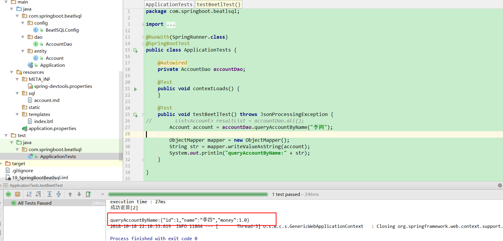

# 第十九讲 SpringBoot集成BeetlSQL

[TOC]

## 1.BeetlSQL简介：

> BeetSql是一个全功能DAO工具， 同时具有Hibernate 优点 & Mybatis优点功能，适用于承认以SQL为中心，同时又需求工具能自动能生成大量常用的SQL的应用。

>1.1 开发效率
无需注解，自动使用大量内置SQL，轻易完成增删改查功能，节省50%的开发工作量
数据模型支持Pojo，也支持Map/List这种快速模型，也支持混合模型
SQL 模板基于Beetl实现，更容易写和调试，以及扩展
可以针对单个表(或者视图）代码生成pojo类和sql模版，甚至是整个数据库。能减少代码编写工作量

> 1.2 维护性
SQL 以更简洁的方式，Markdown方式集中管理，同时方便程序开发和数据库SQL调试。
可以自动将sql文件映射为dao接口类
灵活直观的支持支持一对一，一对多，多对多关系映射而不引入复杂的OR Mapping概念和技术。
具备Interceptor功能，可以调试，性能诊断SQL，以及扩展其他功能

> 1.3 其他
内置支持主从数据库支持的开源工具
性能数倍于JPA，MyBatis
支持跨数据库平台，开发者所需工作减少到最小，目前跨数据库支持mysql,postgres,oracle,sqlserver,h2,sqllite,DB2.

[BeetlSQL 2.10中文文档](http://ibeetl.com/guide/beetlsql.html)

## 2.SpringBoot集成BeetlSQL

### 2.1 pom.xml文件导入依赖

```xml
<dependency>
            <groupId>org.springframework.boot</groupId>
            <artifactId>spring-boot-devtools</artifactId>
            <optional>true</optional>
        </dependency>

		<!--SpringBoot集成BeatlSql-->
		<dependency>
			<groupId>com.ibeetl</groupId>
			<artifactId>beetl</artifactId>
			<version>2.3.2</version>
		</dependency>

        <dependency>
            <groupId>com.ibeetl</groupId>
            <artifactId>beetlsql</artifactId>
            <version>2.3.1</version>
        </dependency>

        <!--MYSQL驱动-->
        <dependency>
            <groupId>mysql</groupId>
            <artifactId>mysql-connector-java</artifactId>
            <version>5.1.44</version>
        </dependency>


        <dependency>
            <groupId>org.springframework</groupId>
            <artifactId>spring-jdbc</artifactId>
            <version>5.1.0.BUILD-SNAPSHOT</version>
        </dependency>


        <dependency>
            <groupId>org.apache.commons</groupId>
            <artifactId>commons-dbcp2</artifactId>
            <version>2.4.0</version>
        </dependency>
```


### 2.2 配置BeetlSQL

>springboot没有对beetlsql快速启动装配，需要手动导入相关的bean，包括数据源，包扫描，事务管理器等

**BeatlSQLConfig.java**

```java
package com.springboot.beatlsql.config;

import org.beetl.core.resource.WebAppResourceLoader;
import org.beetl.ext.spring.BeetlGroupUtilConfiguration;
import org.beetl.ext.spring.BeetlSpringViewResolver;
import org.beetl.sql.core.ClasspathLoader;
import org.beetl.sql.core.Interceptor;
import org.beetl.sql.core.UnderlinedNameConversion;
import org.beetl.sql.core.db.MySqlStyle;
import org.beetl.sql.ext.DebugInterceptor;
import org.beetl.sql.ext.spring4.BeetlSqlDataSource;
import org.beetl.sql.ext.spring4.BeetlSqlScannerConfigurer;
import org.beetl.sql.ext.spring4.SqlManagerFactoryBean;
import org.springframework.beans.factory.annotation.Qualifier;
import org.springframework.boot.autoconfigure.jdbc.DataSourceBuilder;
import org.springframework.context.annotation.Bean;
import org.springframework.context.annotation.Configuration;
import org.springframework.context.annotation.Primary;
import org.springframework.core.io.DefaultResourceLoader;
import org.springframework.core.io.support.ResourcePatternResolver;
import org.springframework.core.io.support.ResourcePatternUtils;
import org.springframework.jdbc.datasource.DataSourceTransactionManager;

import javax.sql.DataSource;
import java.io.IOException;

/**
 * @Description:
 * @Author: zrblog
 * @CreateTime: 2018-10-16 22:43
 * @Version:v1.0
 */
@Configuration
public class BeatlSQLConfig {

    @Bean(initMethod = "init", name = "beetlConfig")
    public BeetlGroupUtilConfiguration getBeetlGroupUtilConfiguration() {
        BeetlGroupUtilConfiguration beetlGroupUtilConfiguration = new BeetlGroupUtilConfiguration();

        ResourcePatternResolver patternResolver = ResourcePatternUtils.getResourcePatternResolver(new DefaultResourceLoader());

        try {
            WebAppResourceLoader webAppResourceLoader = new WebAppResourceLoader(patternResolver.getResource("classpath:/templates").getFile().getPath());
            beetlGroupUtilConfiguration.setResourceLoader(webAppResourceLoader);

        } catch (IOException e) {
            e.printStackTrace();
        }

        return beetlGroupUtilConfiguration;
    }

    @Bean(name = "beetlViewResolver")
    public BeetlSpringViewResolver getBeetlSpringViewResolver(@Qualifier("beetlConfig") BeetlGroupUtilConfiguration beetlGroupUtilConfiguration) {
        BeetlSpringViewResolver beetlSpringViewResolver = new BeetlSpringViewResolver();
        beetlSpringViewResolver.setContentType("text/html;charset=UTF-8");
        beetlSpringViewResolver.setOrder(0);
        beetlSpringViewResolver.setConfig(beetlGroupUtilConfiguration);
        return beetlSpringViewResolver;
    }

    //配置包扫描
    @Bean(name = "beetlSqlScannerConfigurer")
    public BeetlSqlScannerConfigurer getBeetlSqlScannerConfigurer() {
        BeetlSqlScannerConfigurer config = new BeetlSqlScannerConfigurer();
        config.setBasePackage("com.springboot.beatlsql.dao");
        config.setDaoSuffix("Dao");
        config.setSqlManagerFactoryBeanName("sqlManagerFactoryBean");
        return config;
    }

    @Bean(name = "sqlManagerFactoryBean")
    @Primary
    public SqlManagerFactoryBean getSqlManagerFactoryBean(@Qualifier("dataSource") DataSource dataSource) {
        SqlManagerFactoryBean factoryBean = new SqlManagerFactoryBean();

        BeetlSqlDataSource sqlDataSource = new BeetlSqlDataSource();
        sqlDataSource.setMasterSource(dataSource);
        factoryBean.setCs(sqlDataSource);
        factoryBean.setDbStyle(new MySqlStyle());
        factoryBean.setInterceptors(new Interceptor[]{new DebugInterceptor()});
        factoryBean.setNc(new UnderlinedNameConversion()); //开启驼峰
        factoryBean.setSqlLoader(new ClasspathLoader("/sql")); //sql文件路径
        return factoryBean;
    }

    //配置数据库
    @Bean(name = "dataSource")
    public DataSource getDataSource() {
        return DataSourceBuilder.create().url("jdbc:mysql://127.0.0.1:3306/ssm").username("root").password("root").build();
    }

    //开启事务
    @Bean(name = "txManager")
    public DataSourceTransactionManager getDataSourceTransactionManager(@Qualifier("dataSource") DataSource dataSource) {
        DataSourceTransactionManager transactionManager = new DataSourceTransactionManager();
        transactionManager.setDataSource(dataSource);
        return transactionManager;
    }
}
```

### 2.3 新增spring-devtools.properties，index.btl文件

> resources目录下新建META_INF目录，新建spring-devtools.properties

**spring-devtools.properties**

```properties
restart.include.beetl=/beetl-2.3.2.jar
restart.include.beetlsql=/beetlsql-2.3.1.jar
```
然后在template目录下新增index.btl文件。


### 2.4 Account.java

```java
package com.springboot.beatlsql.entity;

/**
 * @Description:
 * @Author: zrblog
 * @CreateTime: 2018-10-16 23:08
 * @Version:v1.0
 */
public class Account {

    private Integer id;

    private String name;

    private double money;

    public Integer getId() {
        return id;
    }

    public void setId(Integer id) {
        this.id = id;
    }

    public String getName() {
        return name;
    }

    public void setName(String name) {
        this.name = name;
    }

    public double getMoney() {
        return money;
    }

    public void setMoney(double money) {
        this.money = money;
    }
}

```

### 2.5 AccountDao.java

```java
package com.springboot.beatlsql.dao;

import com.springboot.beatlsql.entity.Account;
import org.beetl.sql.core.annotatoin.SqlStatement;
import org.beetl.sql.core.mapper.BaseMapper;

/**
 * @Description:
 * @CreateTime: 2018-10-16 23:09
 * @Version:v1.0
 */
public interface AccountDao extends BaseMapper<Account>{

    @SqlStatement(params = "name")
    Account queryAccountByName(String name);
}

```

### 2.6 自定义sql：在resources/sql/目录下新增account.md文件：

**account.md**

```md
queryAccountByName
===
*根据name获取account
select * from account where name = #name#
```

### 2.7 测试用例：ApplicationTests.java

```java

package com.springboot.beatlsql;

import com.fasterxml.jackson.core.JsonProcessingException;
import com.fasterxml.jackson.databind.ObjectMapper;
import com.springboot.beatlsql.dao.AccountDao;
import com.springboot.beatlsql.entity.Account;
import org.junit.Test;
import org.junit.runner.RunWith;
import org.springframework.beans.factory.annotation.Autowired;
import org.springframework.boot.test.context.SpringBootTest;
import org.springframework.test.context.junit4.SpringRunner;

import java.util.List;

@RunWith(SpringRunner.class)
@SpringBootTest
public class ApplicationTests {

	@Autowired
	private AccountDao accountDao;

	@Test
	public void contextLoads() {
	}

	@Test
	public void testBeetlTest() throws JsonProcessingException {
       //        List<Account> resultList = accountDao.all();
        Account account = accountDao.queryAccountByName("李四");

        ObjectMapper mapper = new ObjectMapper();
        String str = mapper.writeValueAsString(account);
        System.out.println("queryAccountByName:" + str);
    }

}

```

### 2.8 测试结果



