# 第 1 课 搭建第一个Hello World 的SpringBoot项目

[TOC]

## 1. 创建一个Empty工程

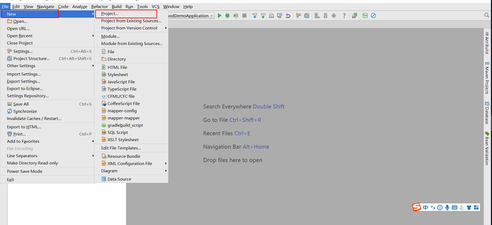

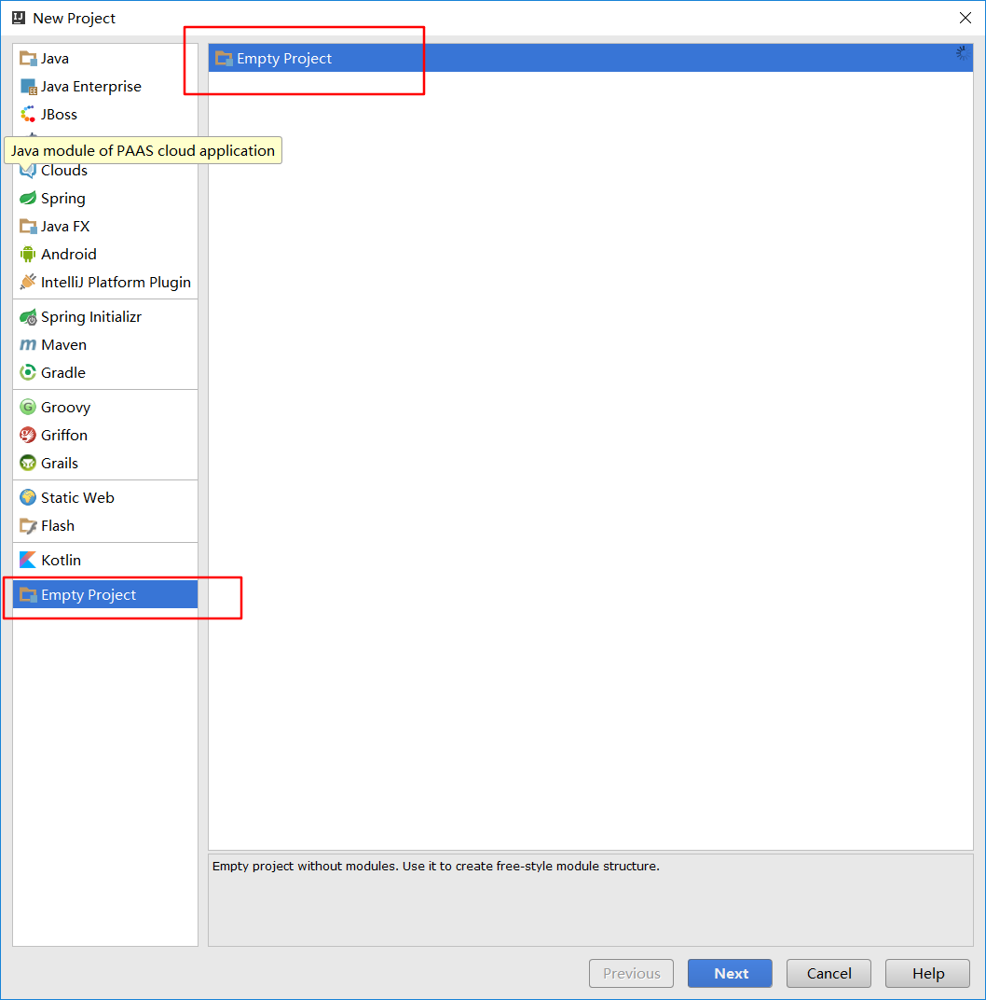

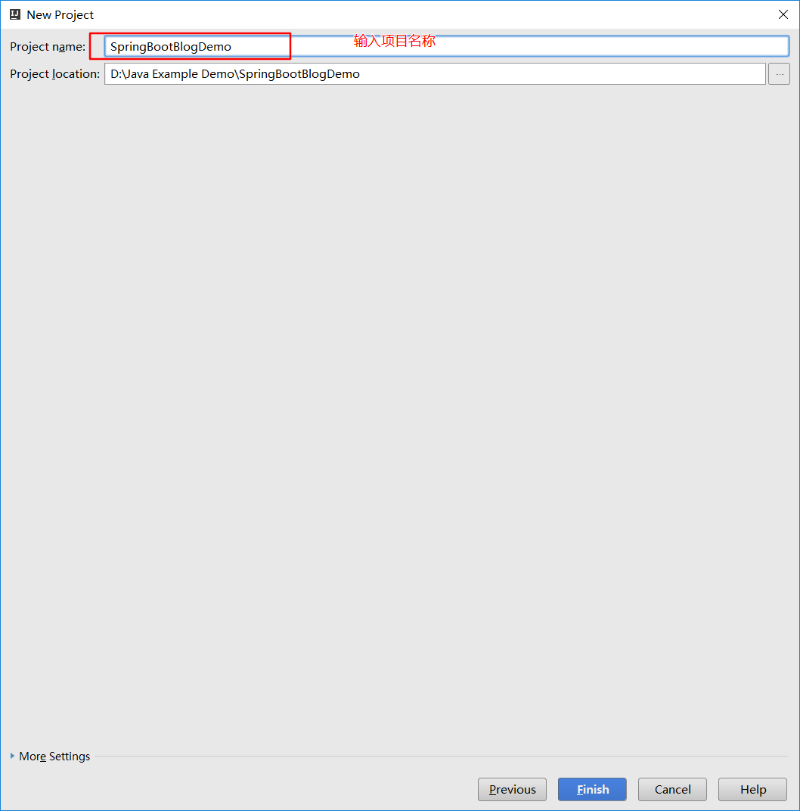

## 2. 创建一个module

### 2.1 new-module

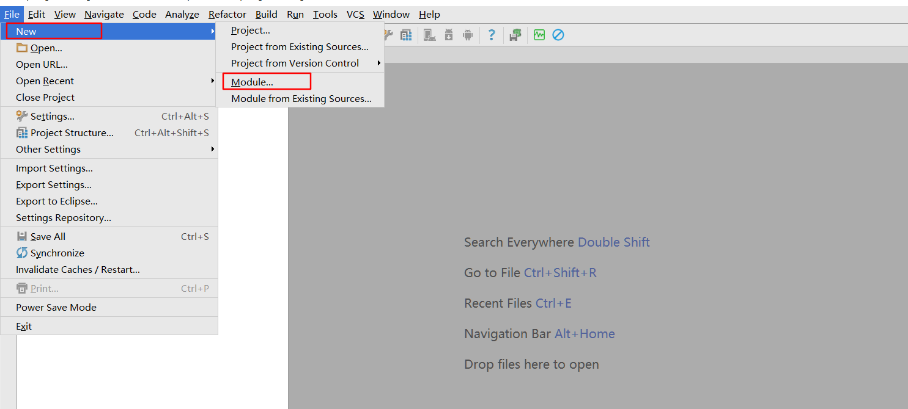

### 2.2 选择 Spring Initializr,选择jdk版本

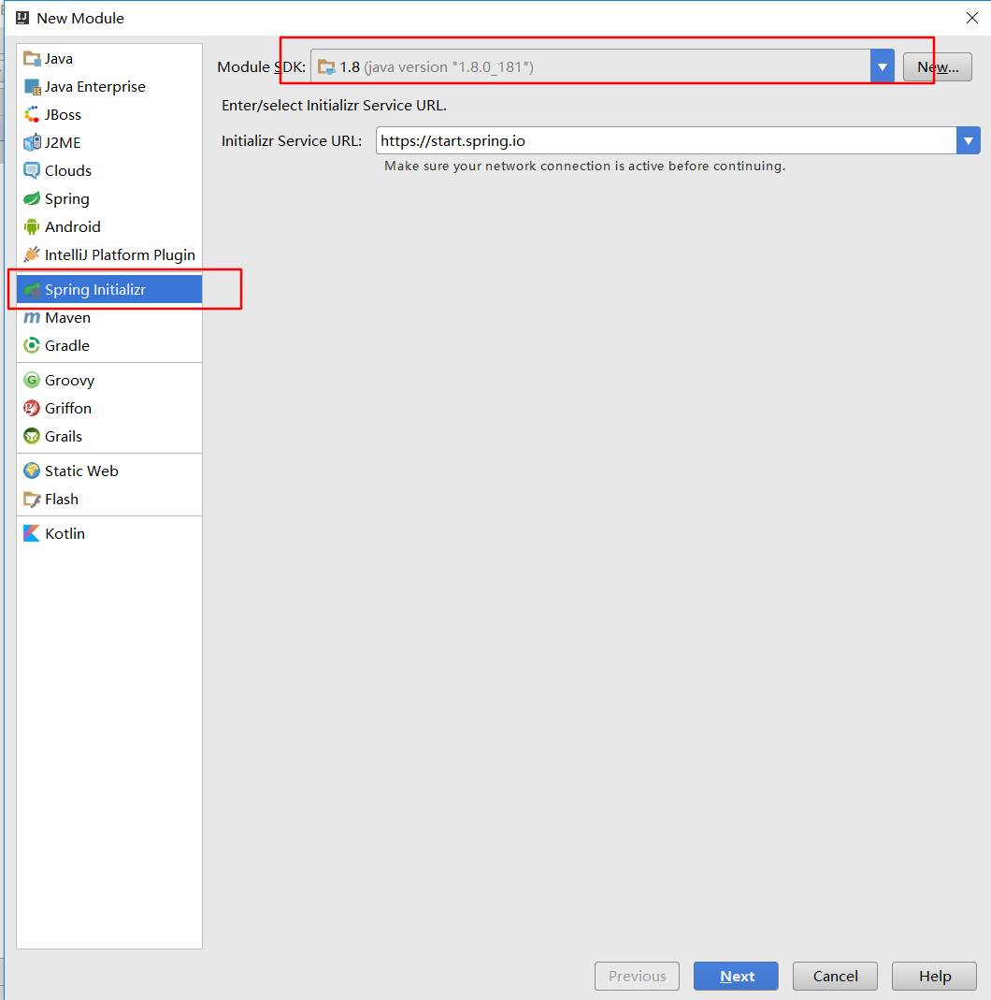

### 2.3 输入模块名称和group

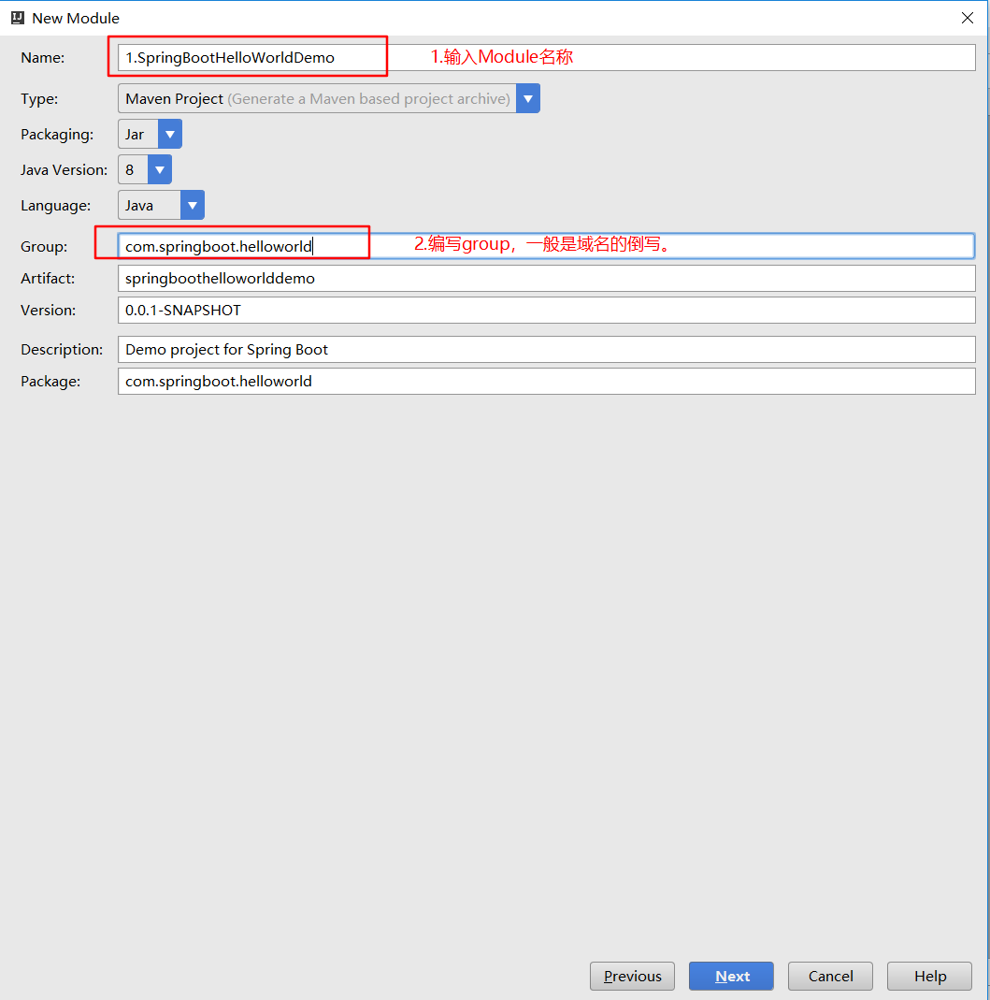

### 2.4 选择SpringBoot版本，勾选web依赖


### 2.5 再次确认模块名称和模块存放的路径，点击finished，完成SpringBoot项目的创建。

### 2.6 项目创建成功之后，目录结构：

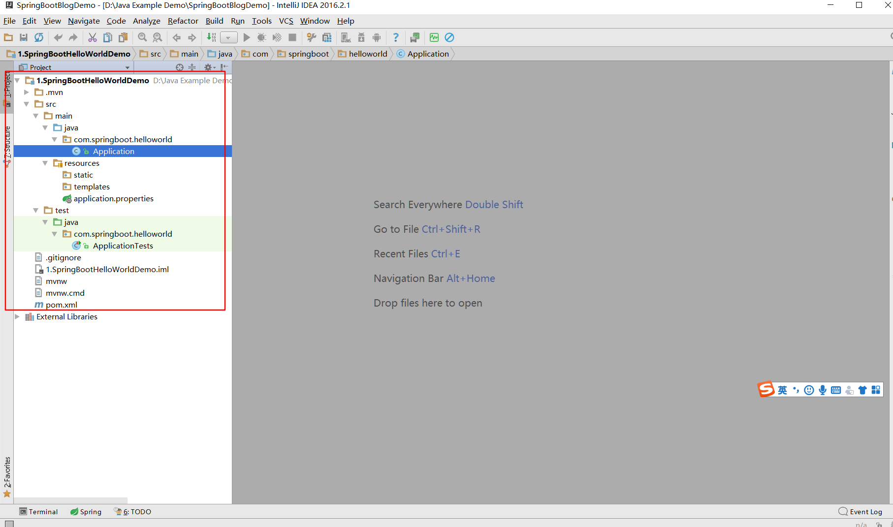

注意：一定要jar所有加载成功，才有如图所示的结果，如果jar包没有加载成功，可以选中项目，右键-Maven-Reimport重新导入jar，或：Ctrl+Shift+F5,重新加载jar包。

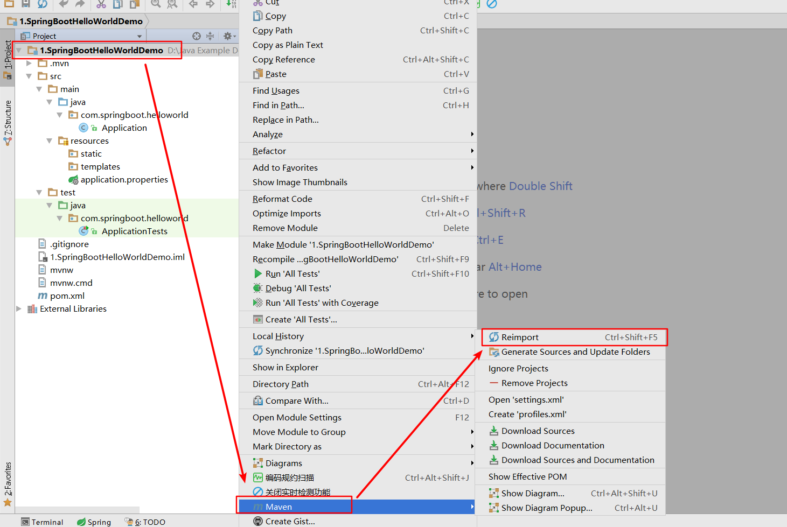

### 2.7 删除.mvn文件夹，删除mvnw,mvnw.cmd文件

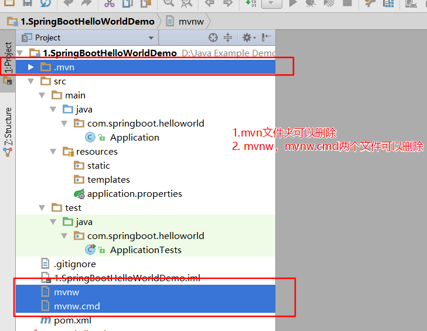

### 2.8 最终目录结构

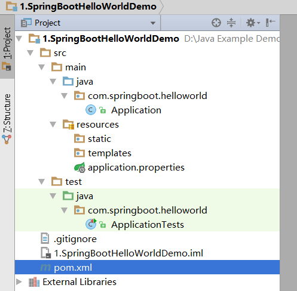


### 2.9 pom.xml文件

```xml

<?xml version="1.0" encoding="UTF-8"?>
<project xmlns="http://maven.apache.org/POM/4.0.0" xmlns:xsi="http://www.w3.org/2001/XMLSchema-instance"
	xsi:schemaLocation="http://maven.apache.org/POM/4.0.0 http://maven.apache.org/xsd/maven-4.0.0.xsd">
	<modelVersion>4.0.0</modelVersion>

	<groupId>com.springboot.helloworld</groupId>
	<artifactId>springboothelloworlddemo</artifactId>
	<version>0.0.1-SNAPSHOT</version>
	<packaging>jar</packaging>

	<name>1.SpringBootHelloWorldDemo</name>
	<description>Demo project for Spring Boot</description>

	<parent>
		<groupId>org.springframework.boot</groupId>
		<artifactId>spring-boot-starter-parent</artifactId>
		<version>1.5.7.RELEASE</version>
		<relativePath/> <!-- lookup parent from repository -->
	</parent>

	<properties>
		<project.build.sourceEncoding>UTF-8</project.build.sourceEncoding>
		<project.reporting.outputEncoding>UTF-8</project.reporting.outputEncoding>
		<java.version>1.8</java.version>
	</properties>

	<dependencies>
		<dependency>
			<groupId>org.springframework.boot</groupId>
			<artifactId>spring-boot-starter-web</artifactId>
		</dependency>

		<dependency>
			<groupId>org.springframework.boot</groupId>
			<artifactId>spring-boot-starter-test</artifactId>
			<scope>test</scope>
		</dependency>
	</dependencies>

	<build>
		<plugins>
			<plugin>
				<groupId>org.springframework.boot</groupId>
				<artifactId>spring-boot-maven-plugin</artifactId>
			</plugin>
		</plugins>
	</build>

	<repositories>
		<repository>
			<id>spring-snapshots</id>
			<name>Spring Snapshots</name>
			<url>https://repo.spring.io/snapshot</url>
			<snapshots>
				<enabled>true</enabled>
			</snapshots>
		</repository>
		<repository>
			<id>spring-milestones</id>
			<name>Spring Milestones</name>
			<url>https://repo.spring.io/milestone</url>
			<snapshots>
				<enabled>false</enabled>
			</snapshots>
		</repository>
	</repositories>

	<pluginRepositories>
		<pluginRepository>
			<id>spring-snapshots</id>
			<name>Spring Snapshots</name>
			<url>https://repo.spring.io/snapshot</url>
			<snapshots>
				<enabled>true</enabled>
			</snapshots>
		</pluginRepository>
		<pluginRepository>
			<id>spring-milestones</id>
			<name>Spring Milestones</name>
			<url>https://repo.spring.io/milestone</url>
			<snapshots>
				<enabled>false</enabled>
			</snapshots>
		</pluginRepository>
	</pluginRepositories>


</project>


```

### 2.10 创建HelloWorldController类

```java

package com.springboot.helloworld.controller;

import org.springframework.web.bind.annotation.RequestMapping;
import org.springframework.web.bind.annotation.RequestMethod;
import org.springframework.web.bind.annotation.RestController;

/**
 * @Description: Hello Controller层实体类
 * @Author: zrblog
 * @Version:v1.0
 */
@RestController
public class HelloController {

    @RequestMapping(value = "/hello",method = RequestMethod.GET)
    public String sayHell(){
        return "Hello World";
    }

}

```

> @RestController = @Controller + @ResponseBody

### 2.11 运行Application的main方法

```red

Caused by: java.lang.NoClassDefFoundError: com/fasterxml/classmate/TypeResolver
	at org.hibernate.validator.internal.util.TypeResolutionHelper.<init>(TypeResolutionHelper.java:21) ~[hibernate-validator-6.0.12.Final.jar:6.0.12.Final]
	at org.hibernate.validator.internal.engine.ValidatorFactoryImpl.<init>(ValidatorFactoryImpl.java:143) ~[hibernate-validator-6.0.12.Final.jar:6.0.12.Final]
	at org.hibernate.validator.HibernateValidator.buildValidatorFactory(HibernateValidator.java:38) ~[hibernate-validator-6.0.12.Final.jar:6.0.12.Final]
	at org.hibernate.validator.internal.engine.ConfigurationImpl.buildValidatorFactory(ConfigurationImpl.java:364) ~[hibernate-validator-6.0.12.Final.jar:6.0.12.Final]

```

点击Project Structure,
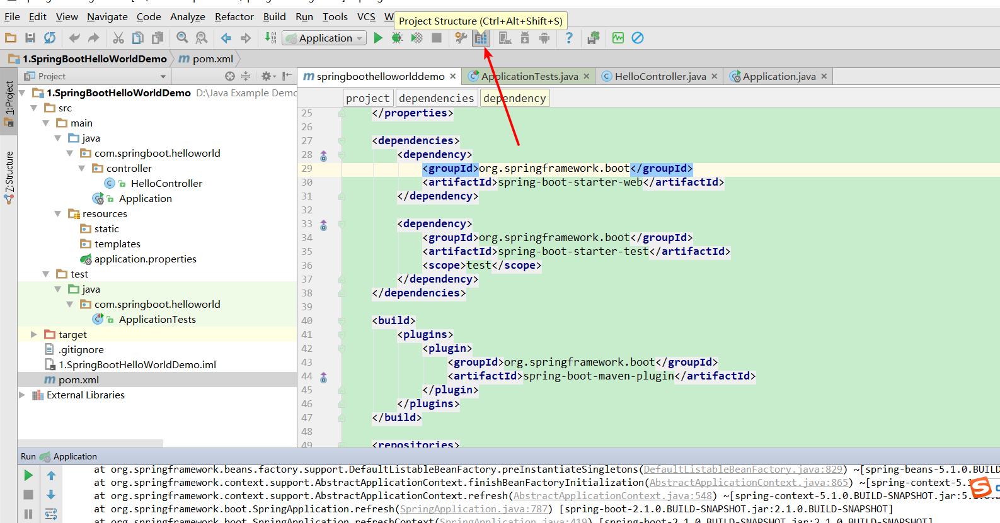

发现有一个jar报红了，没有引入成功

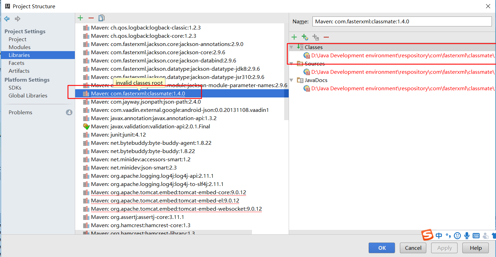

找到maven的Respository中对应jar目录：

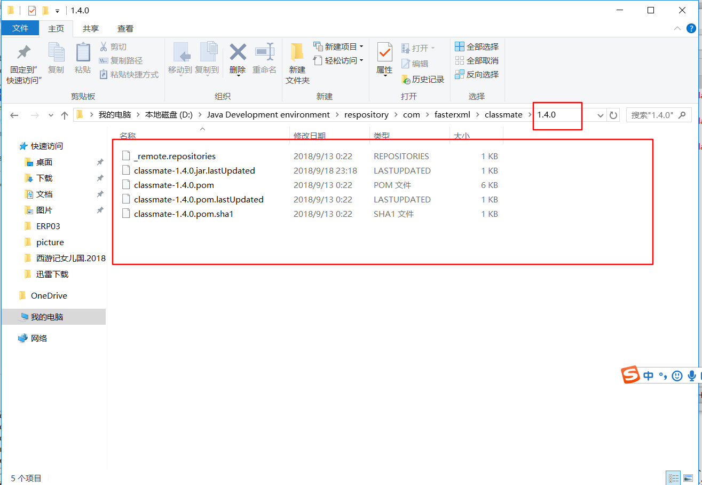

**解决办法：**
 >   大多数项目启动不成功，都是jar没有正确引入的原因，IDEA令人郁闷的也是这一点，项目没有报错，但就是启动不成功。因此经常可以通过 project structure 按钮查看项目的jar导入情况。

> 发现报红色的jar包就是没有下载成功，我们可以将Respository中对应版本jar包目录删除，重新 reimport一下。我就是这样处理的，如果大家遇到这种情况有更好的办法，可以留言告知我哦！非常感谢！！！
>  删除Respository中对应版本jar包目录，进入pom.xml文件中，右键-Maven-Reimport,重新下载jar包。

注意：在选择Sprboot版本的时候，最好选择Release版本。


### 2.13 正常启动成功界面

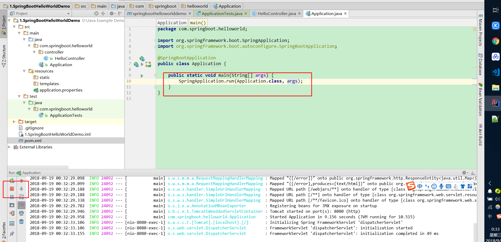

### 2.14 访问 http://localhost:8080/hello

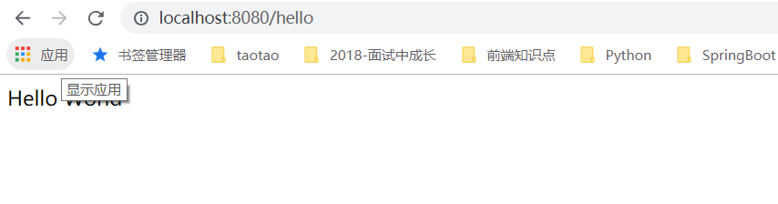


写博客一方面是为了记忆，一方面是希望博客的内容对大家有帮助，如果觉得还不错，点个赞呗！！！


