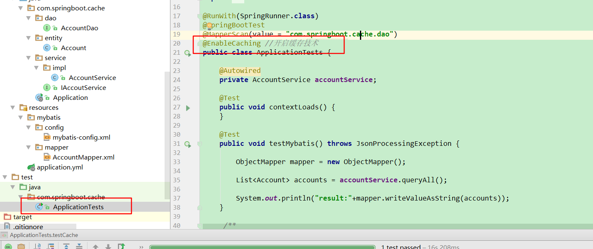
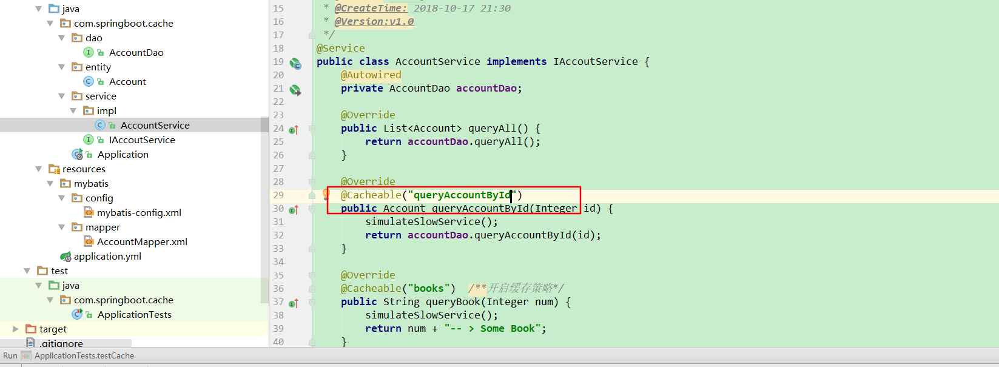
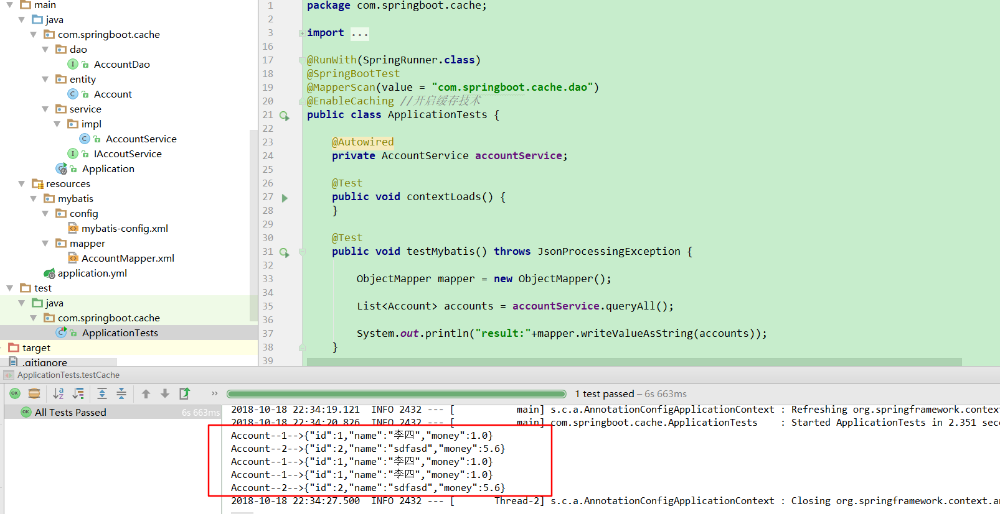

# 第二十讲 SpringBoot集成Cache

[TOC]

**声明式缓存：**
Spring定义CacheManager和Cache接口用来统一不同的缓存技术，例如：JCache,EhCache,Hazelcast,Guava,Redis等。在使用Spring集成Cache的时候，我们需要注册实现CacheManager的Bean。

Spring Boot为我们自动配置了JCacheCacheConfiguration,EhCacheCacheConfiguration,HazelcastCacheCnfiguration,GuavaCacheConfiguration、RedisCacheConfiguration、SimpleCacheConfiguration。

## 默认使用ConcurrenMapCacheManager

在我们不使用其他第三方缓存依赖的时候，Spring自动采用ConcurrenMapCacheManager


## 2.1 SpringBoot集成mybatis

```sql

create table `account` (
	`id` int (11),
	`name` varchar (60),
	`money` double 
); 
insert into `account` (`id`, `name`, `money`) values('1','李四','1');
insert into `account` (`id`, `name`, `money`) values('2','王老五','5.6');
insert into `account` (`id`, `name`, `money`) values('3','张三','4');
```

**application.yml**

```yml
spring:
  datasource:
    driver-class-name : com.mysql.jdbc.Driver
    url: jdbc:mysql://localhost:3306/ssm
    username: root
    password: root
mybatis:
  type-aliases-package: com.springboot.cache
  mapper-locations: classpath:mybatis/mapper/*.xml
  config-location: classpath:mybatis/config/mybatis-config.xml
```

**mybatis-config.xml**

```xml
<?xml version="1.0" encoding="UTF-8" ?>
<!DOCTYPE configuration
        PUBLIC "-//mybatis.org//DTD Config 3.0//EN"
        "http://mybatis.org/dtd/mybatis-3-config.dtd">

<configuration>
    <typeAliases>
    </typeAliases>
</configuration>
```

## 2.2 pom.xml导入依赖

```xml
<dependency>
    <groupId>org.springframework.boot</groupId>
    <artifactId>spring-boot-starter-cache</artifactId>
</dependency>
```

### 2.3 entity层：Account.java

public class Account {

    private Integer id;

    private String name;

    private Double money;
    ......
}

### 2.4 dao层 ：AccountDao.java

```java
package com.springboot.cache.dao;

import com.springboot.cache.entity.Account;
import org.springframework.stereotype.Repository;

import java.util.List;

/**
 * @Description:
 * @CreateTime: 2018-10-17 21:11
 * @Version:v1.0
 */
@Repository
public interface AccountDao {

    List<Account> queryAll();

    Account queryAccountById(Integer id);


}
```

**AccountMapper.xml**

```xml
<?xml version="1.0" encoding="UTF-8"?>
<!DOCTYPE mapper PUBLIC "-//mybatis.org//DTD Mapper 3.0//EN" "http://mybatis.org/dtd/mybatis-3-mapper.dtd">
<mapper namespace="com.springboot.cache.dao.AccountDao">

    <resultMap id="BaseResultMap" type="com.springboot.cache.entity.Account">
        <id column="id" property="id" jdbcType="INTEGER"/>
        <result column="name" property="name" jdbcType="VARCHAR"/>
        <result column="money" property="money" jdbcType="DOUBLE"/>
    </resultMap>

    <sql id="Base_Column_List">
      id,name,money
    </sql>
    
    <select id="queryAccountById" resultMap="BaseResultMap">
        SELECT 
        <include refid="Base_Column_List"/>
        FROM account
        WHERE id = #{id,jdbcType=INTEGER}
    </select>

    <select id="queryAll" resultMap="BaseResultMap">
        SELECT
        <include refid="Base_Column_List"/>
        FROM account
    </select>
</mapper>

```

### 2.5 service层：

**IAccountService.java**

```java
package com.springboot.cache.service;

import com.springboot.cache.entity.Account;

import java.util.List;

/**
 * @Description:
 * @CreateTime: 2018-10-17 21:29
 * @Version:v1.0
 */
public interface IAccoutService {

    List<Account> queryAll();

    Account queryAccountById(Integer id);

    String queryBook(Integer num);
}

```

**AccountServiceImpl.java**

``` java
package com.springboot.cache.service.impl;

import com.springboot.cache.dao.AccountDao;
import com.springboot.cache.entity.Account;
import com.springboot.cache.service.IAccoutService;
import org.springframework.beans.factory.annotation.Autowired;
import org.springframework.cache.annotation.Cacheable;
import org.springframework.stereotype.Service;

import java.util.List;

/**
 * @Description:
 * @Author: zrblog
 * @CreateTime: 2018-10-17 21:30
 * @Version:v1.0
 */
@Service
public class AccountService implements IAccoutService {
    @Autowired
    private AccountDao accountDao;

    @Override
    public List<Account> queryAll() {
        return accountDao.queryAll();
    }

    @Override
    @Cacheable("queryAccountById")
    public Account queryAccountById(Integer id) {
        simulateSlowService();
        return accountDao.queryAccountById(id);
    }

    @Override
    @Cacheable("books")  /**开启缓存策略*/
    public String queryBook(Integer num) {
        simulateSlowService();
        return num + "-- > Some Book";
    }

     /**
      * @Description: 延时三秒
      * @Date: 2018/10/18 22:32
      * @Author: zr
      * @param null
      * @Return 
      */
    private void simulateSlowService() {
        try {
            long time = 3000L;
            Thread.sleep(time);
        } catch (InterruptedException e) {
            throw new IllegalStateException(e);
        }
    }
}

```

### 2.5 没有开启缓存功能测试：

```java
package com.springboot.cache;

import com.fasterxml.jackson.core.JsonProcessingException;
import com.fasterxml.jackson.databind.ObjectMapper;
import com.springboot.cache.entity.Account;
import com.springboot.cache.service.impl.AccountService;
import org.junit.Test;
import org.junit.runner.RunWith;
import org.mybatis.spring.annotation.MapperScan;
import org.springframework.beans.factory.annotation.Autowired;
import org.springframework.boot.test.context.SpringBootTest;
import org.springframework.cache.annotation.EnableCaching;
import org.springframework.test.context.junit4.SpringRunner;

import java.util.List;

@RunWith(SpringRunner.class)
@SpringBootTest
@MapperScan(value = "com.springboot.cache.dao")
public class ApplicationTests {

    @Autowired
    private AccountService accountService;

	@Test
	public void contextLoads() {
	}

	@Test
    public void testMybatis() throws JsonProcessingException {

        ObjectMapper mapper = new ObjectMapper();

        List<Account> accounts = accountService.queryAll();

        System.out.println("result:"+mapper.writeValueAsString(accounts));
    }

     /**
      * @Description: 没有开启缓存，每隔三秒打印一次记录
      * @Date: 2018/10/17
      * @Author: zr
      * @param null
      * @Return 
      */
    @Test
    public void testCache() throws JsonProcessingException {
        printlnAccount(1);
        printlnAccount(2);
        printlnAccount(1);
        printlnAccount(1);
        printlnAccount(2);

    }

    private void printlnAccount(Integer id) throws JsonProcessingException {
        ObjectMapper mapper = new ObjectMapper();
        Account account = accountService.queryAccountById(id);
        String accountJson = mapper.writeValueAsString(account);
        System.out.println("Account--" +id+ "-->" + accountJson);
    }
```
### 2.6 开启缓存测试

#### 2.6.1 添加注解@EnableCaching



#### 2.6.2 需要缓存的方法添加注解@Cacheable



#### 2.6.3 测试，当缓存有这个数据时，会直接返回数据，不会等待数据库去查询数据



只有前面两个数据，程序等待了3秒，之后的数据瞬间打印在了控制台上，这说明缓存起了作用。
