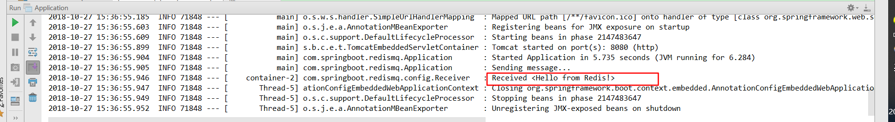

# 第二十一讲 在Springboot使用Redis实现消息队列

[TOC]

## 1.引入依赖：pom.xml

```xml
<dependency>
    <groupId>org.springframework.boot</groupId>
    <artifactId>spring-boot-starter-data-redis</artifactId>
</dependency>
```

## 2. 创建消息接收者：Receiver

> 注意处理消息的方法名：handleMessage
 
```java
package com.springboot.redismq.config;


import org.slf4j.Logger;
import org.slf4j.LoggerFactory;
import org.springframework.beans.factory.annotation.Autowired;
import org.springframework.context.annotation.Bean;

import java.util.concurrent.CountDownLatch;

/**
 * @Description: 消息接收者
 * @Author: zrblog
 * @CreateTime: 2018-10-17 22:31
 * @Version:v1.0
 */
public class Receiver {

    static final Logger logger =  LoggerFactory.getLogger(Receiver.class);

    public CountDownLatch latch;

    @Autowired
    public Receiver(CountDownLatch latch) {
        this.latch = latch;
    }

    public void handleMessage(String message) {
        logger.info("Received <" + message + ">");
        latch.countDown();
    }

}

```

## 3. 配置：RedisMQConfig

> 在Spring data redis中，利用Redis发送一条消息和接收一条消息,需要三样东西：
> 1. 连接工程: MessageListenerAdapter
> 2. 消息监听容器: RedisMessageListenerContainer
> 3. Redis Template: StringRedisTemplate

```java
package com.springboot.redismq.config;

import org.springframework.context.annotation.Bean;
import org.springframework.context.annotation.Configuration;
import org.springframework.data.redis.connection.RedisConnectionFactory;
import org.springframework.data.redis.core.StringRedisTemplate;
import org.springframework.data.redis.listener.PatternTopic;
import org.springframework.data.redis.listener.RedisMessageListenerContainer;
import org.springframework.data.redis.listener.adapter.MessageListenerAdapter;

import java.util.concurrent.CountDownLatch;

/**
 * @Description:
 * @Author: zrblog
 * @CreateTime: 2018-10-17 22:37
 * @Version:v1.0
 */
@Configuration
public class RedisMQConfig {

    @Bean
    Receiver receiver(CountDownLatch latch) {
        return  new Receiver(latch);
    }

    @Bean
    CountDownLatch latch() {
        return new CountDownLatch(1);
    }

    @Bean
    StringRedisTemplate template(RedisConnectionFactory factory) {
        return new StringRedisTemplate(factory);
    }

    @Bean
    RedisMessageListenerContainer container(RedisConnectionFactory factory, MessageListenerAdapter listenerAdapter) {
        RedisMessageListenerContainer container = new RedisMessageListenerContainer();
        container.setConnectionFactory(factory);
        container.addMessageListener(listenerAdapter,new PatternTopic("redisTopic"));
        return container;
    }

    @Bean
    MessageListenerAdapter listenerAdapter(Receiver receiver) {
        return new MessageListenerAdapter(receiver);
    }
}

```

## 4.测试:Application

```java
package com.springboot.redismq;

import org.slf4j.Logger;
import org.slf4j.LoggerFactory;
import org.springframework.boot.SpringApplication;
import org.springframework.boot.autoconfigure.SpringBootApplication;
import org.springframework.context.ApplicationContext;
import org.springframework.data.redis.core.StringRedisTemplate;

import java.util.concurrent.CountDownLatch;

@SpringBootApplication
public class Application {

	private static final Logger LOGGER = LoggerFactory.getLogger(Application.class);


	public static void main(String[] args) throws InterruptedException {
		ApplicationContext ctx =  SpringApplication.run(Application.class, args);

		StringRedisTemplate template = ctx.getBean(StringRedisTemplate.class);
		CountDownLatch latch = ctx.getBean(CountDownLatch.class);

		LOGGER.info("Sending message...");

        //使用StringRedisTemplate发送消息
		template.convertAndSend("redisTopic", "Hello from Redis!");

		latch.await();

		System.exit(0);
	}
}

```

