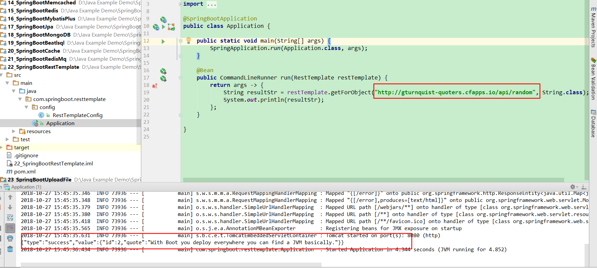

# 第二十二将 Spring集成RestTemplate消费消息

[TOC]

## 1.前言

> 这里主要介绍怎么使用RestTemplate去消费一个服务：http://gturnquist-quoters.cfapps.io/api/random.如果消费成功，会返回一个随机的Json字符串。

## 2.Spring集成RedisTemplate

### 2.1 引入依赖:pom.xml

```xml
<dependency>
    <groupId>org.springframework.boot</groupId>
    <artifactId>spring-boot-starter-web</artifactId>
</dependency>

<dependency>
    <groupId>org.springframework.boot</groupId>
    <artifactId>spring-boot-starter-test</artifactId>
    <scope>test</scope>
</dependency>
```

### 2.2 配置RestTemplate：

```java
package com.springboot.resttemplate.config;

import org.springframework.boot.web.client.RestTemplateBuilder;
import org.springframework.context.annotation.Bean;
import org.springframework.context.annotation.Configuration;
import org.springframework.web.client.RestTemplate;

/**
 * @Description:
 * @Author: zrblog
 * @CreateTime: 2018-10-18 22:57
 * @Version:v1.0
 */
@Configuration
public class RestTemplateConfig {

    @Bean
    public RestTemplate restTemplate(RestTemplateBuilder builder) {
        return builder.build();
    }
}

```

### 2.3 测试：Application

```java
package com.springboot.resttemplate;

import org.springframework.boot.CommandLineRunner;
import org.springframework.boot.SpringApplication;
import org.springframework.boot.autoconfigure.SpringBootApplication;
import org.springframework.context.annotation.Bean;
import org.springframework.web.client.RestTemplate;

@SpringBootApplication
public class Application {

	public static void main(String[] args) {
		SpringApplication.run(Application.class, args);
	}

	@Bean
	public CommandLineRunner run(RestTemplate restTemplate) {
		return args -> {
            String resultStr = restTemplate.getForObject("http://gturnquist-quoters.cfapps.io/api/random", String.class);
            System.out.println(resultStr);
        };
	}

}

```

* 测试结果：



参考资料：[用restTemplate消费服务](https://blog.csdn.net/forezp/article/details/71023724)