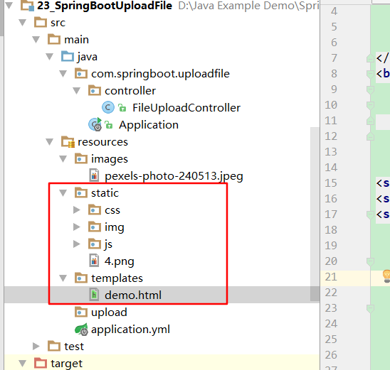
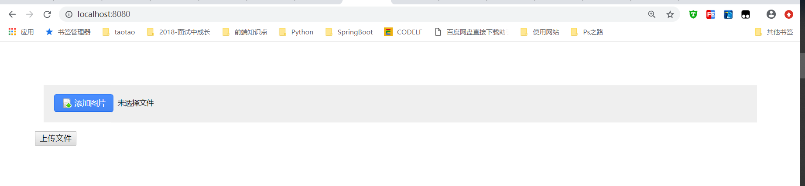
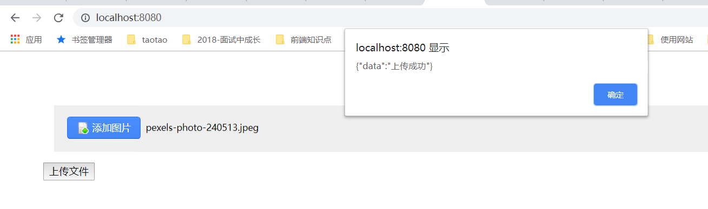
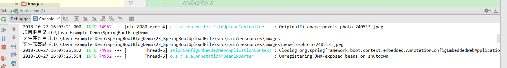

# 第二十三讲 SpringBoot上传文件

[TOC]

## 1. 引入依赖：pom.xml

```xml
<dependency>
			<groupId>org.springframework.boot</groupId>
			<artifactId>spring-boot-starter-web</artifactId>
		</dependency>

		<dependency>
			<groupId>org.springframework.boot</groupId>
			<artifactId>spring-boot-starter-test</artifactId>
			<scope>test</scope>
		</dependency>

        <dependency>
            <groupId>org.springframework.boot</groupId>
            <artifactId>spring-boot-configuration-processor</artifactId>
            <optional>true</optional>
        </dependency>

        <dependency>
			<groupId>org.springframework.boot</groupId>
			<artifactId>spring-boot-devtools</artifactId>
			<optional>true</optional>
		</dependency>

        <!--使用SpringBoot上传文件-->
        <dependency>
            <groupId>org.springframework.boot</groupId>
            <artifactId>spring-boot-starter-thymeleaf</artifactId>
        </dependency>

        <dependency>
            <groupId>commons-io</groupId>
            <artifactId>commons-io</artifactId>
            <version>2.5</version>
        </dependency>

        <dependency>
            <groupId>commons-fileupload</groupId>
            <artifactId>commons-fileupload</artifactId>
            <version>1.2.2</version>
        </dependency>
```

## 2. 引入前端文件：

### 2.1 下载前端文件：
[文件上传按钮](https://github.com/kuailexiaoyi/FileUpload)

前端文件如图所示放置：html文件放置在templates目录下，css，js，img目录存放在static目录下



### 2.2 修改demo.html

```html
<!doctype html>
<html lang="en">
<head>
	<meta charset="UTF-8"/>
	<title>上传按钮 的样式优化插件</title>
	<link rel="stylesheet" href="css/fileUpload.css"/>
    <script type="text/javascript" src='js/jquery.js'></script>
    <script type="text/javascript" src='js/jquery.fileupload.js'></script>
</head>
<body>
	<div class="wrap">
        <input id="uploadFile" title='支持jpg、jpeg、gif、png格式，文件小于5M' tabIndex='3'
			   type='file' size='3' name='file' hidefocus="true" class="fnOpt"/>
    </div>
    <button id="uploadFileBtn" onclick="uploadFile()" type="submit">上传文件</button>

<script type="text/javascript">
	$(".fnOpt").optFileUpload();
    
    function  uploadFile() {
        var formData = new FormData();
        formData.append("file", $("#uploadFile")[0].files[0]);
        $.ajax({
            url:'/fileUpload',
            type:'POST',
            data: formData,
            async: false,
            cache: false,
            contentType: false, //不设置内容类型
            processData: false, //不处理数据
            success:function(data){
                console.log(data);
                alert(data);
            },
            error:function(){
                alert("上传失败！");
            }
        })
    }
</script>
</body>
</html>
```

## 3. 上传文件逻辑：FileUploadController

```java
package com.springboot.uploadfile.controller;

import org.apache.catalina.servlet4preview.http.HttpServletRequest;
import org.slf4j.Logger;
import org.slf4j.LoggerFactory;
import org.springframework.stereotype.Controller;
import org.springframework.util.ResourceUtils;
import org.springframework.web.bind.annotation.RequestMapping;
import org.springframework.web.bind.annotation.RequestParam;
import org.springframework.web.bind.annotation.ResponseBody;
import org.springframework.web.multipart.MultipartFile;

import java.io.*;
import java.net.URL;

/**
 * @Description:
 * @Author: zrblog
 * @CreateTime: 2018-10-20 20:49
 * @Version:v1.0
 */
@Controller
public class FileUploadController {

    private final static Logger logger = LoggerFactory.getLogger(FileUploadController.class);


    /**
     * @param
     * @Description: 跳转到上传文件页面
     * @Return
     * @Author: zrblog
     * @Date: 2018/10/20 21:59
     */
    @RequestMapping("/")
    public String toUploadFile() {
        return "demo";
    }


    /**
     * @Description: 上传文件
     * @Param [file, request]
     * @Return java.lang.String
     * @Author: zrblog
     * @Date: 2018/10/20 22:02
     */
    @RequestMapping("fileUpload")
    @ResponseBody
    public String uploadFile(@RequestParam("file") MultipartFile file, HttpServletRequest request) {

        String contentType = file.getContentType();
        logger.info("ContentType:" + contentType);

        String originalFilename = file.getOriginalFilename();
        logger.info("OriginalFilename:" + originalFilename);

        try {
            //获取跟目录
            File path = new File(ResourceUtils.getURL("classpath:").getPath());
            if(!path.exists()) {
                path = new File("");
                System.out.println("项目根目录:"+path.getAbsolutePath());
            }

            //如果上传目录为/static/images，则可以如下获取：
            File uploadDirPath = new File(path.getAbsolutePath(),"23_SpringBootUploadFile/src/main/resources/images");
            if(!uploadDirPath.exists()){
                uploadDirPath.mkdirs();
            }
            System.out.println("文件存放目录:"+uploadDirPath.getAbsolutePath());

            String imgFilePath = uploadDirPath + File.separator + originalFilename;

            System.out.println("文件完整路径:" + imgFilePath);

            InputStream is = null;
            FileOutputStream fos = null;
            try {

                is = file.getInputStream();

                fos = new FileOutputStream(imgFilePath);

                byte[] bytes = new byte[1024];

                int len = 0;

                while ((len = is.read(bytes)) != -1) {
                    fos.write(bytes, 0, len);
                }

                fos.flush();

            } catch (Exception e) {
                e.printStackTrace();
            } finally {
                if (fos != null) {
                    try {
                        fos.close();
                    } catch (IOException e) {
                        e.printStackTrace();
                    }
                }

                if (is != null) {
                    try {
                        is.close();
                    } catch (IOException e) {
                        e.printStackTrace();
                    }
                }
            }
        } catch (FileNotFoundException e) {
            e.printStackTrace();
        }


        return "{\"data\":\"上传成功\"}";
    }

}

```

## 4.测试：运行Appliaction.java文件中的main方法，启动项目

* 访问：http://localhost:8080/

显示下图界面：



* 选择图片，点击上传文件按钮



* 控制台输出：



参考：
[SpringBoot下文件上传与下载的实现](https://blog.csdn.net/colton_null/article/details/76696674)

[文件上传按钮样式优化](https://github.com/kuailexiaoyi/FileUpload)
