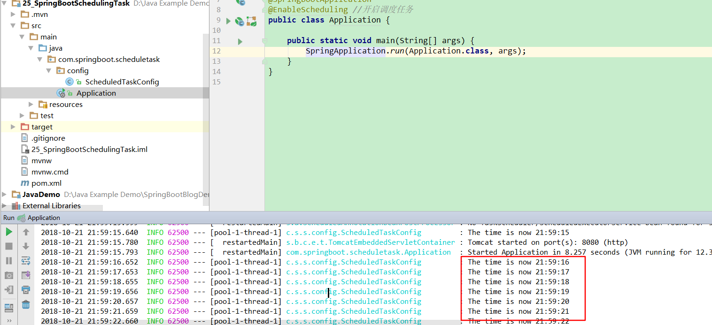

# 第二十五讲 SpringBoot集成定时任务

[TOC]

## 1. 开启调度任务:添加注解@EnableScheduling

Application.java

```java
package com.springboot.scheduletask;

import org.springframework.boot.SpringApplication;
import org.springframework.boot.autoconfigure.SpringBootApplication;
import org.springframework.scheduling.annotation.EnableScheduling;

@SpringBootApplication
@EnableScheduling //开启调度任务
public class Application {

	public static void main(String[] args) {
		SpringApplication.run(Application.class, args);
	}
}

```

## 2.创建定时任务：@Scheduled 每过5s打印一次时间

ScheduledTaskConfig.java

```java
package com.springboot.scheduletask.config;

import org.slf4j.Logger;
import org.slf4j.LoggerFactory;
import org.springframework.scheduling.annotation.Scheduled;
import org.springframework.stereotype.Component;

import java.text.SimpleDateFormat;
import java.util.Date;

/**
 * @Description:
 * @Auther: zrblog
 * @CreateTime: 2018-10-21 11:57
 * @Version:v1.0
 */
@Component
public class ScheduledTaskConfig {

    Logger logger = LoggerFactory.getLogger(ScheduledTaskConfig.class);

    private final static SimpleDateFormat dataFormate = new SimpleDateFormat("HH:mm:ss");

    /**
     * @Description: 创建一个定时任务，每隔5秒打印一次数据
     * @Param [file, request]
     * @Return java.lang.String
     * @Author: zrblog
     * @Date: 2018/10/20 22:02
     */
    @Scheduled(fixedDelay = 1000)
    public void reportCurrentTIme() {
        logger.info("The time is now {}",dataFormate.format(new Date()));
    }
}
```

## 3.运行main方法，测试结果：




