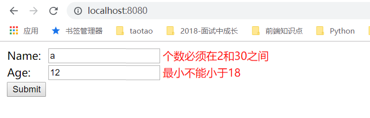

# 第26讲 SpringBoot通过注解实现表单验证

[TOC]

## 1.pom.xml引入依赖

```xml
<!--SpringBoot表单验证-->
<dependency>
    <groupId>org.springframework.boot</groupId>
    <artifactId>spring-boot-starter-thymeleaf</artifactId>
</dependency>

<dependency>
    <groupId>org.hibernate</groupId>
    <artifactId>hibernate-validator</artifactId>
</dependency>

<dependency>
    <groupId>org.apache.tomcat.embed</groupId>
    <artifactId>tomcat-embed-el</artifactId>
</dependency>
```

## 2. 引入前端页面

### 2.1 form.xml

```html
<html>
<head>
    <meta charset="UTF-8"/>
    <title>Form表单验证</title>
</head>
<body>
<form action="#" th:action="@{/}" th:object="${personForm}" method="post">
    <table>
        <tr>
            <td>Name:</td>
            <td><input type="text" th:field="*{name}" /></td>
            <td style="color: red;" th:if="${#fields.hasErrors('name')}" th:errors="*{name}">Name Error</td>
        </tr>
        <tr>
            <td>Age:</td>
            <td><input type="text" th:field="*{age}" /></td>
            <td style="color: red;" th:if="${#fields.hasErrors('age')}" th:errors="*{age}">Age Error</td>
        </tr>
        <tr>
            <td><button type="submit">Submit</button></td>
        </tr>
    </table>
</form>
</body>
</html>
```

### 2.2 result.html

```html
<html>
<head>
    <meta charset="UTF-8"/>
    <title>表单验证成功</title>
</head>
<body>
<h1></h1>表单验证成功！！！！！！！！！</h1>
</body>
</html>
```

## 3. Entity层：PersonForm

```java
package com.springboot.validateform.entity;

import org.springframework.stereotype.Component;

import javax.validation.constraints.Min;
import javax.validation.constraints.NotNull;
import javax.validation.constraints.Size;

/**
 * @Description:
 * @Auther: zrblog
 * @CreateTime: 2018-10-21 22:10
 * @Version:v1.0
 */
public class PersonForm {

    @NotNull
    @Size(min = 2, max = 30) //长度为2-30的字符串
    private String name;

    @NotNull //不能为null
    @Min(18) //age不能小于18
    private Integer age;

    public String getName() {
        return name;
    }

    public void setName(String name) {
        this.name = name;
    }

    public Integer getAge() {
        return age;
    }

    public void setAge(Integer age) {
        this.age = age;
    }

    @Override
    public String toString() {
        return "PersonForm{" +
                "name='" + name + '\'' +
                ", age=" + age +
                '}';
    }
}

```

## 4. Controller层：ValidateFormController.java

```java
package com.springboot.validateform.controller;

import com.springboot.validateform.entity.PersonForm;
import org.springframework.stereotype.Controller;
import org.springframework.validation.BindingResult;
import org.springframework.web.bind.annotation.GetMapping;
import org.springframework.web.bind.annotation.PostMapping;
import org.springframework.web.bind.annotation.RequestMapping;
import org.springframework.web.bind.annotation.RequestMethod;
import org.springframework.web.servlet.config.annotation.ViewControllerRegistry;
import org.springframework.web.servlet.config.annotation.WebMvcConfigurerAdapter;

import javax.validation.Valid;

/**
 * @Description:
 * @Auther: zrblog
 * @CreateTime: 2018-10-21 22:13
 * @Version:v1.0
 */
@Controller
public class ValidateFormController extends WebMvcConfigurerAdapter {

    @Override
    public void addViewControllers(ViewControllerRegistry registry) {
        registry.addViewController("results").setViewName("results");
    }

    /**
     * @Destription: 跳转到表单验证界面
     * @param personForm
     * @return
     */
    @RequestMapping("/")
    public String showForm(PersonForm personForm) {
        return "form";
    }

    /**
     * @Destription: 表单校验
     * @param personForm
     * @param bindingResult
     * @return
     */
    @PostMapping("/")
    public String checkPersonInfo(@Valid PersonForm personForm, BindingResult bindingResult) {

        if (bindingResult.hasErrors()) {
            return "form";
        }

        return "redirect:/result";
    }

    /**
     * @Destription: 表单验证成功，跳转到result页面
     * @param personForm
     * @return
     */
    @RequestMapping(value = "/result",method = RequestMethod.GET)
    public String toResult(PersonForm personForm) {
        return "result";
    }
}
```

## 5.测试：

访问：http://localhost:8080/


输入：Name: a; Age: 12,点击"Submit"



输入：Name: Hello; Age: 15=18,点击"Submit"


参考资料：[SpringBoot验证表单信息](https://blog.csdn.net/forezp/article/details/71023817)