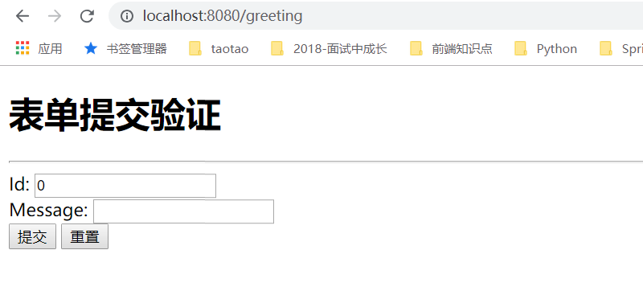
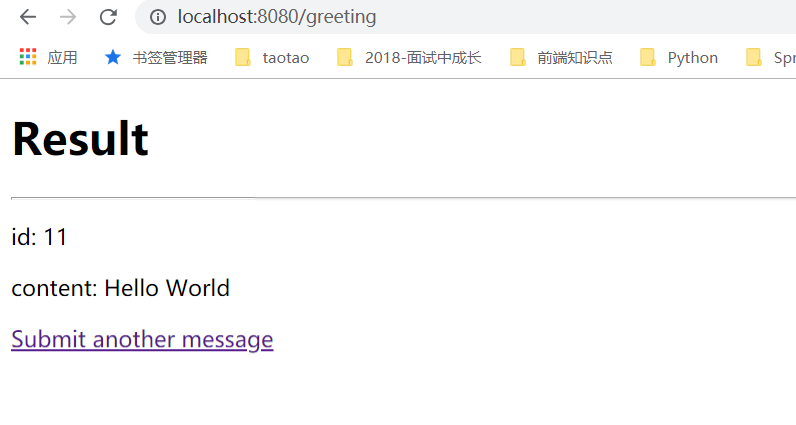

# 第27讲 SpringBoot提交表单信息

[TOC]

## 1. 引入依赖：pom.xml

```xml
<dependency>
    <groupId>org.springframework.boot</groupId>
    <artifactId>spring-boot-starter-thymeleaf</artifactId>
</dependency>
```

## 2. 引入前端文件

### 2.1 greet.html

```html
<!DOCTYPE HTML>
<html xmlns:th="http://www.thymeleaf.org">
<head>
    <title>表单提交页面</title>
    <meta http-equiv="Content-Type" content="text/html; charset=UTF-8" />
</head>
<body>
<h1>Form</h1>
<form action="#" th:action="@{/greeting}" th:object="${greet}" method="post">
    <p>Id: <input type="text" th:field="*{id}" /></p>
    <p>Message: <input type="text" th:field="*{content}" /></p>
    <p><input type="submit" value="Submit" /> <input type="reset" value="Reset" /></p>
</form>
</body>
</html>
```

### 2.2 result.html

```html
<!DOCTYPE HTML>
<html xmlns:th="http://www.thymeleaf.org">
<head>
    <title>表单提交结果</title>
    <meta http-equiv="Content-Type" content="text/html; charset=UTF-8"/>
</head>
<body>
    <h1>Result</h1>
    <hr/>
    <p th:text="'id: ' + ${greet.id}"/>
    <p th:text="'content: ' + ${greet.content}"/>
    <a href="/greeting">Submit another message</a>
</body>
</html>
```

## 3. Entity层：Greet

```java
package com.springboot.handlerform.entity;

/**
 * @Description:
 * @Auther: zrblog
 * @CreateTime: 2018-10-21 22:48
 * @Version:v1.0
 */
public class Greet {

    private long id;

    private String content;

    public long getId() {
        return id;
    }

    public void setId(long id) {
        this.id = id;
    }

    public String getContent() {
        return content;
    }

    public void setContent(String content) {
        this.content = content;
    }

    @Override
    public String toString() {
        return "Greet{" +
                "id=" + id +
                ", content='" + content + '\'' +
                '}';
    }
}
```

## 4. Controller层：GreetController

```java
package com.springboot.handlerform.controller;

import com.springboot.handlerform.entity.Greet;
import org.springframework.stereotype.Controller;
import org.springframework.ui.Model;
import org.springframework.web.bind.annotation.ModelAttribute;
import org.springframework.web.bind.annotation.RequestMapping;
import org.springframework.web.bind.annotation.RequestMethod;

/**
 * @Description:
 * @Auther: zrblog
 * @CreateTime: 2018-10-21 22:49
 * @Version:v1.0
 */
@Controller
@RequestMapping("/")
public class GreetController {

    /**
     * @descirption: 跳转到表单页面
     * @param model
     * @return
     */
    @RequestMapping(value = "greeting",method = RequestMethod.GET)
    public String showGreeting(Model model) {
        model.addAttribute("greet", new Greet());
        return "greet";
    }


    /**
     * @descirption：跳转到结果页面
     * @param greet
     * @return
     */
    @RequestMapping(value = "greeting",method = RequestMethod.POST)
    public String showGreeting(@ModelAttribute Greet greet) {
        return "result";
    }
}

```
 
## 5. 测试：

访问：http://localhost:8080/greeting



输入：Id：11,Message: Hello World ,点击"提交"

