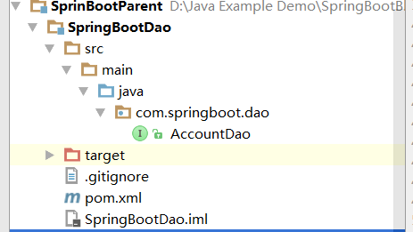
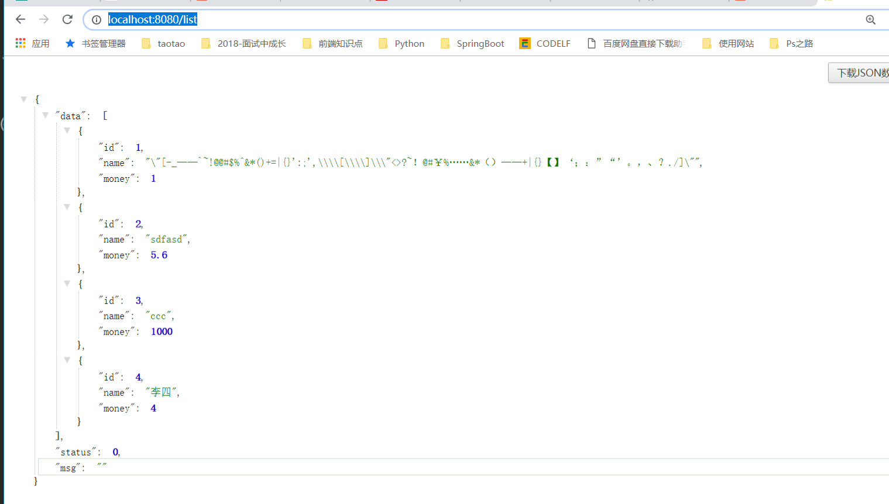

# 第二十八讲 SpringBoot创建多模块项目

[TOC]

> 写该文章之前，重要的事情说三遍：不要的文件全部删除，pom.xml无效的代码全部删除。如果你是想跟着我的博客在IDEA中基于SpringBoot创建多模块项目，各Module的pom.xml文件的内容中的<parent>节点内容和<dependencies>最好是复制。

> 另外在开始创建项目前，最好能将该文全部读完，再开始练习。有一些注意的地方很关键。最好，如果觉得不错，点个赞呗！！！


## 1. 创建父Module:SpringBootParent

右键--new-Module,无论你是用选择Spring Initializr 还是 选择 Maven创建工程，最终创建的父Module只保留以下两个文件：
**pom.xml**
**SpringBootParent.iml**

### 1.1 目录结构如下：


### 1.2 父Module的pom.xml

> 注意：将父Module的\<packageing>节内容修改为**pom**

```xml
<?xml version="1.0" encoding="UTF-8"?>
<project xmlns="http://maven.apache.org/POM/4.0.0"
         xmlns:xsi="http://www.w3.org/2001/XMLSchema-instance"
         xsi:schemaLocation="http://maven.apache.org/POM/4.0.0 http://maven.apache.org/xsd/maven-4.0.0.xsd">
    <modelVersion>4.0.0</modelVersion>

    <groupId>com.springboot.parent</groupId>
    <artifactId>springboot-parent</artifactId>
    <version>0.0.1-SNAPSHOT</version>
    <packaging>pom</packaging>

    <parent>
        <groupId>org.springframework.boot</groupId>
        <artifactId>spring-boot-starter-parent</artifactId>
        <version>1.5.7.RELEASE</version>
        <relativePath/> <!-- lookup parent from repository -->
    </parent>

    <modules>
        <module>SpringBootDao</module>
        <module>SpringBootEntity</module>
        <module>SpringBootService</module>
        <module>SpringBootWeb</module>
    </modules>

</project>
```

## 2. 创建子Module：SpringBootEntity

持久层使用到了@Entity,@Table,@Id,@GeneratedValue,引入jpa依赖

new-Module,选择Spring Initializr，创建SpringBoot Module,只保留以下文件，其他文件，文件夹全部删除。

### 2.1 目录结构如下：


### 2.2 pom.xml

```xml
<?xml version="1.0" encoding="UTF-8"?>
<project xmlns="http://maven.apache.org/POM/4.0.0" xmlns:xsi="http://www.w3.org/2001/XMLSchema-instance"
	xsi:schemaLocation="http://maven.apache.org/POM/4.0.0 http://maven.apache.org/xsd/maven-4.0.0.xsd">
	<modelVersion>4.0.0</modelVersion>

	<groupId>com.springboot.entity</groupId>
	<artifactId>springbootentity</artifactId>
	<version>0.0.1-SNAPSHOT</version>
	<packaging>jar</packaging>
	<name>SpringBootEntity</name>
	<description>Demo project for Spring Boot</description>

	<parent>
		<groupId>com.springboot.parent</groupId>
		<artifactId>springboot-parent</artifactId>
		<version>0.0.1-SNAPSHOT</version>
	</parent>

	<dependencies>
		<dependency>
			<groupId>org.springframework.boot</groupId>
			<artifactId>spring-boot-starter-data-jpa</artifactId>
		</dependency>
	</dependencies>
</project>

```

###  2.3 Account.java

```java
package com.springboot.entity.common;

import javax.persistence.Entity;
import javax.persistence.GeneratedValue;
import javax.persistence.Id;
import javax.persistence.Table;

/**
 * @Description:
 * @Auther: zrblog
 * @CreateTime: 2018-10-23 21:52
 * @Version:v1.0
 */
@Entity
@Table(name = "account")
public class Account {

    @Id
    @GeneratedValue
    private Integer id;

    private String name;

    private Double money;

    public Integer getId() {
        return id;
    }

    public void setId(Integer id) {
        this.id = id;
    }

    public String getName() {
        return name;
    }

    public void setName(String name) {
        this.name = name;
    }

    public Double getMoney() {
        return money;
    }

    public void setMoney(Double money) {
        this.money = money;
    }
}

```

### 2.4 R.java

```java
package com.springboot.entity.common;

import java.io.Serializable;

/**
 * @Description:
 * @Auther: zrblog
 * @CreateTime: 2018-10-23 21:51
 * @Version:v1.0
 */
public class R<T> implements Serializable {

    private static final long serialVersionUID = -4577255781088498763L;
    private static final int OK = 0;
    private static final int FAIL = 1;
    private static final int UNAUTHORIZED = 2;

    private T data; //服务端数据
    private int status = OK; //状态码
    private String msg = ""; //描述信息

    //APIS
    public static R isOk() {
        return new R();
    }

    public static R isFail() {
        return new R().status(FAIL);
    }

    public static R isFail(Throwable e) {
        return isFail().msg(e);
    }

    public R msg(Throwable e) {
        this.setMsg(e.toString());
        return this;
    }

    public R data(T data) {
        this.setData(data);
        return this;
    }

    public R status(int status) {
        this.setStatus(status);
        return this;
    }


    //Constructors
    public R() {

    }

    public T getData() {
        return data;
    }

    public void setData(T data) {
        this.data = data;
    }

    public int getStatus() {
        return status;
    }

    public void setStatus(int status) {
        this.status = status;
    }

    public String getMsg() {
        return msg;
    }

    public void setMsg(String msg) {
        this.msg = msg;
    }
}
```

## 3.创建子Module：SpringBootDao

创建module方法参照SpringBootEntity Module的创建。

只保留以下文件，其他文件，文件夹全部删除。

### 3.1 目录结构如下：



### 3.2 pom.xml:

> 注意该Module依赖SpringBootEntity

```xml
<?xml version="1.0" encoding="UTF-8"?>
<project xmlns="http://maven.apache.org/POM/4.0.0" xmlns:xsi="http://www.w3.org/2001/XMLSchema-instance"
	xsi:schemaLocation="http://maven.apache.org/POM/4.0.0 http://maven.apache.org/xsd/maven-4.0.0.xsd">
	<modelVersion>4.0.0</modelVersion>

	<groupId>com.springboot.dao</groupId>
	<artifactId>springbootdao</artifactId>
	<version>0.0.1-SNAPSHOT</version>
	<packaging>jar</packaging>
	<name>SpringBootDao</name>
	<description>Demo project for Spring Boot</description>

	<parent>
		<groupId>com.springboot.parent</groupId>
		<artifactId>springboot-parent</artifactId>
		<version>0.0.1-SNAPSHOT</version>
	</parent>

	<dependencies>
		<dependency>
			<groupId>com.springboot.entity</groupId>
			<artifactId>springbootentity</artifactId>
			<version>0.0.1-SNAPSHOT</version>
		</dependency>
	</dependencies>
</project>

```

### 3.3 AccountDao.java

```java
package com.springboot.dao;

import com.springboot.entity.common.Account;
import org.springframework.data.jpa.repository.JpaRepository;
import org.springframework.stereotype.Repository;

/**
 * @Description:
 * @Auther: zrblog
 * @CreateTime: 2018-10-23 21:56
 * @Version:v1.0
 */
@Repository
public interface AccountDao extends JpaRepository<Account,Integer> {
}


```

## 4. 创建子Module：SpringBootService

### 4.1 目录结构如下：其他文件、文件夹全部删除


### 4.2 pom.xml

> 注意该Module依赖SpringBootDao Module

```xml
<?xml version="1.0" encoding="UTF-8"?>
<project xmlns="http://maven.apache.org/POM/4.0.0" xmlns:xsi="http://www.w3.org/2001/XMLSchema-instance"
	xsi:schemaLocation="http://maven.apache.org/POM/4.0.0 http://maven.apache.org/xsd/maven-4.0.0.xsd">
	<modelVersion>4.0.0</modelVersion>

	<groupId>com.springboot.service</groupId>
	<artifactId>springbootservice</artifactId>
	<version>0.0.1-SNAPSHOT</version>
	<packaging>jar</packaging>

	<name>SpringBootService</name>
	<description>Demo project for Spring Boot</description>

	<parent>
		<groupId>com.springboot.parent</groupId>
		<artifactId>springboot-parent</artifactId>
		<version>0.0.1-SNAPSHOT</version>
	</parent>

	<dependencies>
		<dependency>
			<groupId>com.springboot.dao</groupId>
			<artifactId>springbootdao</artifactId>
			<version>0.0.1-SNAPSHOT</version>
		</dependency>
	</dependencies>
</project>

```

### 4.3 IAccountService.java

```java
package com.springboot.service;

import com.springboot.entity.common.Account;

import java.util.List;

/**
 * @Description:
 * @Auther: zrblog
 * @CreateTime: 2018-10-23 21:43
 * @Version:v1.0
 */
public interface IAccountService {

    List<Account> list();

}

```

### 4.4 AccountServiceImpl.java

```java
package com.springboot.service.impl;

import com.springboot.dao.AccountDao;
import com.springboot.entity.common.Account;
import com.springboot.service.IAccountService;
import org.springframework.beans.factory.annotation.Autowired;
import org.springframework.stereotype.Service;

import java.util.List;

/**
 * @Description:
 * @Auther: zrblog
 * @CreateTime: 2018-10-23 21:57
 * @Version:v1.0
 */
@Service
public class AccountServiceImpl implements IAccountService {

    @Autowired
    private AccountDao accountDao;

    @Override
    public List<Account> list() {
        return accountDao.findAll();
    }
}

```

## 5. 创建父Module：SpringBootWeb

> 注意：该Moule依赖 SpringBootService **Moule**

### 5.1 目录结构如下：


### 5.2 pom.xml

```xml
<?xml version="1.0" encoding="UTF-8"?>
<project xmlns="http://maven.apache.org/POM/4.0.0" xmlns:xsi="http://www.w3.org/2001/XMLSchema-instance"
	xsi:schemaLocation="http://maven.apache.org/POM/4.0.0 http://maven.apache.org/xsd/maven-4.0.0.xsd">
	<modelVersion>4.0.0</modelVersion>

	<groupId>com.springboot.web</groupId>
	<artifactId>springbootweb</artifactId>
	<version>0.0.1-SNAPSHOT</version>
	<packaging>jar</packaging>

	<name>SpringBootWeb</name>
	<description>Demo project for Spring Boot</description>

    <parent>
        <groupId>com.springboot.parent</groupId>
        <artifactId>springboot-parent</artifactId>
        <version>0.0.1-SNAPSHOT</version>
    </parent>

    <properties>
        <project.build.sourceEncoding>UTF-8</project.build.sourceEncoding>
        <project.reporting.outputEncoding>UTF-8</project.reporting.outputEncoding>
        <java.version>1.8</java.version>
    </properties>

    <dependencies>
        <dependency>
            <groupId>com.springboot.service</groupId>
            <artifactId>springbootservice</artifactId>
            <version>0.0.1-SNAPSHOT</version>
        </dependency>

        <dependency>
            <groupId>org.springframework.boot</groupId>
            <artifactId>spring-boot-starter</artifactId>
        </dependency>

        <dependency>
            <groupId>org.springframework.boot</groupId>
            <artifactId>spring-boot-starter-test</artifactId>
            <scope>test</scope>
        </dependency>

        <dependency>
            <groupId>org.springframework.boot</groupId>
            <artifactId>spring-boot-starter-web</artifactId>
        </dependency>

        <dependency>
            <groupId>org.springframework.boot</groupId>
            <artifactId>spring-boot-devtools</artifactId>
            <scope>runtime</scope>
        </dependency>
        <dependency>
            <groupId>mysql</groupId>
            <artifactId>mysql-connector-java</artifactId>
            <version>5.1.44</version>
        </dependency>
    </dependencies>

    <build>
        <plugins>
            <plugin>
                <groupId>org.springframework.boot</groupId>
                <artifactId>spring-boot-maven-plugin</artifactId>
            </plugin>
        </plugins>
    </build>
</project>

```

### 5.3 application.yml

```yml
spring:
  datasource:
    url: jdbc:mysql://localhost:3306/ssm
    username: root
    password: root
    driver-class-name: com.mysql.jdbc.Driver
```

### 5.4 AccountController.java

> 注意：这里使用@RestController注解。不知道什么原因，我用@Controller + @RequestMapping("/")替代，浏览器就是访问不了，郁闷。如果有知道的大神，留下你宝贵的留言呗。

```java
package com.springboot.web.controller;

import com.springboot.entity.common.R;
import com.springboot.service.IAccountService;
import org.springframework.beans.factory.annotation.Autowired;
import org.springframework.web.bind.annotation.GetMapping;
import org.springframework.web.bind.annotation.RestController;

/**
 * @Description:
 * @Auther: zrblog
 * @CreateTime: 2018-10-23 22:03
 * @Version:v1.0
 */
@RestController
public class AccountController {

    @Autowired
    private IAccountService accountService;

    @GetMapping("list")
    public R list() {
        try {
            return R.isOk().data(accountService.list());
        } catch (Exception e) {
            return R.isFail(e);
        }

    }
}

```

### 5.5 SpringBootWebApplication.java


```java
package com.springboot.web;

import org.springframework.boot.SpringApplication;
import org.springframework.boot.autoconfigure.SpringBootApplication;
import org.springframework.boot.autoconfigure.domain.EntityScan;
import org.springframework.context.annotation.ComponentScan;
import org.springframework.context.annotation.ComponentScans;
import org.springframework.data.jpa.repository.config.EnableJpaRepositories;

@SpringBootApplication
@ComponentScans(value = {@ComponentScan("com.springboot")})
@EnableJpaRepositories("com.springboot.dao")
@EntityScan("com.springboot.entity")
public class SpringBootWebApplication {

	public static void main(String[] args) {
		SpringApplication.run(SpringBootWebApplication.class, args);
	}
}
```

>重要的事情说三遍：这三个注解一定要加，
@ComponentScans不加：就会报IAccountService找不到
@EnableJpaRepositories不加：就会报AccountDao找不到
@EntityScan不加：就会报Account找不到

```java
@ComponentScans(value = {@ComponentScan("com.springboot")})
@EnableJpaRepositories("com.springboot.dao")
@EntityScan("com.springboot.entity")
```

## 6.运行main方法：访问 http://localhost:8080/list

