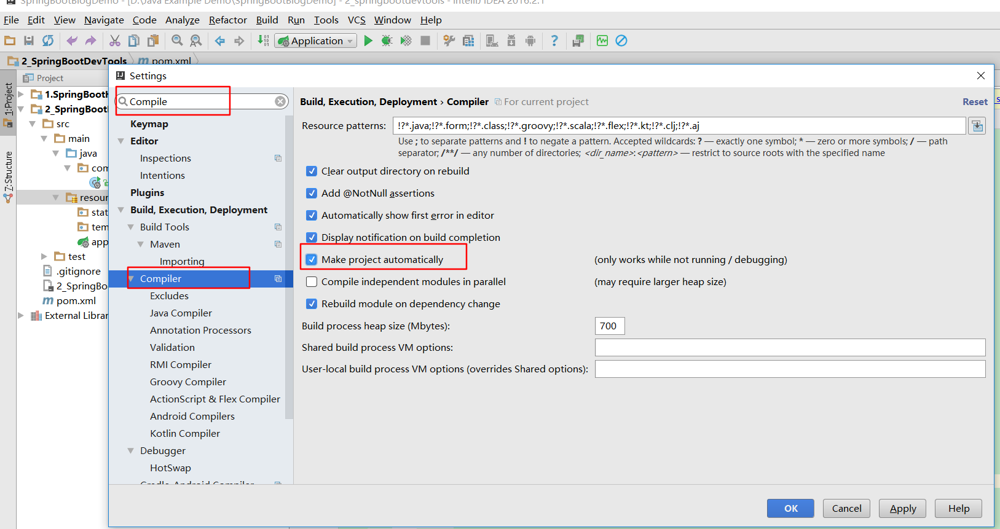
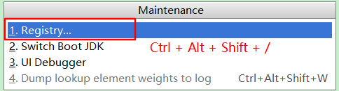
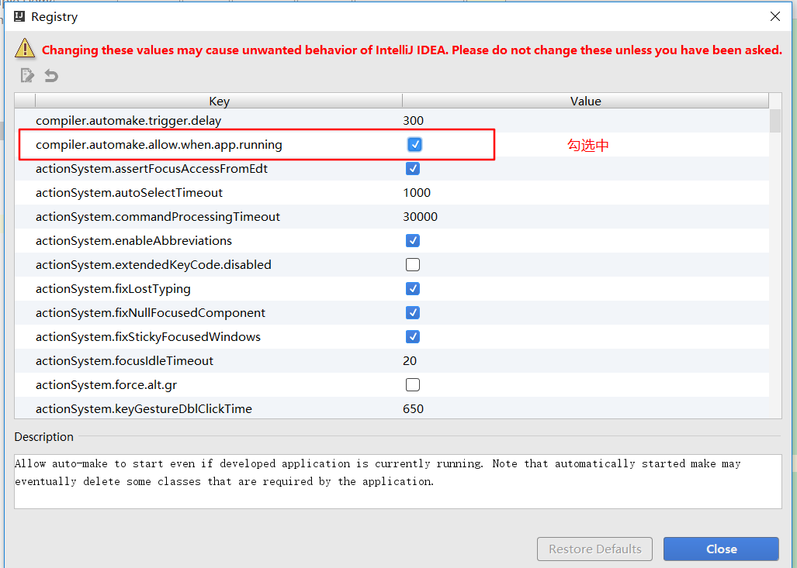
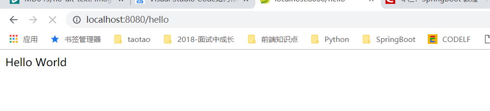
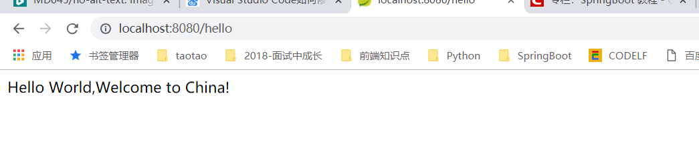

# 第2讲 SpringBoot热部署：SpringBoot集成DevTools

> 修改代码，需要重启系统，严重影响开发体验，相信做过开发的都深有体会。

## 1.引入jar包

```xml
<!--springboot热部署-->
<dependency>
    <groupId>org.springframework.boot</groupId>
    <artifactId>spring-boot-devtools</artifactId>
    <optional>true</optional>
</dependency>

```

## 2.配置项目自动编译



## 3.Register配置：Ctrl + Shift + Alt + /，快捷键打开配置界面，勾选**compiler.automake.allow.when.app.running**





## 4测试：修改DevToolsController类的返回值，项目不用重启，发现页面返回值发生变化。





---

写博客一方面是为了记忆，一方面是希望博客的内容对大家有帮助，如果觉得还不错，点个赞呗！！！