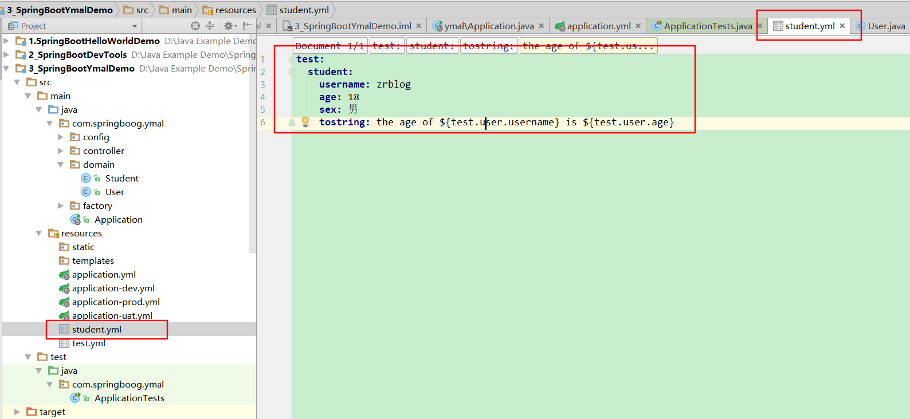

# 第三课 SpringBoot读取配置文件属性

[TOC]

## 1. 获取application.yml文件中的属性

### 1.1 设置属性：application.yml

```yml
test:
  user:
    username: zrblog
    age: 18
    tostring: the age of ${test.user.username} is ${test.user.age}
```

### 1.2 编写User类：User.java

* 实体类添加注解@Configuration,@ConfigurationProperties(prefix = "test.user")

```java
package com.springboog.ymal.domain;

import org.springframework.boot.context.properties.ConfigurationProperties;
import org.springframework.context.annotation.Configuration;

/**
 * @Description:
 * @Author: zrblog
 * @CreateTime: 2018-09-19 23:40
 * @Version:v1.0
 */
@Configuration
@ConfigurationProperties(prefix = "test.user")
public class User {

    private String username;

    private Integer age;

    private String tostring;

    public String getUsername() {
        return username;
    }

    public void setUsername(String username) {
        this.username = username;
    }

    public Integer getAge() {
        return age;
    }

    public void setAge(Integer age) {
        this.age = age;
    }

    public String getTostring() {
        return tostring;
    }

    public void setTostring(String tostring) {
        this.tostring = tostring;
    }
}

```

### 1.3 测试：读取application.yml文件中的属性

```java
package com.springboog.ymal;

import com.springboog.ymal.domain.Student;
import com.springboog.ymal.domain.User;
import org.junit.Test;
import org.junit.runner.RunWith;
import org.springframework.beans.factory.annotation.Autowired;
import org.springframework.boot.test.context.SpringBootTest;
import org.springframework.test.context.junit4.SpringRunner;

@RunWith(SpringRunner.class)
@SpringBootTest
public class ApplicationTests {

    @Autowired
	private User user;

	@Test
	public void contextLoads() {
	}

     /**
      * @Description: 测试 获取application.yml文件中的属性
      * @Date: 2018/10/9 23:22
      * @Author: zr
      * @param null
      * @Return
      */
	@Test
	public void testApplicationFileAttribute() {
        System.out.println(user.getTostring());
    }
}

```

## 2.读取自定义配置文件student.yml文件属性：

### 2.1 student.yml

```yml
test:
  student:
    username: zrblog
    age: 18
    sex: 男
    tostring: the age of ${test.user.username} is ${test.user.age}
```



### 2.2 编写Student类：Student.java

> 添加以下注解：
> @Component
@ConfigurationProperties(prefix = "test.student")
@PropertySource("classpath:student.yml")
@Configuration

```java

package com.springboog.ymal.domain;

import com.sun.org.apache.xpath.internal.operations.String;
import org.springframework.boot.context.properties.ConfigurationProperties;
import org.springframework.context.annotation.Configuration;
import org.springframework.context.annotation.PropertySource;
import org.springframework.stereotype.Component;

/**
 * @Description:
 * @Author: zrblog
 * @CreateTime: 2018-09-19 23:49
 * @Version:v1.0
 */
@Component
@ConfigurationProperties(prefix = "test.student")
@PropertySource("classpath:student.yml")
@Configuration
public class Student {

    @Value("${username}")
    private String username;

    @Value("${age}")
    private Integer age;

    @Value("${sex}")
    private String sex;

    @Value("${tostring}")
    private String toString;

    public String getUsername() {
        return username;
    }

    public void setUsername(String username) {
        this.username = username;
    }

    public Integer getAge() {
        return age;
    }

    public void setAge(Integer age) {
        this.age = age;
    }

    public String getSex() {
        return sex;
    }

    public void setSex(String sex) {
        this.sex = sex;
    }

    public String getToString() {
        return toString;
    }

    public void setToString(String toString) {
        this.toString = toString;
    }
}

```

### 2.3 测试：读取student.yml文件中的属性

```java

package com.springboog.ymal;

import com.springboog.ymal.domain.Student;
import com.springboog.ymal.domain.User;
import org.junit.Test;
import org.junit.runner.RunWith;
import org.springframework.beans.factory.annotation.Autowired;
import org.springframework.boot.test.context.SpringBootTest;
import org.springframework.test.context.junit4.SpringRunner;

@RunWith(SpringRunner.class)
@SpringBootTest
public class ApplicationTests {

    @Autowired
    private Student student;

	@Test
	public void contextLoads() {
	}

     /**
      * @Description: 测试 获取指定文件中的属性
      * @Date: 2018/10/9 23:25
      * @Author: zr
      * @param null
      * @Return 
      */
    @Test
    public void testTargetFileAttribute() {
        System.out.println("testTargetFileAttribute:"+student.getToString());
    }
}

```


> 目录结构：


## 3.SpringBoot多环境配置

### 3.1 resources目录下创建application-dev.yml,application-uat.yml，application-prod.yml


### 3.2 配置属性 spring.profiles.active = dev

> appliaction.yml

```yml
spring:
  profiles:
    active: dev
```

> application-dev.yml

```yml
server:
  port: 8081 #配置tomcat访问端口
```

### 3.3 测试：访问 http://localhost:8081/student


