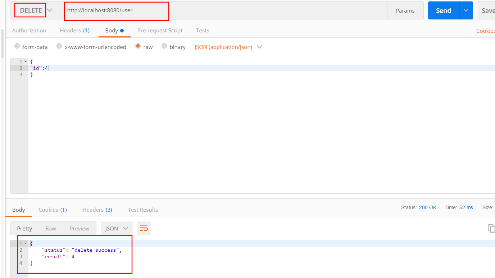

##  **第四课 SpringBoot集成jdbcTemplate**

[TOC]

## 1. 准备SQL环境：

```SQL

CREATE TABLE `tb_user` (
  `id` INT(11) NOT NULL AUTO_INCREMENT COMMENT 'ID',
  `username` VARCHAR(50) NOT NULL COMMENT '用户名',
  `age` INT(11) NOT NULL COMMENT '年龄',
  `ctm` DATETIME NOT NULL COMMENT '创建时间',
  PRIMARY KEY (`id`)
) ENGINE=INNODB DEFAULT CHARSET=utf8


INSERT INTO `tb_user` (`username`, `age`, `ctm`) VALUES('张三', '18', NOW()) ;
INSERT INTO `tb_user` (`username`, `age`, `ctm`) VALUES('李四', '20', NOW()) ;
INSERT INTO `tb_user` (`username`, `age`, `ctm`) VALUES('王五', '19', NOW()) ;

```

## 2. 引入依赖：pom.xml

```xml
<dependencies>	
    <dependency>
		<groupId>org.springframework.boot</groupId>
		<artifactId>spring-boot-starter-test</artifactId>
		<scope>test</scope>
	</dependency>

	<!--SpringBoot集成jdbcTemplate-->
	<dependency>
		<groupId>org.springframework.boot</groupId>
		<artifactId>spring-boot-starter-jdbc</artifactId>
	</dependency>

	<!--mysql驱动-->
	<dependency>
	  <groupId>mysql</groupId>
	  <artifactId>mysql-connector-java</artifactId>
	  <scope>runtime</scope>
	</dependency>

	<!--web依赖-->
	<dependency>
	  <groupId>org.springframework.boot</groupId>
	  <artifactId>spring-boot-starter-web</artifactId>
	</dependency>

	<!--druid连接池-->
	<dependency>
	  <groupId>com.alibaba</groupId>
	  <artifactId>druid</artifactId>
	  <version>1.1.0</version>
	</dependency>
</dependencies>
```

## 3. 配置数据源：application.yml

```yml
spring:
  datasource:
    driver-class-name : com.mysql.jdbc.Driver
    url: jdbc:mysql://localhost:3306/ssm
    username: root
    password: root
```

## 4. 编写Entity层:实体类

* JsonResult

```java
package com.springboot.jdbctemplate.domain;
 
public class JsonResult {
 
	private String status = null;
 
	private Object result = null;
 
	public JsonResult status(String status) {
		this.status = status;
		return this;
	}

	public String getStatus() {
		return status;
	}

	public void setStatus(String status) {
		this.status = status;
	}

	public Object getResult() {
		return result;
	}

	public void setResult(Object result) {
		this.result = result;
	}
}

```

* User.java

```java
package com.springboot.jdbctemplate.domain;

import java.util.Date;

/**
 * @Description:
 * @Author: zrblog
 * @CreateTime: 2018-09-22 10:51
 * @Version:v1.0
 */
public class User {

    private Integer id;

    private String username;

    private Integer age;

    private Date ctm;

    public Integer getId() {
        return id;
    }

    public void setId(Integer id) {
        this.id = id;
    }

    public String getUsername() {
        return username;
    }

    public void setUsername(String username) {
        this.username = username;
    }

    public Integer getAge() {
        return age;
    }

    public void setAge(Integer age) {
        this.age = age;
    }

    public Date getCtm() {
        return ctm;
    }

    public void setCtm(Date ctm) {
        this.ctm = ctm;
    }
}

```

## 5. 编写Dao层：

* UserDao.java

```java
package com.springboot.jdbctemplate.dao;

import com.springboot.jdbctemplate.domain.User;

import java.util.List;

/**
 * @Description:
 * @Author: zrblog
 * @CreateTime: 2018-09-22 10:52
 * @Version:v1.0
 */
public interface UserDao {

    User queryUserById(Integer id);

    List<User> queryAllUser();

    Integer addUser(User user);

    Integer updateUser(User user);

    Integer deleteUser(User user);
}

```

* UserDaoImpl.java

```java
package com.springboot.jdbctemplate.dao;

import com.springboot.jdbctemplate.domain.User;
import org.springframework.beans.factory.annotation.Autowired;
import org.springframework.jdbc.core.BeanPropertyRowMapper;
import org.springframework.jdbc.core.JdbcTemplate;
import org.springframework.stereotype.Repository;

import java.util.List;

/**
 * @Description:
 * @Author: zrblog
 * @CreateTime: 2018-09-22 10:57
 * @Version:v1.0
 */
@Repository
public class UserDaoImpl implements  UserDao {

    @Autowired
    private JdbcTemplate jdbcTemplate;

    @Override
    public User queryUserById(Integer id) {

        String sql = "select * from tb_user where id = ?";

        List<User> resultList = jdbcTemplate.query(sql, new Object[]{id}, new BeanPropertyRowMapper(User.class));

        if (resultList != null && !resultList.isEmpty()) {
            return resultList.get(0);
        } else {
            return null;
        }
    }

    @Override
    public List<User> queryAllUser() {
        String sql = "select * from tb_user";

        List<User> resultList = jdbcTemplate.query(sql, new Object[]{}, new BeanPropertyRowMapper(User.class));

       return  resultList;
    }

    @Override
    public Integer addUser(User user) {

        String sql = "INSERT INTO tb_user(username,age) VALUES(?, ?)";

        Integer result = jdbcTemplate.update(sql, user.getUsername(), user.getAge());

        return result;
    }

    @Override
    public Integer updateUser(User user) {
        String sql = "UPDATE  tb_user SET username = ?,age = ? WHERE  id = ?";

        Integer result = jdbcTemplate.update(sql, user.getUsername(), user.getAge(),user.getId());

        return result;
    }

    @Override
    public Integer deleteUser(User user) {
        String sql = "DELETE FROM tb_user  WHERE  id = ?";

        Integer result = jdbcTemplate.update(sql, user.getId());

        return result;
    }
}

```

## 6. 编写Service层：

* UserService.java

```java
package com.springboot.jdbctemplate.service;

import com.springboot.jdbctemplate.domain.User;

import java.util.List;

/**
 * @Description:
 * @Author: zrblog
 * @CreateTime: 2018-09-22 10:52
 * @Version:v1.0
 */
public interface UserService {

    User queryUserById(Integer id);

    List<User> queryAllUser();

    Integer addUser(User user);

    Integer updateUser(User user);

    Integer deleteUser(User user);
}

```

* UserServiceImpl.java

```java
package com.springboot.jdbctemplate.service;

import com.springboot.jdbctemplate.dao.UserDao;
import com.springboot.jdbctemplate.domain.User;
import org.springframework.beans.factory.annotation.Autowired;
import org.springframework.jdbc.core.BeanPropertyRowMapper;
import org.springframework.stereotype.Service;

import java.util.List;

/**
 * @Description:
 * @Author: zrblog
 * @CreateTime: 2018-09-22 10:57
 * @Version:v1.0
 */
@Service
public class UserServiceImpl implements UserService {

    @Autowired
    private UserDao userDao;

    @Override
    public User queryUserById(Integer id) {

        return userDao.queryUserById(id);
    }

    @Override
    public List<User> queryAllUser() {
        return userDao.queryAllUser();
    }

    @Override
    public Integer addUser(User user) {

        return userDao.addUser(user);
    }

    @Override
    public Integer updateUser(User user) {
        return userDao.updateUser(user);
    }

    @Override
    public Integer deleteUser(User user) {
        return userDao.deleteUser(user);
    }
}

```

## 7. 编写Controller层：

* UserController.java

```java
package com.springboot.jdbctemplate.controller;

import com.springboot.jdbctemplate.domain.JsonResult;
import com.springboot.jdbctemplate.domain.User;
import com.springboot.jdbctemplate.service.UserService;
import org.springframework.beans.factory.annotation.Autowired;
import org.springframework.http.ResponseEntity;
import org.springframework.web.bind.annotation.*;

import java.util.List;

/**
 * @Description:
 * @Author: zrblog
 * @CreateTime: 2018-09-22 11:10
 * @Version:v1.0
 */
@RestController
@RequestMapping("/")
public class UserController {

    @Autowired
    private UserService userService;


    /**
     * @destirption 通过Id查询User
     * @param id
     * @return
     */
    @RequestMapping(value = "user/{id}", method = RequestMethod.GET)
    @ResponseBody
    public ResponseEntity<JsonResult> queryUserById(@PathVariable(value = "id") Integer id) {
        JsonResult jsonResult = new JsonResult();

        try {
            User user = userService.queryUserById(id);

            jsonResult.setResult(user);
            jsonResult.setStatus("success");
        } catch (Exception e) {
            jsonResult.setResult(e.getMessage());
            jsonResult.setStatus("success");
        }

        return ResponseEntity.ok(jsonResult);
    }

    /**
     * @destirption 查询所有User
     * @param
     * @return
     */
    @RequestMapping(value = "users", method = RequestMethod.GET)
    @ResponseBody
    public ResponseEntity<JsonResult> queryUserById() {
        JsonResult jsonResult = new JsonResult();

        try {
            List<User> users = userService.queryAllUser();

            jsonResult.setResult(users);
            jsonResult.setStatus("success");
        } catch (Exception e) {
            jsonResult.setResult(e.getMessage());
            jsonResult.setStatus("success");
        }

        return ResponseEntity.ok(jsonResult);
    }

    /**
     * @destirption 添加User
     * @param user
     * @return
     */
    @RequestMapping(value = "user", method = RequestMethod.POST)
    @ResponseBody
    public ResponseEntity<JsonResult> addUser(@RequestBody User user) {
        JsonResult jsonResult = new JsonResult();

        Integer result = userService.addUser(user);
        if (result == 1) {
            jsonResult.setResult(result);
            jsonResult.setStatus("insert success");
        } else {
            jsonResult.setResult(result);
            jsonResult.setStatus("insert fail");
        }

        return ResponseEntity.ok(jsonResult);
    }

    /**
     * @destirption 删除User
     * @param user
     * @return
     */
    @RequestMapping(value = "user", method = RequestMethod.DELETE)
    @ResponseBody
    public ResponseEntity<JsonResult> deleteUser(@RequestBody User user) {
        JsonResult jsonResult = new JsonResult();

        Integer result = userService.deleteUser(user);
        if (result == 1) {
            jsonResult.setResult(user.getId());
            jsonResult.setStatus("delete success");
        } else {
            jsonResult.setResult(user.getId());
            jsonResult.setStatus("delete fail");
        }

        return ResponseEntity.ok(jsonResult);
    }

    /**
     * @destirption 更新User
     * @param user
     * @return
     */
    @RequestMapping(value = "user", method = RequestMethod.PUT)
    @ResponseBody
    public ResponseEntity<JsonResult> updateUser(@RequestBody User user) {
        JsonResult jsonResult = new JsonResult();

        Integer result = userService.updateUser(user);
        if (result == 1) {
            jsonResult.setResult(user.getId());
            jsonResult.setStatus("updateUser success");
        } else {
            jsonResult.setResult(user.getId());
            jsonResult.setStatus("updateUser fail");
        }

        return ResponseEntity.ok(jsonResult);
    }
}

```


Idea设置自动提示忽略大小写：


## 8. 使用postman测试： 

-- 添加用户


- 删除用户
- 


- 更新用户
- 


- 根据Id查询用户：http://localhost:8080/user/1
- 


- 查询所有用户：http://localhost:8080/users
- 


