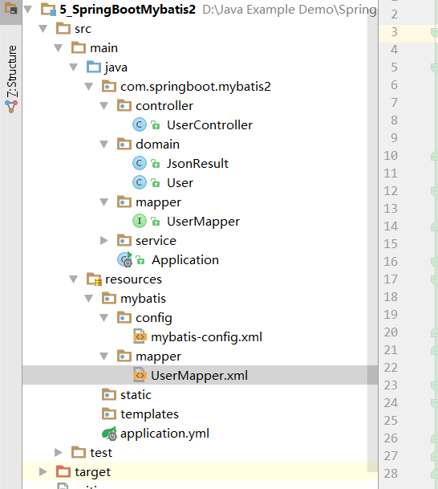

# 第五课 SpringBoot集成Mybatis（2）-配置文件版

[TOC]

## 1. 引入依赖：pom.xml

```xml
<dependencies>
		<dependency>
			<groupId>org.springframework.boot</groupId>
			<artifactId>spring-boot-starter-web</artifactId>
		</dependency>

		<dependency>
			<groupId>org.springframework.boot</groupId>
			<artifactId>spring-boot-starter-test</artifactId>
			<scope>test</scope>
		</dependency>

		<!--SpringBoot集成Mybatis-->
		<dependency>
			<groupId>org.mybatis.spring.boot</groupId>
			<artifactId>mybatis-spring-boot-starter</artifactId>
			<version>1.3.2</version>
		</dependency>

		<!--mysql驱动-->
		<dependency>
			<groupId>mysql</groupId>
			<artifactId>mysql-connector-java</artifactId>
			<scope>runtime</scope>
		</dependency>

	</dependencies>
```

## 2. 配置application.yml：添加Mapper自动扫描路径和配置文件路径

```yml
spring:
  datasource:
    driver-class-name : com.mysql.jdbc.Driver
    url: jdbc:mysql://localhost:3306/ssm
    username: root
    password: root
mybatis:
  mapper-locations: classpath:mybatis/mapper/*.xml #springboot集成mybatis 配置Mapper.xml映射文件路径
  config-location: classpath:mybatis/config/mybatis-config.xml #springboot集成mybatis 配置mybatis配置文件路径


```

## 3. 编写Dao层：

* UserMapper.java

```java

/**
 * @Description:
 * @Author: zrblog
 * @CreateTime: 2018-09-23 22:32
 * @Version:v1.0
 */
@Repository
public interface UserMapper {

    User queryUserById(Integer id);

    List<User> queryAllUser();
}


```

## 4. 编写Service层

* UserService.java

```java
/**
 * @Description:
 * @Author: zrblog
 * @CreateTime: 2018-09-22 10:52
 * @Version:v1.0
 */
public interface UserService {

    User queryUserById(Integer id);

    List<User> queryAllUser();
}

```
---

* UserServiceImpl.java

```java

/**
 * @Description:
 * @Author: zrblog
 * @CreateTime: 2018-09-22 10:57
 * @Version:v1.0
 */
@Service
public class UserServiceImpl implements UserService {

    @Autowired
    private UserMapper userMapper;

    @Override
    public User queryUserById(Integer id) {
        return userMapper.queryUserById(id);
    }

    @Override
    public List<User> queryAllUser() {
        return userMapper.queryAllUser();
    }
}
```

## 5. 编写Controller层

* UserController.java

```java

/**
 * @Description:
 * @Author: zrblog
 * @CreateTime: 2018-09-22 11:10
 * @Version:v1.0
 */
@RestController
@RequestMapping("/")
public class UserController {

    @Autowired
    private UserService userService;


    @RequestMapping(value = "user/{id}", method = RequestMethod.GET)
    @ResponseBody
    public ResponseEntity<JsonResult> queryUserById(@PathVariable(value = "id") Integer id) {
        JsonResult jsonResult = new JsonResult();

        try {
            User user = userService.queryUserById(id);

            jsonResult.setResult(user);
            jsonResult.setStatus("success");
        } catch (Exception e) {
            jsonResult.setResult(e.getMessage());
            jsonResult.setStatus("success");
        }

        return ResponseEntity.ok(jsonResult);
    }

    @RequestMapping(value = "users", method = RequestMethod.GET)
    @ResponseBody
    public ResponseEntity<JsonResult> queryUserById() {
        JsonResult jsonResult = new JsonResult();

        try {
            List<User> users = userService.queryAllUser();

            jsonResult.setResult(users);
            jsonResult.setStatus("success");
        } catch (Exception e) {
            jsonResult.setResult(e.getMessage());
            jsonResult.setStatus("success");
        }

        return ResponseEntity.ok(jsonResult);
    }
}
```

## 6. 编写mybatis-config.xml文件

```xml
<?xml version="1.0" encoding="UTF-8" ?>
<!DOCTYPE configuration
        PUBLIC "-//mybatis.org//DTD Config 3.0//EN"
        "http://mybatis.org/dtd/mybatis-3-config.dtd">

<configuration>
    <typeAliases>
    </typeAliases>
</configuration>
```

## 7. 编写UserMapper.xml文件

```xml

<?xml version="1.0" encoding="UTF-8"?>
<!DOCTYPE mapper PUBLIC "-//mybatis.org//DTD Mapper 3.0//EN" "http://mybatis.org/dtd/mybatis-3-mapper.dtd">
<mapper namespace="com.springboot.mybatis2.mapper.UserMapper">

    <resultMap id="BaseResultMap" type="com.springboot.mybatis2.domain.User">
        <id column="id" property="id" jdbcType="INTEGER"/>
        <result column="username" property="username" jdbcType="VARCHAR"/>
        <result column="age" property="age" jdbcType="INTEGER"/>
        <result column="ctm" property="ctm" jdbcType="TIMESTAMP"/>
    </resultMap>

    <sql id="Base_Column_List">
      id,username,age,ctm
    </sql>
    
    <select id="queryUserById" resultMap="BaseResultMap">
        SELECT 
        <include refid="Base_Column_List"/>
        FROM tb_user
        WHERE id = #{id,jdbcType=INTEGER}
    </select>

    <select id="queryAllUser" resultMap="BaseResultMap">
        SELECT
        <include refid="Base_Column_List"/>
        FROM tb_user
    </select>
</mapper>

```




## 8. 配置MapperScan注解

> 注意：
// xxxMapper接口可以使用@Mapper注解，但是每个mapper都加注解比较麻烦，所以统一配置@MapperScan在扫描路径在application类中

```java
@SpringBootApplication
@MapperScan(value = "com.springboot.mybatis.mapper")
public class Application {

	public static void main(String[] args) {
		SpringApplication.run(Application.class, args);
	}
}
```

## 9. 测试

* 访问地址：http://localhost:8080/users

```json
{
    "status": "success",
    "result": [
        {
        "id": 1,
        "username": "张三",
        "age": 18,
        "ctm": 1537583657000
        },
        {
        "id": 2,
        "username": "Honey",
        "age": 22,
        "ctm": 1537583657000
        },
        {
        "id": 3,
        "username": "王五",
        "age": 19,
        "ctm": 1537583657000
        },
        {
        "id": 5,
        "username": "Tony",
        "age": 66,
        "ctm": null
        },
        {
        "id": 6,
        "username": "Jack",
        "age": 23,
        "ctm": null
        }
    ]
}
```
