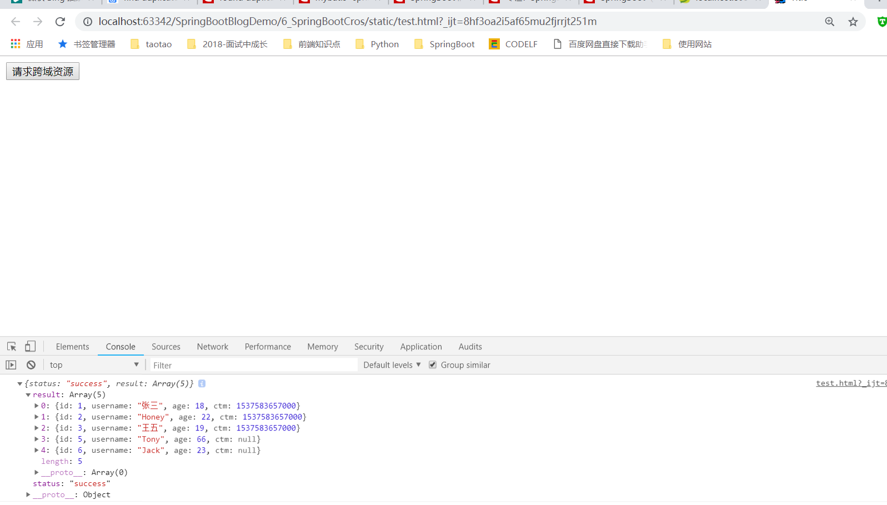

# 第六课 SpringBoot集成Cros解决跨域问题

[TOC]

## 1、开发RestFul类型接口

### 1.1 配置pom.xml，引入依赖

```xml
<dependencies>
		<dependency>
			<groupId>org.springframework.boot</groupId>
			<artifactId>spring-boot-starter-web</artifactId>
		</dependency>

		<dependency>
			<groupId>org.springframework.boot</groupId>
			<artifactId>spring-boot-starter-test</artifactId>
			<scope>test</scope>
		</dependency>

		<!--SpringBoot集成Mybatis-->
		<dependency>
			<groupId>org.mybatis.spring.boot</groupId>
			<artifactId>mybatis-spring-boot-starter</artifactId>
			<version>1.3.2</version>
		</dependency>

		<!--mysql驱动-->
		<dependency>
			<groupId>mysql</groupId>
			<artifactId>mysql-connector-java</artifactId>
			<scope>runtime</scope>
		</dependency>

	</dependencies>
```

### 1.2 application.yml中添加Mapper自动扫描路径

```yml
spring:
  datasource:
    driver-class-name : com.mysql.jdbc.Driver
    url: jdbc:mysql://localhost:3306/ssm
    username: root
    password: root
mybatis:
  mapper-locations: classpath:mybatis/mapper/*.xml #springboot集成mybatis 配置Mapper.xml映射文件路径
  config-location: classpath:mybatis/config/mybatis-config.xml #springboot集成mybatis 配置mybatis配置文件路径


```

### 1.3 编写UserMapper

```java

/**
 * @Description:
 * @Author: zrblog
 * @CreateTime: 2018-09-23 22:32
 * @Version:v1.0
 */
@Repository
public interface UserMapper {

    User queryUserById(Integer id);

    List<User> queryAllUser();
}


```

### 1.4 编写UserService与UserServiceImpl

> UserService:
```java
/**
 * @Description:
 * @Author: zrblog
 * @CreateTime: 2018-09-22 10:52
 * @Version:v1.0
 */
public interface UserService {

    User queryUserById(Integer id);

    List<User> queryAllUser();
}

```
---

> UserServiceImpl:

```java

/**
 * @Description:
 * @Author: zrblog
 * @CreateTime: 2018-09-22 10:57
 * @Version:v1.0
 */
@Service
public class UserServiceImpl implements UserService {

    @Autowired
    private UserMapper userMapper;

    @Override
    public User queryUserById(Integer id) {
        return userMapper.queryUserById(id);
    }

    @Override
    public List<User> queryAllUser() {
        return userMapper.queryAllUser();
    }
}
```

### 1.5 编写UserController

```java

/**
 * @Description:
 * @Author: zrblog
 * @CreateTime: 2018-09-22 11:10
 * @Version:v1.0
 */
@RestController
@RequestMapping("/")
public class UserController {

    @Autowired
    private UserService userService;


    @RequestMapping(value = "user/{id}", method = RequestMethod.GET)
    @ResponseBody
    public ResponseEntity<JsonResult> queryUserById(@PathVariable(value = "id") Integer id) {
        JsonResult jsonResult = new JsonResult();

        try {
            User user = userService.queryUserById(id);

            jsonResult.setResult(user);
            jsonResult.setStatus("success");
        } catch (Exception e) {
            jsonResult.setResult(e.getMessage());
            jsonResult.setStatus("success");
        }

        return ResponseEntity.ok(jsonResult);
    }

    @RequestMapping(value = "users", method = RequestMethod.GET)
    @ResponseBody
    public ResponseEntity<JsonResult> queryUserById() {
        JsonResult jsonResult = new JsonResult();

        try {
            List<User> users = userService.queryAllUser();

            jsonResult.setResult(users);
            jsonResult.setStatus("success");
        } catch (Exception e) {
            jsonResult.setResult(e.getMessage());
            jsonResult.setStatus("success");
        }

        return ResponseEntity.ok(jsonResult);
    }
}
```


### 1.6 编写mybatis-config.xml文件

> 注意：
// xxxMapper接口可以使用@Mapper注解，但是每个mapper都加注解比较麻烦，所以统一配置@MapperScan在扫描路径在application类中

```xml
<?xml version="1.0" encoding="UTF-8" ?>
<!DOCTYPE configuration
        PUBLIC "-//mybatis.org//DTD Config 3.0//EN"
        "http://mybatis.org/dtd/mybatis-3-config.dtd">

<configuration>
    <typeAliases>
    </typeAliases>
</configuration>
```

### 1.7 编写UserMapper.xml文件

```xml

<?xml version="1.0" encoding="UTF-8"?>
<!DOCTYPE mapper PUBLIC "-//mybatis.org//DTD Mapper 3.0//EN" "http://mybatis.org/dtd/mybatis-3-mapper.dtd">
<mapper namespace="com.springboot.cros.mapper.UserMapper">

    <resultMap id="BaseResultMap" type="com.springboot.cros.domain.User">
        <id column="id" property="id" jdbcType="INTEGER"/>
        <result column="username" property="username" jdbcType="VARCHAR"/>
        <result column="age" property="age" jdbcType="INTEGER"/>
        <result column="ctm" property="ctm" jdbcType="TIMESTAMP"/>
    </resultMap>

    <sql id="Base_Column_List">
      id,username,age,ctm
    </sql>
    
    <select id="queryUserById" resultMap="BaseResultMap">
        SELECT 
        <include refid="Base_Column_List"/>
        FROM tb_user
        WHERE id = #{id,jdbcType=INTEGER}
    </select>

    <select id="queryAllUser" resultMap="BaseResultMap">
        SELECT
        <include refid="Base_Column_List"/>
        FROM tb_user
    </select>
</mapper>

```


### 1.8 配置MapperScan注解

> 注意：
// xxxMapper接口可以使用@Mapper注解，但是每个mapper都加注解比较麻烦，所以统一配置@MapperScan在扫描路径在application类中

```java
@SpringBootApplication
@MapperScan(value = "com.springboot.mybatis.mapper")
public class Application {

	public static void main(String[] args) {
		SpringApplication.run(Application.class, args);
	}
}
```

## 2、编写test.html文件

```html
<!DOCTYPE html>
<html lang="en">
<head>
    <meta charset="UTF-8">
    <title>Title</title>
    <link href="bootstrap/css/bootstrap.css" rel="stylesheet" style="text:css"/>
    <script type="application/javascript" src="js/jquery.js"></script>
    <script type="application/javascript"  src="bootstrap/js/bootstrap.js"></script>
    <script type="application/javascript"  type="text/javascript">
        function crosRequest(){
            $.ajax({
                url:'http://localhost:8080/users',
                type:'get',
                dataType:'json',
                success:function(data){
                    console.log(data);
                }
            });
        }
    </script>
</head>
<body>
<button type="button" class="btn btn-link" onclick="crosRequest()">请求跨域资源</button>
</body>
</html>


```

### 2.1 打开test.html，跨域请求测试


**报错，不能访问，存在跨域问题**


### 2.2 解决方案一：在映射的方法上添加注解@CrossOrigin

```java

    @CrossOrigin
    @RequestMapping(value = "users", method = RequestMethod.GET)
    @ResponseBody
    public ResponseEntity<JsonResult> queryAllUser() {
        JsonResult jsonResult = new JsonResult();

        try {
            List<User> users = userService.queryAllUser();

            jsonResult.setResult(users);
            jsonResult.setStatus("success");
        } catch (Exception e) {
            jsonResult.setResult(e.getMessage());
            jsonResult.setStatus("success");
        }

        return ResponseEntity.ok(jsonResult);
    }
```



### 2.3 解决方案二：配置全局CROS配置

```java
@Configuration
public class CrosConfig {

    @Bean
    public WebMvcConfigurer crosConfigurer(){
        return new WebMvcConfigurerAdapter() {
            @Override
            public void addCorsMappings(CorsRegistry registry) {
                registry.addMapping("/**")
                        .allowedOrigins("*")
                        .allowedMethods("GET", "POST", "DELETE", "PUT", "OPTIONS")
                        .allowCredentials(false).maxAge(3600);

            }
        };
    }
}
```

### 2.4 解决方案三：配置全局CROS配置

```java
@Configuration
public class CrosConfigFilter {

    @Bean
    public FilterRegistrationBean crosFilter() {
        UrlBasedCorsConfigurationSource source = new UrlBasedCorsConfigurationSource();

        CorsConfiguration cros = new CorsConfiguration();

        cros.setAllowCredentials(false);

        cros.addAllowedOrigin("*");

        cros.addAllowedHeader("*");

        cros.addAllowedMethod("*");

        source.registerCorsConfiguration("/**", cros);

        FilterRegistrationBean bean = new FilterRegistrationBean(new CorsFilter(source));

        bean.setOrder(0);

        return bean;
    }
}
```