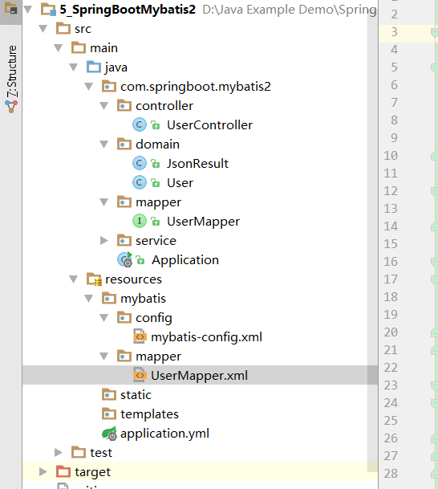
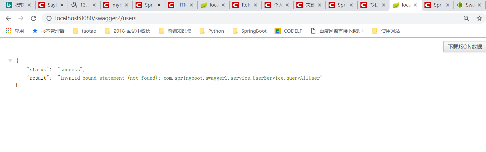

# 第七课 SpringBoot集成Swagger2

[TOC]

## 1.开发RestFul类型接口

### 1.1. 配置pom.xml，引入依赖

```xml
        <!--SpringBoot集成Mybatis-->
		<dependency>
			<groupId>org.mybatis.spring.boot</groupId>
			<artifactId>mybatis-spring-boot-starter</artifactId>
			<version>1.3.2</version>
		</dependency>

		<!--mysql驱动-->
		<dependency>
			<groupId>mysql</groupId>
			<artifactId>mysql-connector-java</artifactId>
			<scope>runtime</scope>
		</dependency>

        <!--SpringBoot集成Swagger2-->

        <dependency>
            <groupId>io.springfox</groupId>
            <artifactId>springfox-swagger2</artifactId>
            <version>2.6.1</version>
        </dependency>

        <dependency>
            <groupId>io.springfox</groupId>
            <artifactId>springfox-swagger-ui</artifactId>
            <version>2.6.1</version>
        </dependency>
```

### 1.2. application.yml中添加Mapper自动扫描路径

```yml
spring:
  datasource:
    driver-class-name : com.mysql.jdbc.Driver
    url: jdbc:mysql://localhost:3306/ssm
    username: root
    password: root
mybatis:
  mapper-locations: classpath:mybatis/mapper/*.xml #springboot集成mybatis 配置Mapper.xml映射文件路径
  config-location: classpath:mybatis/config/mybatis-config.xml #springboot集成mybatis 配置mybatis配置文件路径


```

### 1.3. 编写UserMapper

```java

/**
 * @Description:
 * @Author: zrblog
 * @CreateTime: 2018-09-23 22:32
 * @Version:v1.0
 */
@Repository
public interface UserMapper {

    User queryUserById(Integer id);

    List<User> queryAllUser();
}


```

### 1.4. 编写UserService与UserServiceImpl

> UserService:
```java
/**
 * @Description:
 * @Author: zrblog
 * @CreateTime: 2018-09-22 10:52
 * @Version:v1.0
 */
public interface UserService {

    User queryUserById(Integer id);

    List<User> queryAllUser();
}

```
---

> UserServiceImpl:

```java

/**
 * @Description:
 * @Author: zrblog
 * @CreateTime: 2018-09-22 10:57
 * @Version:v1.0
 */
@Service
public class UserServiceImpl implements UserService {

    @Autowired
    private UserMapper userMapper;

    @Override
    public User queryUserById(Integer id) {
        return userMapper.queryUserById(id);
    }

    @Override
    public List<User> queryAllUser() {
        return userMapper.queryAllUser();
    }
}
```

### 1.5. 编写UserController

```java

/**
 * @Description:
 * @Author: zrblog
 * @CreateTime: 2018-09-22 11:10
 * @Version:v1.0
 */
@RestController
@RequestMapping("/")
public class UserController {

    @Autowired
    private UserService userService;


    @RequestMapping(value = "user/{id}", method = RequestMethod.GET)
    @ResponseBody
    public ResponseEntity<JsonResult> queryUserById(@PathVariable(value = "id") Integer id) {
        JsonResult jsonResult = new JsonResult();

        try {
            User user = userService.queryUserById(id);

            jsonResult.setResult(user);
            jsonResult.setStatus("success");
        } catch (Exception e) {
            jsonResult.setResult(e.getMessage());
            jsonResult.setStatus("success");
        }

        return ResponseEntity.ok(jsonResult);
    }

    @RequestMapping(value = "users", method = RequestMethod.GET)
    @ResponseBody
    public ResponseEntity<JsonResult> queryUserById() {
        JsonResult jsonResult = new JsonResult();

        try {
            List<User> users = userService.queryAllUser();

            jsonResult.setResult(users);
            jsonResult.setStatus("success");
        } catch (Exception e) {
            jsonResult.setResult(e.getMessage());
            jsonResult.setStatus("success");
        }

        return ResponseEntity.ok(jsonResult);
    }
}
```


### 1.6. 编写mybatis-config.xml文件

```xml
<?xml version="1.0" encoding="UTF-8" ?>
<!DOCTYPE configuration
        PUBLIC "-//mybatis.org//DTD Config 3.0//EN"
        "http://mybatis.org/dtd/mybatis-3-config.dtd">

<configuration>
    <typeAliases>
    </typeAliases>
</configuration>
```

### 1.7. 编写UserMapper.xml文件

```xml

<?xml version="1.0" encoding="UTF-8"?>
<!DOCTYPE mapper PUBLIC "-//mybatis.org//DTD Mapper 3.0//EN" "http://mybatis.org/dtd/mybatis-3-mapper.dtd">
<mapper namespace="com.springboot.swagger2.mapper.UserMapper">

    <resultMap id="BaseResultMap" type="com.springboot.swagger2.domain.User">
        <id column="id" property="id" jdbcType="INTEGER"/>
        <result column="username" property="username" jdbcType="VARCHAR"/>
        <result column="age" property="age" jdbcType="INTEGER"/>
        <result column="ctm" property="ctm" jdbcType="TIMESTAMP"/>
    </resultMap>

    <sql id="Base_Column_List">
      id,username,age,ctm
    </sql>
    
    <select id="queryUserById" resultMap="BaseResultMap">
        SELECT 
        <include refid="Base_Column_List"/>
        FROM tb_user
        WHERE id = #{id,jdbcType=INTEGER}
    </select>

    <select id="queryAllUser" resultMap="BaseResultMap">
        SELECT
        <include refid="Base_Column_List"/>
        FROM tb_user
    </select>
</mapper>

```




### 1.8. 配置MapperScan注解

> 注意：
// xxxMapper接口可以使用@Mapper注解，但是每个mapper都加注解比较麻烦，所以统一配置@MapperScan在扫描路径在application类中

```java
@SpringBootApplication
@MapperScan(value = "com.springboot.swagger.mapper")
public class Application {

	public static void main(String[] args) {
		SpringApplication.run(Application.class, args);
	}
}
```

## 2、swagger2配置

### 2.1 编写Swagger2配置文件

```java
/**
 * @Description:
 * @Author: zrblog
 * @CreateTime: 2018-09-24 09:19
 * @Version:v1.0
 */
@Configuration
public class Swagger2Config {

    @Bean
    public Docket createRestApi() {
        return new Docket(DocumentationType.SWAGGER_2)
                .apiInfo(apiInfo())
                .select()
                .apis(RequestHandlerSelectors.basePackage("com.springboot.swagger2"))
                .paths(PathSelectors.any())
                .build();

    }

    private ApiInfo apiInfo() {
        return new ApiInfoBuilder()
                .title("SpringBoot集成Swagger2构建api文档")
                .description("简单优雅的Restful风格，http://blog.csdn.net/saytime")
                .termsOfServiceUrl("http://blog.csdn.net/saytime")
                .version("1.0")
                .build();

    }
}
```

### 2.2  Application类添加注解@EnableSwagger2

```java

@SpringBootApplication
@MapperScan("com.springboot.swagger2.mapper")
@EnableSwagger2
public class Application {

	public static void main(String[] args) {
		SpringApplication.run(Application.class, args);
	}
}
```

### 2.3 测试：http://localhost:8080/swagger-ui.html


点击【try it out】


返回结果：


其他接口测试类似

### 2.4 需要注意的地方

> 刚开始：我的Application.java内容是这样的：

```java
@SpringBootApplication
@MapperScan("com.springboot.swagger2")
@EnableSwagger2
public class Application {

	public static void main(String[] args) {
		SpringApplication.run(Application.class, args);
	}
}

```
> 测试：http://localhost:8080/swagger2/users

问题：



> 查找原因：

1. 查看各层代码，有没有引错类。
2. 查看application.yml文件是否配置正确。
3. 查询UserMapper.xml命名空间和引入的类是否正常。

---

能找的原因都找了，就是一直报这个错，简直是崩溃啊！！！百度了一圈也没有找到，很绝望，然后开始慢慢回想，再学习SpringBoot集成Mybatis的时候，哪里遗忘了，最后尝试将 **@MapperScan("com.springboot.swagger2")** 改成 ** **@MapperScan("com.springboot.swagger2.maper")** 就能正确访问了。郁闷死了，因为这一个小遗漏，就搞了这么长的时间,虽然我也不清楚具体是什么原因，只能默默的做个笔记，避免以后犯同样的错误。

```java
@SpringBootApplication
@MapperScan("com.springboot.swagger2.mapper")
@EnableSwagger2
public class Application {

	public static void main(String[] args) {
		SpringApplication.run(Application.class, args);
	}
}
```


