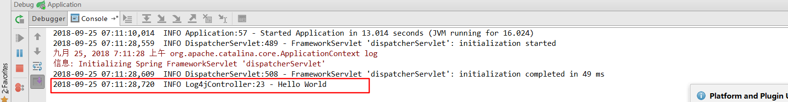

# 第八课 SpringBoot集成Log4j
[TOC]

> SpringBoot框架默认使用的是 **Logback** 框架

## 1. 引入log4j依赖

```xml
<dependency>
    <groupId>org.springframework.boot</groupId>
    <artifactId>spring-boot-starter</artifactId>
    <exclusions>
        <!--排除SpringBoot自带的logback依赖-->
        <exclusion>
            <groupId>org.springframework.boot</groupId>
            <artifactId>spring-boot-starter-logging</artifactId>
        </exclusion>
    </exclusions>
</dependency>


<!--SpringBoot集成Log4j-->
<dependency>
    <groupId>org.springframework.boot</groupId>
    <artifactId>spring-boot-starter-log4j</artifactId>
    <version>1.3.8.RELEASE</version>
</dependency>
```

## 2. 编写log4j.properties配置文件

```properties
#Log4j配置
log4j.rootCategory=INFO,stdout

#控制台输出
log4j.appender.stdout=org.apache.log4j.ConsoleAppender
log4j.appender.stdout.layout=org.apache.log4j.PatternLayout
log4j.appender.stdout.layout.ConversionPattern=%d{yyyy-MM-dd HH:mm:ss,SSS} %5p %c{1}:%L - %m%n
```

## 3. 使用Log4j打印日志-Log4jController.java

```java

import com.fasterxml.jackson.core.JsonProcessingException;
import org.slf4j.Logger;
import org.slf4j.LoggerFactory;
import org.springframework.web.bind.annotation.RequestMapping;
import org.springframework.web.bind.annotation.RestController;

/**
 * @Description:
 * @Author: zrblog
 * @CreateTime: 2018-09-25 07:07
 * @Version:v1.0
 */
@RestController
public class Log4jController {

    private static final Logger logger = LoggerFactory.getLogger(Log4jController.class);

    @RequestMapping("/log4j")
    public String sayHello() throws JsonProcessingException {
        logger.info("Hello World");
        return "Hello World";
    }
}
```

## 4. 测试：http://localhost:8080/log4j





[log4j百度百科](https://baike.baidu.com/item/log4j/480673?fr=aladdin)

> log4j还有许多其他强大的功能，这里都没有做详细介绍，这里只是做SpringBoot简单集成log4j，如果大家觉得不错，点个赞呗！！！