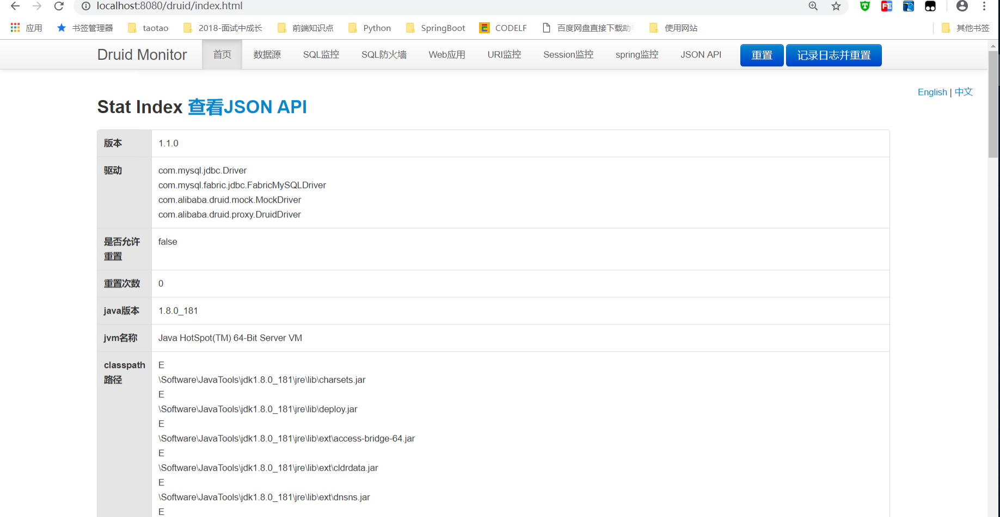
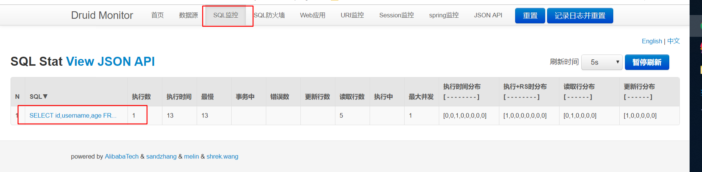
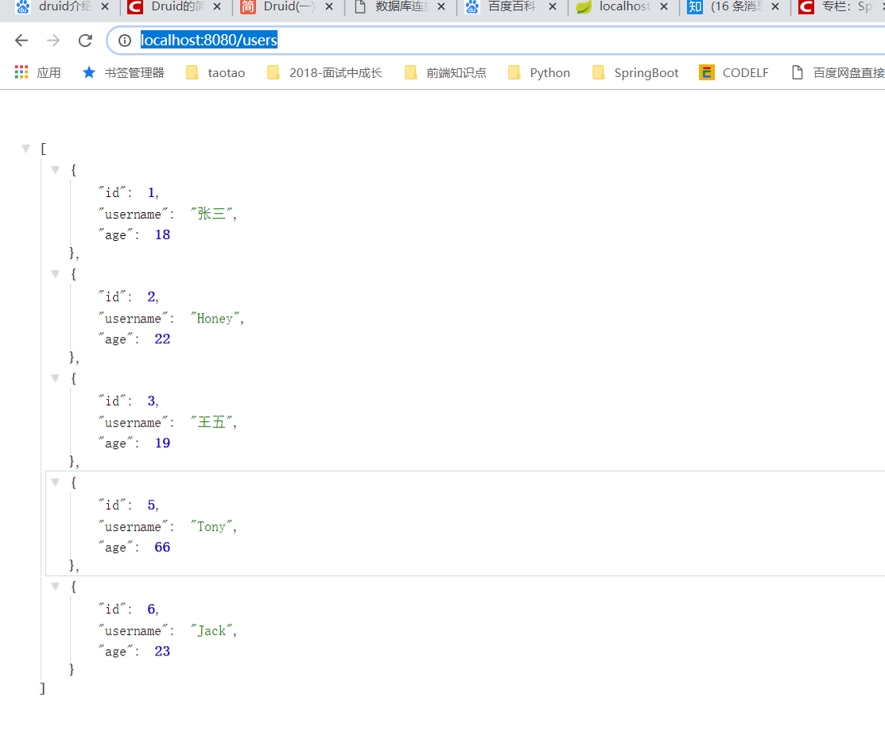

# 第九课 SpringBoot集成Druid连接池

[TOC]

## 1. 什么是Druid

> Druid是阿里巴巴开源平台上一个数据库连接池实现，它结合了C3P0、DBCP、PROXOOL等DB池的优点，同时加入了日志监控，可以很好的监控DB池连接和SQL的执行情况，可以说是针对监控而生的DB连接池(据说是目前最好的连接池)
https://blog.csdn.net/saytime/article/details/78963121

>Druid首先是一个数据库连接池。Druid是目前最好的数据库连接池，在功能、性能、扩展性方面，都超过其他数据库连接池，包括DBCP、C3P0、BoneCP、Proxool、JBoss DataSource。Druid已经在阿里巴巴部署了超过600个应用，经过一年多生产环境大规模部署的严苛考验。
https://blog.csdn.net/qq_34531925/article/details/78899345

## 2. 引入依赖

```xml

<!--mysql驱动-->
<dependency>
    <groupId>mysql</groupId>
    <artifactId>mysql-connector-java</artifactId>
    <scope>runtime</scope>
</dependency>

<!--jdbcTemplate-->
<dependency>
    <groupId>org.springframework.boot</groupId>
    <artifactId>spring-boot-starter-jdbc</artifactId>
</dependency>

<!--druid连接池-->
<dependency>
    <groupId>com.alibaba</groupId>
    <artifactId>druid</artifactId>
    <version>1.1.0</version>
</dependency>

```

## 3. 编写druid.properties配置文件

```properties

#数据库设置
spring.datasource.driverClassName=com.mysql.jdbc.Driver
spring.datasource.url=jdbc:mysql://localhost:3306/tb_user?useUnicode=true&characterEncoding=utf8&autoReconnect=true&useSSL=true
spring.datasource.username=root
spring.datasource.password=root
#--------------------------
# 下面为连接池的补充设置，应用到上面所有数据源中
# 初始化大小，最小，最大
spring.datasource.initialSize=5
spring.datasource.minIdle=1
spring.datasource.maxActive=50
# 配置获取连接等待超时的时间
spring.datasource.maxWait=60000
# 配置间隔多久才进行一次检测，检测需要关闭的空闲连接，单位是毫秒
spring.datasource.timeBetweenEvictionRunsMillis=60000
# 配置一个连接在池中最小生存的时间，单位是毫秒
spring.datasource.minEvictableIdleTimeMillis=300000
spring.datasource.validationQuery=SELECT 1 FROM DUAL
spring.datasource.testWhileIdle=true
spring.datasource.testOnBorrow=false
spring.datasource.testOnReturn=false
# 打开PSCache，并且指定每个连接上PSCache的大小
spring.datasource.poolPreparedStatements=false
#spring.datasource.maxPoolPreparedStatementPerConnectionSize=20
# 配置监控统计拦截的filters，去掉后监控界面sql无法统计，'wall'用于防火墙
spring.datasource.filters=stat,wall,log4j
# 通过connectProperties属性来打开mergeSql功能；慢SQL记录
spring.datasource.connectionProperties=druid.stat.mergeSql=true;druid.stat.slowSqlMillis=5000
# 合并多个DruidDataSource的监控数据
#spring.datasource.useGlobalDataSourceStat=true

```

## 4. 实例化 Druid Datasource

```java

/**
 * @Description:
 * @Author: zrblog
 * @CreateTime: 2018-09-25 07:36
 * @Version:v1.0
 */
@Configuration
@PropertySource(value = "classpath:druid.properties")
public class DruidConfiguration {

    @Bean(destroyMethod = "close",initMethod = "init")
    @ConfigurationProperties(prefix = "spring.datasource")
    public DataSource druidDataSouce(){
        DruidDataSource druidDataSource = new DruidDataSource();
        return druidDataSource;
    }

    @Bean
    public ServletRegistrationBean druidStatViewServlet(){

        ServletRegistrationBean servletRegistrationBean = new ServletRegistrationBean(new StatViewServlet(), "/druid/*");

        //添加初始化参数：initParams
        //白名单
        servletRegistrationBean.addInitParameter("allow", "127.0.0.1");

        //IP黑名单(存在共同时，deny优先于allow)：如果满足deny的话提示：Sorry,you are not permitted to view this page.
        servletRegistrationBean.addInitParameter("deny","192.168.1.73");

        //登录查询信息的账号密码
        servletRegistrationBean.addInitParameter("loginUsername", "admin");
        servletRegistrationBean.addInitParameter("loginPassword", "admin");

        //是否能够重置数据
        servletRegistrationBean.addInitParameter("resetEnable", "false");

        return servletRegistrationBean;
    }

    @Bean
    public FilterRegistrationBean druidStatFilter(){
        FilterRegistrationBean filterRegistrationBean = new FilterRegistrationBean(new WebStatFilter());

        //添加过滤规则
        filterRegistrationBean.addUrlPatterns("/*");

        //添加不需要忽略的格式信息
        filterRegistrationBean.addInitParameter("exclusions","*.js,*.css,*.gif,*.jpg,*.png,*.ico,/druid/*");

        return filterRegistrationBean;
    }
}

```

## 5. 监控测试：http://localhost:8080/druid
账号：admin,密码：admin





## 6. 测试：DruidController

```java
/**
 * @Description:
 * @Author: zrblog
 * @CreateTime: 2018-09-25 07:49
 * @Version:v1.0
 */
@RestController
public class DruidController {

    private static final Logger logger = LoggerFactory.getLogger(DruidController.class);

    @Autowired
    private JdbcTemplate jdbcTemplate;

    @RequestMapping("users")
    @ResponseBody
    public List<Map<String, Object>> queryAllUser() {
        List<Map<String, Object>> resultList = jdbcTemplate.queryForList("SELECT id,username,age FROM tb_user", new Object[]{});
        return resultList;
    }
}
```

访问：http://localhost:8080/users




